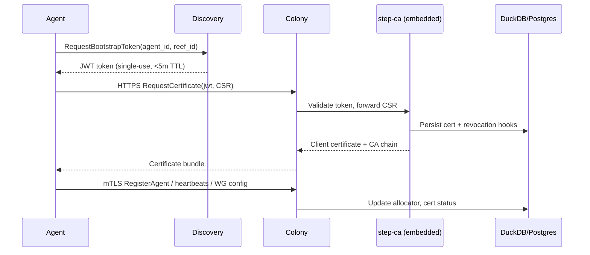

# RFD 022 - Embedded step-ca for Agent mTLS Bootstrap

**Status:** ⏭️ Superseded by [RFD 047](./047-colony-ca-infrastructure.md)

## Summary

Replace the ad-hoc certificate authority described in RFD 020 with an embedded
`step-ca` instance that runs in-process with Colony. Agents receive short-lived,
single-use bootstrap tokens from Discovery/Colony, redeem them against the
embedded `step-ca`, and thereafter authenticate every RPC via mTLS. The design
eliminates shared secrets entirely, enforces TLS from the first packet, and
reuses a battle-tested CA lifecycle (rotation, revocation, HSM integration)
without introducing another operational service.
This also provides the foundation for Reef federation (RFD 003) to migrate off
`colony_secret` once that document is updated.

## Problem

- **Current behavior/limitations**:
    - Agent registration still relies on the shared `colony_secret`, which must
      be
      transmitted before any TLS protections are in place.
    - RFD 020 proposes a custom CA stack stored in DuckDB, but does not solve
      the
      bootstrap trust anchor, multi-colony replication, or key management story.
    - There is no guardrail preventing a leaked `colony_secret` from minting
      arbitrary agent identities.
- **Why this matters**:
    - Intercepted secrets compromise entire colonies.
    - Operators must run bespoke PKI code with unclear rotation/backup guidance.
    - Multi-colony and future Reef federation need a horizontally
      scalable, auditable identity authority to avoid divergent trust stores.
- **Use cases affected**:
    - Secure deployment of agents in untrusted networks.
    - Revocation and replay protection when rolling new agent builds.
    - Colony/agent discovery workflows that need cryptographic continuity.

## Solution

Embed `step-ca` inside the Colony binary and let it serve as the single CA for
agent certificates, backed by a replicated datastore that already exists for the
persistent IP allocator (RFD 019). Discovery issues single-use JWT bootstrap
tokens per agent; agents exchange the token plus a CSR over HTTPS with the
embedded `step-ca` and immediately transition to mTLS for all subsequent RPCs.

**Key Design Decisions**

- **Embedded step-ca**: Run `step-ca` as a library inside Colony. Colony owns
  configuration, lifecycle, and exposes admin commands through the Coral CLI.
- **Single-use bootstrap tokens**: Agents must obtain a scoped JWT that encodes
  `agent_id`, `colony_id`, Reef context, and expiry. Tokens are minted by
  Discovery after Colony authorizes the registration.
- **Pre-baked trust anchor**: Every agent binary ships with the Reef CA bundle
  (or colony fingerprint) signed during release. First HTTPS request validates
  the server certificate before any secrets leave the host.
- **Shared datastore**: CA keys, issued certificates, revocation status, and
  bootstrap token logs live beside the existing allocator data in DuckDB today.
- **No legacy fallback**: Registration endpoints refuse connections lacking a
  valid certificate; operators cannot silently drop to HTTP.

**Benefits**

- Removes shared secrets from the protocol entirely.
- Provides hardened PKI semantics (rotation, audit logs, CRL/OCSP) without
  reinventing them.
- Aligns with Reef-aware multi-colony federation by storing identity artifacts
  in the shared control plane.
- Reduces operational burden: one binary to run, no external CA to manage.

**Architecture Overview**



### Component Changes

1. **Colony / Embedded CA**
    - Initialize `step-ca` with root + intermediate keys on first launch,
      storing
      encrypted keys in the shared datastore (with optional cloud KMS unlock).
    - Host an internal HTTPS endpoint (localhost listener) that the Colony gRPC
      server uses to perform issuance and revocation via `step-ca` APIs.
    - Expose gRPC/HTTP handlers (`RequestCertificate`, `RevokeCertificate`,
      `ListCertificates`) that proxy to the embedded CA and enforce policy
      (token validation, Reef scoping).

2. **Discovery / Reef**
    - Maintain per-agent registration intents and mint JWT provisioner tokens.
    - Include Reef identifiers so multiple colonies can verify whether they are
      the canonical issuer for a given agent.
    - Surface token issuance metrics and alerts.
    - **Reef compatibility**: Until RFD 003 is revised, Reef continues using
      `colony_secret` for WireGuard peering; once this RFD is implemented, Reef
      must transition to requesting bootstrap tokens/certificates just like any
      agent before establishing tunnels.

3. **Agent**
    - Bundle trust anchors in release artifacts.
    - Implement bootstrap flow: request token, generate keypair (Ed25519),
      submit CSR to Colony endpoint, persist cert/key securely, then establish
      mTLS channels for the rest of the lifecycle.
    - Implement proactive renewal (30 days before expiry) using existing cert.

4. **CLI / Operator Experience**
    - `coral colony ca status`: view CA fingerprint, key location, next
      rotation.
    - `coral colony ca rotate`: trigger step-ca intermediate rotation with
      zero-downtime issuance.
    - `coral discovery issue-token --agent foo`: manual bootstrap token mint.

5. **Datastore**
    - Extend the existing DuckDB schema with tables for bootstrap tokens,
      issued certificates, revocations, and CA metadata, keeping compatibility
      with the future Postgres-backed control plane.

**Configuration Example**

```yaml
security:
    ca:
        provider: step
        root_store: postgres://coral-ca
        kms_key: aws-kms://alias/coral-step-root
        token_ttl: 5m
discovery:
    bootstrap_tokens:
        issuer: reef-control
        audience: colony-step-ca
```

## Implementation Plan

### Phase 1: CA Embedding

- [] Vendor `go.step.sm/crypto` and expose a Colony CA manager.
- [] Implement migrations `004-step-ca-state` for CA metadata/tables.
- [] Wire CA key storage to the shared DuckDB datastore (with Postgres option)
    + optional KMS envelope (placeholder for future KMS integration).

### Phase 2: Bootstrap Tokens

- [] Define protobuf/REST APIs for `CreateBootstrapToken`,
  `ConsumeBootstrapToken`.
- [] Implement `003-bootstrap-tokens` migration (token table + audit log).
- [] Discovery issues tokens scoped to `agent_id`, `colony_id`, Reef.

### Phase 5: Testing & Docs

- [] Unit tests for token validation, CSR policy.
- [] Integration tests for server-side bootstrap flow.
- [] All existing tests passing with new infrastructure.

**Note:** Agent-side implementation moved to RFD 047 to keep this RFD focused on
server-side infrastructure.

**Note:** mTLS enforcement deferred to maintain backward compatibility during
agent rollout.

## API Changes

### New Protobuf Messages

```protobuf
message CreateBootstrapTokenRequest {
    string reef_id = 1;
    string colony_id = 2;
    string agent_id = 3;
    string intent = 4; // e.g., "register", "renew"
}

message CreateBootstrapTokenResponse {
    string jwt = 1;
    int64 expires_at = 2;
}

message RequestCertificateRequest {
    string jwt = 1;         // bootstrap token
    bytes csr = 2;          // PEM CSR (Ed25519 or RSA)
}

message RequestCertificateResponse {
    bytes certificate = 1;  // PEM client cert
    bytes ca_chain = 2;     // PEM root + intermediate
    int64 expires_at = 3;
}

message RevokeCertificateRequest {
    string serial_number = 1;
    string reason = 2;
}
```

### New RPC Endpoints

```protobuf
service DiscoveryService {
    rpc CreateBootstrapToken(CreateBootstrapTokenRequest)
        returns (CreateBootstrapTokenResponse);
}

service ColonyService {
    rpc RequestCertificate(RequestCertificateRequest)
        returns (RequestCertificateResponse);
    rpc RevokeCertificate(RevokeCertificateRequest)
        returns (google.protobuf.Empty);
}
```

### CLI Commands

```bash
coral discovery issue-token --agent foo --reef reef-a --colony colony-1
coral colony ca status
coral colony ca rotate --confirm
```

### Configuration Changes

- `security.ca.provider` (enum: `step` | `external`)
- `security.ca.token_ttl` (duration, default 5m)
- `security.ca.require_mtls` (bool, default true, cannot be disabled)

## Testing Strategy

### Unit Tests

- Token issuance validation (scope, expiry, replay).
- CSR policy enforcement (matching `agent_id`, SAN restrictions).
- Revocation propagation into the embedded `step-ca` store.

### Integration Tests

- Full bootstrap flow: token request → CSR issuance → mTLS registration.
- Invalid/expired/replayed tokens rejected by issuance endpoint.
- Multi-colony scenario: ensure only the owning colony honors the token.

### E2E Tests

- Agent reconnect after reboot using stored cert.
- Renewal before expiry with existing cert (no new token).
- Revocation causing immediate mTLS handshake failure.

## CLI Local Proxy Implications

RFD 005’s CLI local proxy remains the standard operator entry point. This RFD
updates its authentication path rather than removing it:

- `coral proxy start` now performs the same bootstrap flow as an agent: request
  a single-use token, generate a CSR, obtain a certificate from the embedded
  `step-ca`, then bring up its WireGuard interface.
- Proxy certificates are stored and renewed under the user’s Coral state dir
  (e.g., `~/.coral/proxy/<colony>`), sharing the lifecycle hooks described in
  Phase 3.
- The WireGuard registration RPC swaps the `colony_secret` payload for proof of
  possession derived from the proxy’s certificate (CN/SAN encode proxy and
  colony identity).
- Operators still interact with `localhost:PORT` as before; the only visible
  change is improved security (proxies can be revoked individually, no shared
  secret rotation).
- If a proxy host is compromised, the colony revokes that certificate and the
  proxy immediately loses mesh access, keeping the private topology intact.

## Security Considerations

- Root and intermediate keys can be sealed in cloud KMS or encrypted at rest
  using `step-ca` native key wrapping; rotation procedures piggyback on
  Smallstep tooling.
- Bootstrap tokens leverage JWT with short TTL and single-use semantics stored
  in the shared datastore to prevent replay.
- Agents fail closed: without a trusted CA chain embedded in the release, the
  bootstrap handler rejects the connection, preventing MITM provisioning.
- All Colony APIs enforce mTLS; plaintext listeners are removed.
- Reef peers (RFD 003) must also acquire certificates via this flow; until that
  doc is updated, Reef remains on `colony_secret` + WireGuard, but deployment of
  this RFD should track a follow-on change that migrates Reef to certificate
  auth so the federation layer shares the same trust fabric.

## Migration Strategy

1. **Deployment Steps**
    - Apply migrations `003-bootstrap-tokens` and `004-step-ca-state`.
    - Deploy updated Colony binary (starts embedded `step-ca`).
    - Deploy Discovery service capable of issuing bootstrap tokens.
    - Roll out new agent binaries; old agents must upgrade before reconnecting.
    - Coordinate with Reef owners (RFD 003) so Reef either upgrades in lockstep
      to use bootstrap tokens/certificates or stays on the legacy flow until its
      RFD is amended—no mixed auth paths per colony.

2. **Rollback Plan**
    - Roll back Colony binary to previous version (disables embedded CA).
    - Delete CA metadata tables if necessary (keys remain sealed for future
      use).
    - Agents must re-register once the new version redeploys; no legacy HTTP
      path.

---

## Implementation Status

**Core Capability:** ✅ Complete

RFD 022 server-side infrastructure is fully implemented and operational. The
embedded CA manager, bootstrap token issuance, and certificate request handlers
are production-ready.

**Operational Components:**

- ✅ Embedded CA with root and intermediate certificate generation (ECDSA P-256)
- ✅ Bootstrap token issuance via Discovery service (`CreateBootstrapToken` RPC)
- ✅ Certificate request/issuance via Colony service (`RequestCertificate` RPC)
- ✅ Certificate revocation support (`RevokeCertificate` RPC)
- ✅ Database migrations for tokens and CA state (003, 004)
- ✅ CLI commands: `coral colony ca status`, `coral colony ca rotate` (
  placeholder)
- ✅ JWT-based single-use tokens with replay protection
- ✅ CSR validation and CN policy enforcement

**What Works Now:**

- Colony generates and manages root/intermediate CA certificates on first start
- Discovery service issues JWT bootstrap tokens with 5-minute TTL
- Colony validates tokens, processes CSRs, and issues client certificates
- Certificates stored in DuckDB with revocation tracking
- Token consumption tracked to prevent replay attacks
- All tests passing, builds successfully

**File Locations:**

- CA Manager: `internal/colony/ca/manager.go`
- Token Manager: `internal/discovery/tokens.go`
- Colony Handlers: `internal/colony/server/server.go:348-447`
- Discovery Handler: `internal/discovery/server/server.go:648-696`
- Database Schema: `internal/colony/database/schema.go:233-293`
- CLI Commands: `internal/cli/colony/ca.go`

**Integration Status:**

The server-side infrastructure is complete and ready for agent adoption. The
following components are operational:

1. **Colony CA Manager** - Generates and manages CA certificates, issues client
   certificates
2. **Discovery Token Service** - Issues and tracks single-use bootstrap tokens
3. **Colony Certificate Service** - Validates tokens and signs agent CSRs
4. **Database Storage** - Tracks tokens, certificates, and revocations

## Deferred Features

The following features are explicitly deferred to future RFDs to keep RFD 022
scoped to server-side infrastructure:

**Agent Bootstrap Client** (RFD 047 - Agent Certificate Bootstrap
Implementation)

- Agent-side certificate request flow
- Ed25519 keypair generation
- CSR creation and submission
- Certificate storage and renewal
- CLI commands: `coral agent bootstrap`, `cert status`, `cert renew`

**mTLS Enforcement** (Future RFD - Planned)

- Require client certificates for all agent RPCs
- Disable `colony_secret` authentication
- Certificate-based authorization policies
- Graceful migration from shared secrets to certificates

**Certificate Lifecycle** (Future RFD - Planned)

- Automatic certificate renewal (30 days before expiry)
- Certificate expiry monitoring and alerting
- Renewal failure handling
- CRL/OCSP distribution

**KMS Integration** (Future RFD - Planned)

- AWS KMS envelope encryption for CA keys
- GCP Cloud KMS integration
- Azure Key Vault support
- Key rotation with external KMS

**CA Rotation** (Future RFD - Planned)

- Automated intermediate CA rotation
- Zero-downtime certificate re-issuance
- Overlapping validity periods
- Rotation scheduling and procedures

**CLI Proxy Bootstrap** (RFD 005 Update - Planned)

- Proxy certificate-based authentication
- Per-user certificate management
- Proxy certificate renewal

**Reef Federation mTLS** (RFD 003 Update - Planned)

- Colony-to-colony certificate authentication
- Cross-reef trust establishment
- Federation certificate policies
