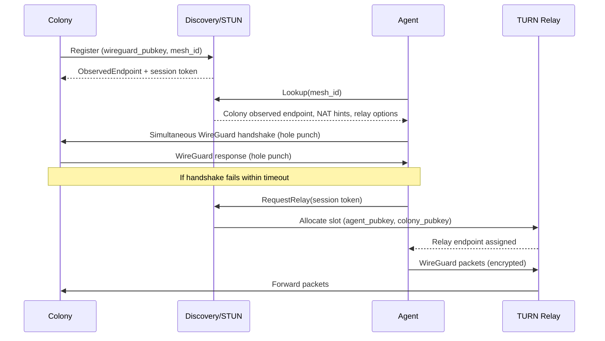

# RFD 023 - Discovery STUN/TURN for Fully NATed Colonies

**Status:** 🚧 Draft

## Summary

Extend the Discovery service (RFD 001) so colonies, proxies, and agents can
bootstrap WireGuard peering even when *both* sides sit behind consumer NATs or
firewalls. Discovery gains STUN-style endpoint reflection, coordinated UDP hole
punching, and a TURN-like relay fallback, allowing developers to self-host
colonies on laptops (with their own LLM API keys) without exposing public
ports. The design preserves the existing CLI proxy model (RFD 005) and the mTLS
bootstrap flow from RFD 022.

## Problem

- **Current behavior/limitations**:
    - Discovery simply records static endpoints supplied by colonies/agents. If
      a
      colony is behind NAT and only publishes private addresses, remote agents
      cannot reach it.
    - WireGuard peers assume at least one side is publicly reachable; when both
      are behind NAT, handshakes fail.
    - There is no relay or rendezvous service to coordinate simultaneous
      handshakes or keep NAT bindings alive.
- **Why this matters**:
    - Coral’s target audience wants to self-host colonies on desktops or home
      labs, keeping proprietary LLM keys local while remote agents execute work.
    - Operators prefer not to open inbound firewall ports or expose colony APIs.
    - Without NAT traversal, adoption is limited to VPS or data center installs.
- **Use cases affected**:
    - Developer laptop colony controlling agents on cloud VMs.
    - Edge agents on factory floors connecting to a control colony behind CGNAT.
    - CLI proxy users roaming between networks (coffee shop Wi-Fi, tethered
      hotspot) while colonies run at home.

## Solution

Augment Discovery with three capabilities:

1. **Endpoint reflection (STUN-lite)**: Discovery reports the observed public
   IP/port and NAT type for each registered peer.
2. **Coordinated UDP hole punching**: Discovery orchestrates simultaneous
   WireGuard handshake attempts and maintains keepalives so symmetric NATs can
   form direct tunnels whenever possible.
3. **Relay fallback (TURN-lite)**: When hole punching fails, Discovery assigns a
   relay (can be the Discovery server itself or a dedicated `coral-relay`
   binary) that forwards encrypted WireGuard packets.

**Key Design Decisions**

- **Discovery as rendezvous**: Keep a single logical control plane; agents and
  colonies already trust Discovery for bootstrap, so extending it avoids extra
  services.
- **Token-bound sessions**: Use the same bootstrap tokens/certificates from RFD
  022 to authenticate STUN/TURN requests, preventing open relays.
- **Relay neutrality**: Relays never decrypt payloads—WireGuard packets stay
  end-to-end encrypted. Relays track usage for billing/rate limiting.
- **Config discovery**: CLI proxy and agents learn about available relays via
  Discovery responses; no manual config needed.
- **Pluggable transport**: Default implementation uses UDP; future releases can
  add TCP-to-UDP relays for extremely restrictive networks.

**Benefits**

- Colonies can remain completely behind NAT/firewalls yet still control remote
  agents.
- Operators keep LLM API keys and sensitive context on their machines while
  interacting with external agents.
- Simplifies getting-started experience (no port forwarding, no VPN).
- Enables roaming clients (CLI proxy, MCP) to reconnect automatically when
  their public IP changes.

**Architecture Overview**



## Component Changes

1. **Discovery Service**
    - Add UDP listener (default 3478) for STUN-like probes.
    - Persist observed endpoints, NAT type heuristics, and relay assignments in
      a
      new table (`peer_sessions`).
    - Extend gRPC API with `RequestRelay` / `ReleaseRelay`.
    - Emit NAT traversal metrics (success/fail, relay usage).

2. **Colony**
    - On registration, send periodic STUN keepalives so Discovery maintains
      current public mappings.
    - Accept updated `LookupColony` payloads that include peer endpoint lists
      and
      relay instructions.
    - When acting as a relay candidate (optional future), expose config to allow
      colonies with public IPs to volunteer bandwidth.

3. **Agent**
    - Integrate NAT traversal library that:
        - Attempts direct WireGuard handshake using multiple observed endpoints.
        - Falls back to Discovery-managed relay on failure.
        - Refreshes assignments when connectivity drops.

4. **CLI Local Proxy (RFD 005)**
    - Reuse the same traversal stack so a proxy on a laptop can reach colonies
      running at home without manual port forwarding.

5. **Relay Service (new binary, optional)**
    - Stateless UDP forwarder controlled by Discovery.
    - Maintains session table keyed by agent/colony public keys.
    - Supports rate limiting and accounting.

## Implementation Plan

### Phase 1: STUN-lite

- [ ] Add UDP listener to Discovery that records observed IP:port + NAT guess.
- [ ] Define proto extensions for returning observed endpoints and NAT metadata.
- [ ] Update colonies/agents/proxies to send periodic probes.

### Phase 2: Coordinated Hole Punching

- [ ] Implement `InitiatePunch` RPC where Discovery tells both peers to start
  exchanging WireGuard handshakes.
- [ ] Add timers/keepalives to keep NAT mappings alive during bootstrap.
- [ ] Telemetry for punch success rate.

### Phase 3: Relay Support

- [ ] Ship lightweight `coral-relay` (or embed in Discovery) that forwards UDP.
- [ ] Add `RequestRelay` / `ReleaseRelay` RPCs using step-ca auth.
- [ ] Persist relay assignments in `peer_sessions` table.

### Phase 4: Client Integration

- [ ] Update agent, colony, and CLI proxy networking layers to consume the new
  Discovery metadata, attempt hole punching, and fail over to relay.
- [ ] Expose configuration flags (e.g., `allow_relay`, bandwidth caps).

### Phase 5: Testing & Docs

- [ ] Unit tests for STUN parsing, NAT classification, relay allocation.
- [ ] Integration tests using mininet or containerized NATs.
- [ ] Docs describing “self-hosted colony behind NAT” workflow.

## API Changes

### Updated Protobuf (discovery/v1)

```protobuf
message LookupColonyResponse {
    // Existing fields...
    repeated Endpoint observed_endpoints = 10;
    NatHint nat = 11;
    repeated RelayOption relays = 12;
}

message Endpoint {
    string ip = 1;
    uint32 port = 2;
    string protocol = 3; // "udp"
    bool via_relay = 4;
}

enum NatHint {
    NAT_UNKNOWN = 0;
    NAT_CONE = 1;
    NAT_RESTRICTED = 2;
    NAT_SYMMETRIC = 3;
}

message RequestRelayRequest {
    string mesh_id = 1;
    bytes agent_pubkey = 2;
    bytes colony_pubkey = 3;
}

message RequestRelayResponse {
    Endpoint relay_endpoint = 1;
    string session_id = 2;
    int64 expires_at = 3;
}
```

## Testing Strategy

### Unit Tests

- STUN packet parsing and NAT classification.
- Relay allocation bookkeeping.
- Token/certificate enforcement on new RPCs.

### Integration Tests

- Simulated NAT environments (cone vs symmetric) verifying hole punching.
- Relay fallback correctness (packets flow, session expires cleanly).
- CLI proxy/agent reconnect scenarios when public IP changes.

### E2E Tests

- Developer laptop colony behind NAT controlling cloud agent via proxy.
- Both colony and agent behind CGNAT using relay fallback.
- Telemetry validation: success rates, relay utilization alerts.

## Security Considerations

- All STUN/TURN requests require valid bootstrap tokens/certificates (per RFD
    022) to prevent anonymous abuse.
- Relays never decrypt WireGuard payloads; they simply forward UDP datagrams.
- Discovery enforces rate limits per `mesh_id` and per certificate to avoid DoS.
- Session metadata (public IPs, ports) is stored with short TTLs and removed
  upon logout to minimize sensitive logging.

## Migration Strategy

1. Deploy Discovery updates (STUN/relay ports) and database migration
   `005-discovery-relay`.
2. Roll out new agent/colony/proxy binaries that understand observed endpoints
   but still fall back to current behavior if Discovery lacks data.
3. Enable relay fallback per colony via configuration flag once confidence is
   high.
4. Eventually mark static-endpoint-only mode as deprecated.
