# RFD 024 - OpenTelemetry Fan-Out for Coral AI

**Status:** 🚧 Draft

## Summary

Introduce “CoralTel”, an observability bridge that mirrors high-signal
OpenTelemetry (OTel) telemetry into Coral’s AI workflows without disrupting
existing pipelines (Honeycomb, Grafana, etc.). Coral agents/proxies expose local
OTLP endpoints, filter events to what the AI needs, and forward them over the
step-ca authenticated mesh—so Coral can cite application-level evidence
alongside eBPF signals without duplicating entire telemetry stores.

## Problem

- **Current behavior/limitations**:
    - Coral’s AI insights rely on passive sensors (eBPF, CLI proxy), leaving a
      gap
      when teams already invested in OTel instrumentation; duplicating
      everything
      would overload storage and break existing pipelines.
    - Without selective sampling, mirroring OTel data into Coral would double
      telemetry volume and compete with primary observability platforms.
- **Why this matters**:
    - Operators want AI assistance that references both Coral’s deep kernel view
      (RFD 013) and application-level telemetry they already maintain elsewhere.
    - Self-hosted colonies (with local LLM keys) need correlated signals without
      uploading sensitive data to multiple SaaS endpoints.
- **Use cases affected**:
    - “Why is checkout slow?” queries that should cite OTel spans + eBPF stats.
    - Serverless/SDK users who instrument with OTel and expect Coral to ingest
      only relevant slices.

## Solution

1. **Local OTLP ingress (“CoralTel”)**: Agents, sidecars, and CLI proxies expose
   a loopback OTLP gRPC/HTTP endpoint. Applications keep their existing OTel
   exporters and simply add Coral as an additional exporter/fan-out target.
2. **Selective filtering & adaptive sampling**: CoralTel filters spans/metrics
   based on configurable rules (errors, high latency, specific services) and
   adaptive AI-driven sampling to avoid duplicating entire telemetry streams.
3. **Mesh-forwarded telemetry**: Filtered OTel data travels through the existing
   step-ca authenticated channel (RFD 022) and benefits from NAT traversal
   support (RFD 023). Colonies store short-lived summaries (DuckDB table
   `otel_insights`) for AI queries, not long-term retention.
4. **SDK helper (serverless)**: Provide a lightweight Coral SDK that wraps OTel
   exporters for serverless apps, automatically targeting the local CoralTel
   endpoint (or embedded shim) so cold starts and outbound-only networking are
   handled transparently.

### Adaptive Sampling Strategy

- **Baseline**: Agents start with a default 5 % trace sampling rate and 1 %
  metric sampling rate, configurable per service/environment.
- **Triggers**:
    - Active `coral ask` / AI investigation targeting a service → raise that
      service’s sampling to up to 50 % for the session.
    - Local anomaly signals (eBPF spike, error budget burn) → raise to 25 % for
      5 minutes via automatic colony policy updates.
    - Resource pressure (agent buffer >80 %, colony backpressure signal) → drop
      to
      1 % until pressure subsides.
- **Control loop**: Colony recomputes desired sampling every 30 seconds based on
  rolling 1-minute windows of span volume, AI demand, and resource metrics.
  Policies are pushed via `UpdateTelemetryPolicy`; agents clamp the requested
  value within 0.5 %–80 % bounds and acknowledge the effective rate.

**Benefits**

- Lets teams keep Honeycomb/Grafana as their primary telemetry while Coral taps
  only what its AI needs.
- Bridges passive eBPF data with structured OTel spans/metrics for richer
  diagnostic responses.
- Works in private/self-hosted colonies with no public ingress—apps just send
  OTel data to localhost; Coral handles the rest.
- Avoids reinventing telemetry SDKs; instead, Coral becomes an opinionated OTel
  consumer tightly integrated with Coral’s AI workflows.

**Architecture Overview**


## Component Changes

1. **Agent / Proxy**
    - Embed OTLP receiver (gRPC + HTTP) bound to localhost by default.
    - Implement CEL-based filtering rules (latency thresholds, attribute
      matching, service allowlists) and adaptive sampling toggled by colony
      instructions.
    - Forward filtered spans/metrics over existing mesh channels using agent's
      certificate identity; store minimal buffering to avoid data loss on
      disconnect.

2. **Colony**
    - Add OTEL ingestion pipeline (`otel_insights` DuckDB table or Postgres)
      plus
      retention TTL (e.g., 24h).
    - Extend AI orchestration to correlate OTel + eBPF context.
    - Provide configuration endpoints for sampling policies, service filters,
      and
      data minimization.

3. **Coral SDK (Serverless helper)**
    - Wrap standard OTel exporters and present a lightweight OTLP collector that
      reuses the NAT traversal + step-ca bootstrap flows (RFDs 022 & 023).

4. **CLI / Consumer side**
    - `coral ask` exposes citations referencing CoralTel spans/metrics (e.g.,
      “OTel span checkout latency=950 ms”).
    - CLI flags to toggle OTel fan-out per command or per colony context.

## Database Schema

**Migration `006-otel-ingest.sql`**

```sql
CREATE TABLE otel_insights
(
    bucket_start TIMESTAMP NOT NULL,
    bucket_end   TIMESTAMP NOT NULL,
    agent_id     TEXT      NOT NULL,
    service_name TEXT      NOT NULL,
    signal       TEXT      NOT NULL,    -- trace | metric
    span_kind    TEXT,
    status_code  TEXT,
    attributes   MAP(VARCHAR, VARCHAR), -- low-cardinality resource attributes only
    latency_p50  DOUBLE PRECISION,
    latency_p95  DOUBLE PRECISION,
    latency_p99  DOUBLE PRECISION,
    error_count  INTEGER,
    metric_name  TEXT,
    metric_value DOUBLE PRECISION,
    trace_ids    VARCHAR[],             -- array of representative trace IDs
    created_at   TIMESTAMP DEFAULT CURRENT_TIMESTAMP
);

CREATE INDEX idx_otel_insights_service_bucket
    ON otel_insights (service_name, bucket_start);

CREATE INDEX idx_otel_insights_agent_bucket
    ON otel_insights (agent_id, bucket_start);

-- Retention: Periodic cleanup job deletes rows older than configured TTL
-- DELETE FROM otel_insights WHERE bucket_start < NOW() - INTERVAL '24 HOURS';
```

- Buckets are 1-minute windows aligned with colony clocks. Agents send
  aggregated summaries per bucket, enabling joins with eBPF summaries using the
  shared `agent_id` + bucket interval.
- `attributes` stores only low-cardinality resource attributes (service.version,
  environment, deployment ring). Sensitive or high-cardinality keys are removed
  at the agent per privacy policy.

## Implementation Plan

### Phase 1: Local OTLP Receiver

- [ ] Add OTLP gRPC/HTTP server to agent/proxy guarded by config flag.
- [ ] Support multi-exporter configuration examples for Go/Python apps.
- [ ] Write `006-otel-ingest` migration (new `otel_insights` table).

### Phase 2: Filtering & Adaptive Sampling

- [ ] Implement CEL engine integration for filter evaluation.
- [ ] Implement filter DSL (service name, span kind, status, attribute match).
- [ ] Add PII scrubbing and attribute redaction based on regex policies.
- [ ] Add colony-to-agent control messages to raise/lower sampling during AI
  sessions.
- [ ] Telemetry for dropped vs forwarded spans.

### Phase 3: SDK Helper & Serverless Mode

- [ ] Publish language SDK (Go first) that registers Coral as an additional OTel
  exporter automatically.
    - [ ] Provide Lambda/Cloud Run examples showing outbound-only connectivity
      using
      NAT traversal from RFD 023.

### Phase 4: Documentation & Testing

- [ ] Tutorial “Keep Honeycomb AND feed CoralTel” with dual-export configs.
- [ ] E2E tests combining OTel + eBPF context in AI answers.
- [ ] Security review for OTLP ingestion path and data minimization.

## Signal Scope

- **In scope (Phase 1)**: OTLP traces and metrics. Metrics share the same
  batching channel; agents aggregate counter/gauge values into the
  `metric_name/metric_value` columns per bucket.
- **Deferred**: OTLP logs/events. Future RFD will describe whether Coral should
  ingest structured logs; for now, logs continue flowing only to primary
  observability systems.

## Serverless SDK Flow

```mermaid
sequenceDiagram
    participant Func as Serverless Function
    participant SDK as Coral SDK
    participant Discovery
    participant Colony

    Func->>SDK: Initialize OTel exporter
    SDK->>Discovery: Request bootstrap token (Reef/Colony scoped)
    Discovery-->>SDK: Token + relay hints (RFD 023)
    SDK->>Colony: RequestCertificate(jwt, CSR)
    Colony-->>SDK: Client cert + CA chain
    SDK->>Colony: Establish outbound OTLP stream (via relay if needed)
    Func->>SDK: Emit spans/metrics
    SDK->>Colony: Send TelemetryBatch (compressed OTLP)
    Note over SDK: On failure, buffer 10 MB max, then drop with counters
```



- Credentials: each function instance gets a cert tied to its logical service
  identity; tokens are provisioned via CI/CD or Reef configuration.
- Failure mode: if the colony endpoint is unavailable, the SDK keeps exporting
  to the primary OTel backend and drops Coral batches after buffers fill (fail
  open). The 10 MB buffer is per function instance; in platforms that reuse
  warm instances, the buffer persists between invocations until the instance is
  recycled.

## Correlation Model

- Every agent attaches `agent_id`, `bucket_start`, and `bucket_end` to its
  CoralTel summaries. eBPF summaries (RFD 013) use the same identifiers, so AI
  queries join on `(agent_id, bucket_start)`.
- Clock skew tolerance: agents timestamp buckets using local monotonic clocks
  and include their NTP offset in each `TelemetryBatch`. The colony rebins data
  into canonical 1-minute buckets allowing ±5 s drift, so modest skew between
  hosts does not break correlations.
- When applications propagate trace IDs, the agent copies representative
  `trace_ids` into `otel_insights.trace_ids`. eBPF programs can optionally log
  trace context via uprobe helpers, enabling direct trace-to-kernel linking.
- Example query: “checkout latency spike” selects the bucket with high
  `latency_p99`, then pulls eBPF CPU heatmaps for the same bucket to explain the
  cause.

## Performance & Backpressure

- **Agent buffers**: 50 MB RAM cap per agent; when 80 % full, sampling drops to
  1 % automatically. Optional 200 MB disk spill can be enabled for air-gapped
  sites.
- **CPU cost**: Filter evaluation uses CEL compiled once per policy; measured at
  <2 % CPU on 4 vCPU hosts at 10 k spans/sec. Operators can pin CPU budget via
  agent config.
- **Colony slow/down**: Agents retry with exponential backoff (max 30 s). If
  colony unreachable for >10 minutes, CoralTel pauses and logs warnings but
  does not block the primary exporter.

## Data Privacy & Compliance

- Agents strip or hash attributes matching configurable regexes (PII, emails,
  tokens) before forwarding. Operators supply allow/deny lists per service.
- Per-region retention: each colony tracks `otel_insights` TTL (default 24 h);
  operators can lower to meet GDPR/SOC2 requirements. Data never leaves the
  colony’s region unless explicitly replicated.
- Audit logs record every policy change (sampling, filters) for compliance
  review.

## Observability of CoralTel

- Agents emit Prometheus metrics following existing `coral_agent_*` conventions:
    - `coral_agent_telemetry_spans_received_total`,
      `coral_agent_telemetry_spans_forwarded_total`,
      `coral_agent_telemetry_spans_dropped_total`
    - `coral_agent_telemetry_sampling_rate` per service
    - `coral_agent_telemetry_batch_latency_seconds`
- Colonies expose ingestion metrics (batch throughput, decompress time). These
  feed existing `coral status` dashboards so operators can confirm CoralTel
  health.

## API Changes

### Agent ↔ Colony Control

```protobuf
message TelemetryPolicy {
    repeated string service_allowlist = 1;
    repeated string service_blocklist = 2;
    double latency_threshold_ms = 3;
    double sampling_rate = 4; // 0-1
}

message UpdateTelemetryPolicyRequest {
    string agent_id = 1;
    TelemetryPolicy policy = 2;
}

// Agent → Colony data plane (compressed OTLP payload)
message TelemetryBatch {
    string agent_id = 1;
    bytes otlp_payload = 2; // zstd-compressed OTLP ExportRequest
    int64 bucket_start = 3; // unix seconds
    int64 bucket_end = 4;
    int32 dropped_spans = 5;
    int32 dropped_metrics = 6;
}

message TelemetryBatchAck {
    string batch_id = 1;
    bool accepted = 2;
    string message = 3;
}
```

Agents send OTLP ExportRequests (spans + metrics) over the mesh; payloads are
compressed with zstd level 3. When the colony is unreachable, agents buffer up
to 50 MB per agent; beyond that they drop oldest batches and bump
`dropped_spans`.

- If `TelemetryBatchAck.accepted` is `false`, the agent retries up to 3 times
  with exponential backoff (1 s, 4 s, 9 s). After max retries the batch is
  discarded and its spans counted toward `dropped_spans` to avoid blocking newer
  telemetry.

### Filter DSL Example

Policies embed CEL expressions evaluated per span/metric:

```yaml
filters:
    -   name: checkout_latency
        expression: service_name == "checkout" && attributes["http.status_code"] >= "500"
    -   name: high_latency
        expression: duration_ms > 500 && span_kind == "SPAN_KIND_SERVER"
```

Agents evaluate expressions before sampling; only matching spans enter the
sampling lottery, reducing noise. Filters always run on raw OTLP spans/metrics
prior to aggregation; once a span is dropped it never contributes to bucket
summaries.

_(No additional external APIs beyond telemetry policy updates in this phase.)_

## Testing Strategy

### Unit Tests

- OTLP receiver filtering logic, sampling adjustments, and buffering.
- Telemetry policy propagation (agent ↔ colony).

### Integration Tests

- App → CoralTel → Colony path using multi-exporter config (Honeycomb + Coral).
- Adaptive sampling triggered by AI session start/stop.

### E2E Tests

- “Checkout slow” scenario pulling OTel spans and eBPF stats, ensuring AI
  answers cite both CoralTel and eBPF evidence.
- Serverless function emitting OTel data via Coral SDK over NAT traversal.

## Security Considerations

- OTLP listener binds to localhost by default; remote access requires explicit
  allowlist. Data forwarded to colony inherits the agent’s certificate identity.
- Filtering ensures only necessary telemetry leaves the app host; no full
  duplication or long-term storage in Coral.
- Retention enforced via table TTLs; data aged out automatically to minimize
  sensitive log retention.
- Attribute scrubbing policies (regex allow/deny) run on the agent prior to
  export, preventing PII or secrets from entering CoralTel.

## Migration Strategy

1. Roll out agent/proxy binaries with OTLP receiver disabled by default.
2. Operators opt-in per colony/service, updating app configs to add Coral as a
   second OTel exporter.
3. Document deprecation of any legacy ad-hoc telemetry hooks as CoralTel becomes
   the standard pathway.
