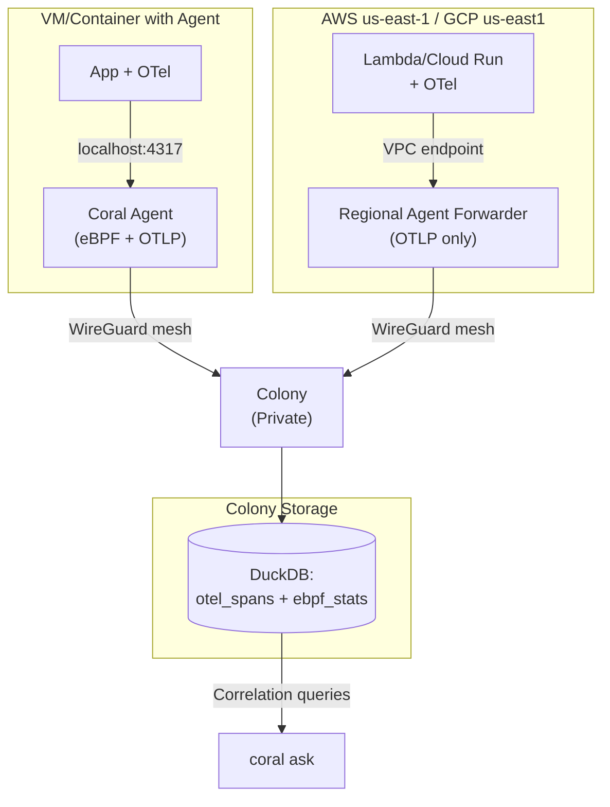

# RFD 025 - Basic OpenTelemetry Ingestion for Mixed Environments

**Status:** 🚧 Draft

## Summary

Enable Coral to observe serverless and containerized workloads where eBPF is
unavailable by accepting OpenTelemetry (OTel) data alongside existing eBPF
signals. Agents expose a localhost OTLP endpoint with simple static filtering,
allowing the AI to correlate application-level traces with kernel-level metrics.

## Problem

- **Current behavior/limitations**:
    - Coral relies on eBPF for observability, which is unavailable in Lambda,
      Cloud Run, Fargate, and many managed Kubernetes environments.
    - Teams with mixed architectures (VMs + serverless) cannot get unified AI
      insights across their entire stack.
    - Without application-level context, Coral can see network/CPU issues but
      cannot identify which business transactions are affected.

- **Why this matters**:
    - Modern deployments increasingly use serverless (30-50% of workloads in
      cloud-native environments).
    - Teams already instrument with OTel; asking them to choose between existing
      observability and Coral creates friction.
    - Correlation between "service X checkout is slow" (OTel) and "node Y CPU
      spiked" (eBPF) is manually intensive across separate tools.

- **Use cases affected**:
    - "Why is checkout slow?" queries that need both span latency (OTel) and
      host metrics (eBPF).
    - Serverless-heavy architectures where Coral currently provides zero
      visibility.
    - Air-gapped deployments needing local observability aggregation.

## Solution

**Core principle:** Accept OTel data without reinventing telemetry
infrastructure. Agents become an *additional* OTLP export target, not a
replacement for primary observability.

**Key Design Decisions:**

1. **Localhost OTLP endpoint**: Agents expose `127.0.0.1:4317` (gRPC) and
   `127.0.0.1:4318` (HTTP). Applications add Coral as a fan-out target in their
   existing OTel exporter config.

2. **Static filtering only**: Simple rules (errors always, latency >500ms, 10%
   of normal requests). No adaptive sampling, no control loops. Predictable and
   debuggable.

3. **Time-bucketed aggregation**: Agents summarize telemetry into 1-minute
   buckets before forwarding. Colony stores summaries (not raw spans) alongside
   eBPF data, enabling correlation via `(agent_id, timestamp)`.

4. **Regional agent forwarders for serverless**: Persistent agents deployed in
   each serverless region act as OTLP collectors. Lambda and Cloud Run functions
   export to regional agents via VPC private endpoints, agents forward to colony
   via WireGuard mesh.

**Benefits:**

- Coral can observe mixed environments (Kubernetes eBPF + Lambda OTel).
- AI correlates application errors with infrastructure issues.
- Zero disruption to existing Honeycomb/Grafana pipelines.
- Simple operational model: static config, no feedback loops.

**Architecture Overview:**



## Component Changes

1. **Agent**
    - Embed OTLP gRPC/HTTP receiver (using `go.opentelemetry.io/collector`),
      disabled by default via `agent.telemetry.enabled: false`.
    - Apply static filters (configured in `agent.yaml`): error spans,
      high-latency spans, sample rate for normal spans.
    - Aggregate spans into 1-minute buckets:
      `(service, p50/p95/p99 latency, error_count, trace_ids[])`.
    - Forward buckets to colony over existing mesh connection (RFD 022).

2. **Colony**
    - Add `otel_spans` DuckDB table (schema below) with 24-hour TTL.
    - Receive aggregated OTel buckets from agents over WireGuard mesh (existing
      RPC channels).
    - Expose correlation queries to AI: "SELECT otel + eBPF WHERE agent_id = X
      AND bucket = Y".

3. **Regional Agent Forwarder** (for serverless environments)
    - Lightweight agent deployment (OTLP collection only, no eBPF).
    - Deploy per cloud region (e.g., `agent-forwarder-us-east-1`).
    - Expose OTLP endpoint via VPC PrivateLink (AWS) or Private Service Connect
      (GCP).
    - Apply same static filters as regular agents.
    - Forward aggregated buckets to colony via WireGuard mesh.
    - Stateless and horizontally scalable.

4. **CLI**
    - `coral ask` queries include OTel citations when available: "checkout p99
      latency = 950ms (trace abc123)".
    - No new commands; OTel data appears automatically in responses.

## Database Schema

**Migration `007-otel-basic.sql`**

```sql
CREATE TABLE otel_spans
(
    bucket_time   TIMESTAMP NOT NULL, -- 1-minute aligned bucket
    agent_id      TEXT      NOT NULL,
    service_name  TEXT      NOT NULL,
    span_kind     TEXT,               -- CLIENT, SERVER, INTERNAL
    p50_ms        DOUBLE PRECISION,
    p95_ms        DOUBLE PRECISION,
    p99_ms        DOUBLE PRECISION,
    error_count   INTEGER   DEFAULT 0,
    total_spans   INTEGER   DEFAULT 0,
    sample_traces TEXT[],             -- Up to 5 representative trace IDs
    created_at    TIMESTAMP DEFAULT CURRENT_TIMESTAMP
);

CREATE INDEX idx_otel_spans_lookup
    ON otel_spans (agent_id, bucket_time, service_name);

-- TTL: DELETE FROM otel_spans WHERE bucket_time < NOW() - INTERVAL '24 HOURS';
```

**Correlation example:**

```sql
-- "Why was checkout slow at 14:23?"
SELECT e.cpu_pct,
       e.network_rx_mbps,
       o.p99_ms,
       o.error_count,
       o.sample_traces
FROM ebpf_stats e
         JOIN otel_spans o ON e.agent_id = o.agent_id
    AND e.bucket_time = o.bucket_time
WHERE o.service_name = 'checkout'
  AND o.bucket_time = '2024-11-08 14:23:00'
  AND o.p99_ms > 500;
```

## Implementation Plan

### Phase 1: Agent OTLP Receiver

- [ ] Embed OTel Collector receiver components in agent.
- [ ] Add config schema: `agent.telemetry.enabled`, `agent.telemetry.filters`.
- [ ] Implement static filtering: errors, latency threshold, sample rate.
- [ ] Aggregate spans into 1-minute buckets per service.
- [ ] Write `007-otel-basic` migration.

### Phase 2: Colony Storage & Correlation

- [ ] Add `otel_spans` DuckDB table to colony.
- [ ] Implement gRPC handler to receive aggregated buckets from agents.
- [ ] Implement 24-hour TTL cleanup job.
- [ ] Add correlation query helpers for AI context (join otel_spans +
  ebpf_stats).

### Phase 3: Regional Forwarder for Serverless

- [ ] Add `--mode=forwarder` flag to agent binary (OTLP only, no eBPF).
- [ ] Document regional forwarder deployment (AWS PrivateLink, GCP PSC).
- [ ] Provide Terraform modules for regional forwarder + VPC endpoints.
- [ ] Test Lambda → VPC endpoint → forwarder → colony mesh flow.
- [ ] Document OTel exporter config for serverless functions.

### Phase 4: Testing & Documentation

- [ ] Unit tests for filtering and aggregation logic.
- [ ] Integration test: app → agent → colony → DuckDB.
- [ ] E2E test: "checkout slow" query returns OTel + eBPF correlation.
- [ ] Tutorial: "Add Coral to existing OTel setup".

## API Changes

### Agent Configuration

```yaml
agent:
    telemetry:
        enabled: false  # Opt-in per agent
        endpoint: "127.0.0.1:4317"
        filters:
            -   always_capture: errors
            -   always_capture: latency_gt_ms:500
            -   sample_rate: 0.10  # 10% of normal spans
```

### Protobuf Messages

```protobuf
// Agent → Colony telemetry data
message TelemetryBucket {
    string agent_id = 1;
    int64 bucket_time = 2;         // Unix timestamp (minute-aligned)
    string service_name = 3;
    string span_kind = 4;

    double p50_ms = 5;
    double p95_ms = 6;
    double p99_ms = 7;
    int32 error_count = 8;
    int32 total_spans = 9;
    repeated string sample_traces = 10;  // Max 5 trace IDs
}

message IngestTelemetryRequest {
    repeated TelemetryBucket buckets = 1;
}

message IngestTelemetryResponse {
    int32 accepted = 1;
    int32 rejected = 2;
    string message = 3;
}
```

### Application OTel Configuration

**For apps on agent-managed hosts:**

```yaml
# Go SDK example
exporters:
    otlp/honeycomb:
        endpoint: api.honeycomb.io:443
    otlp/coral:
        endpoint: localhost:4317
        tls:
            insecure: true

service:
    pipelines:
        traces:
            exporters: [ otlp/honeycomb, otlp/coral ]
```

**For serverless functions:**

```python
# Python Lambda example (AWS us-east-1)
from opentelemetry.exporter.otlp.proto.grpc.trace_exporter import
    OTLPSpanExporter
from opentelemetry.sdk.trace.export import BatchSpanProcessor

# Export to both Honeycomb and Coral regional forwarder
exporter_honeycomb = OTLPSpanExporter(endpoint="https://api.honeycomb.io")

# Regional agent forwarder endpoint (via VPC PrivateLink)
# Endpoint created via: aws ec2 create-vpc-endpoint --service-name coral-agent-forwarder-us-east-1
exporter_coral = OTLPSpanExporter(
    endpoint="coral-forwarder-us-east-1.vpce-1234567890abcdef0.vpce-svc-1234567890abcdef0.us-east-1.vpce.amazonaws.com:4317",
    insecure=True  # Within VPC, agent forwarder handles mTLS to colony
)

tracer_provider.add_span_processor(BatchSpanProcessor(exporter_honeycomb))
tracer_provider.add_span_processor(BatchSpanProcessor(exporter_coral))
```

**Regional forwarder deployment** (one per cloud region):

```bash
# Deploy agent forwarder in AWS us-east-1
coral agent serve \
  --mode=forwarder \
  --telemetry.enabled=true \
  --telemetry.endpoint=0.0.0.0:4317 \
  --colony.endpoint=<colony-wireguard-ip>:9000

# Expose via VPC PrivateLink for Lambda functions
aws ec2 create-vpc-endpoint-service-configuration \
  --network-load-balancer-arns <nlb-arn> \
  --acceptance-required
```

## Testing Strategy

### Unit Tests

- Filter logic: errors always captured, latency thresholds applied correctly.
- Aggregation: 100 spans → correct p50/p95/p99 buckets.
- Bucket alignment: spans at 14:23:45 and 14:23:58 → same bucket.

### Integration Tests

- Agent receives OTLP spans → forwards aggregated buckets to colony.
- Colony stores buckets in DuckDB with correct schema.
- TTL cleanup removes 25-hour-old data.

### E2E Tests

- Instrumented app on VM sends spans to localhost:4317, agent forwards to
  colony.
- `coral ask "why is checkout slow"` returns: "checkout p99=950ms at 14:23 (
  traces: abc, def), CPU 85% on agent-xyz".
- Lambda function exports to regional forwarder via VPC endpoint, forwarder
  forwards to colony via mesh, data appears in AI queries.

## Security Considerations

- **Localhost binding**: OTLP receiver binds to `127.0.0.1` by default. Remote
  access requires explicit config and firewall rules.
- **PII in spans**: Document attribute scrubbing patterns. Agents can drop
  attributes matching regex (e.g., `email`, `ssn`).
- **Serverless authentication**: Serverless functions export to regional
  forwarders via VPC endpoints (no authentication needed within VPC). Forwarders
  authenticate to colony using step-ca client certs (RFD 022) over WireGuard
  mesh.
- **Data retention**: 24-hour TTL minimizes exposure. No long-term PII storage.

## Migration Strategy

1. **Rollout**:
    - Deploy agents with `telemetry.enabled: false` (no behavior change).
    - Operators opt in per agent/environment by setting `enabled: true`.
    - Update app OTel configs to add `localhost:4317` as export target.
    - **(Optional) Serverless**: Deploy regional forwarders in each cloud
      region,
      configure VPC endpoints, update Lambda/Cloud Run OTel exporters.

2. **Backward compatibility**:
    - No breaking changes. Agents without telemetry config continue eBPF-only
      operation.
    - Colony gracefully handles agents with/without OTel data.
    - Regional forwarders are optional; deploy only if serverless workloads
      exist.

3. **Rollback**:
    - Set `telemetry.enabled: false` and restart agents.
    - Remove OTLP exporter from app configs.
    - Tear down regional forwarders (if deployed).
    - Data ages out in 24 hours; no manual cleanup needed.

## Future Enhancements

**Deferred to later RFDs:**

- **Adaptive sampling**: Dynamic sampling based on AI query patterns (RFD 024
  concept).
- **Metrics ingestion**: Currently traces only; add OTLP metrics support.
- **Logs correlation**: Ingest OTLP logs and link to traces/metrics.
- **Multi-language SDKs**: If standard exporters prove insufficient for
  serverless.
- **Real-time streaming**: Current design batches every 60s; explore sub-second
  latency.

---

## Rationale for Simplifications

This RFD intentionally omits complexity from RFD 024:

- **No adaptive sampling**: Static 10% sampling is predictable. Adaptive
  sampling adds control loops, latency, and edge cases (what if sampling changes
  mid-incident?).
- **No custom SDKs**: Standard OTel exporters work. Build SDKs only if adoption
  proves they're needed.
- **Aggregation, not raw storage**: 1-minute buckets vs. raw spans saves 95%
  storage and makes correlation queries fast. Detailed traces stay in primary
  observability.
- **24-hour retention**: AI queries are investigative, not long-term analytics.
  For historical queries, use Honeycomb/Grafana.

**Goal**: Prove correlation value with minimal operational burden. Add
complexity only when usage demonstrates clear need.
