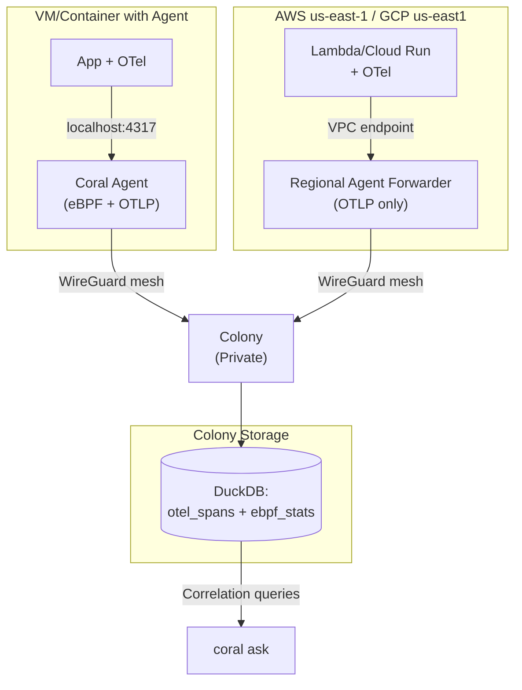

# RFD 025 - Basic OpenTelemetry Ingestion for Mixed Environments

**Status:** 🚧 Draft

## Summary

Enable Coral to observe serverless and containerized workloads where eBPF is
unavailable by accepting OpenTelemetry (OTel) data alongside existing eBPF
signals. Agents expose a localhost OTLP endpoint with simple static filtering,
allowing the AI to correlate application-level traces with kernel-level metrics.

## Problem

- **Current behavior/limitations**:
    - Coral relies on eBPF for observability, which is unavailable in Lambda,
      Cloud Run, Fargate, and many managed Kubernetes environments.
    - Teams with mixed architectures (VMs + serverless) cannot get unified AI
      insights across their entire stack.
    - Without application-level context, Coral can see network/CPU issues but
      cannot identify which business transactions are affected.

- **Why this matters**:
    - Modern deployments increasingly use serverless (30-50% of workloads in
      cloud-native environments).
    - Teams already instrument with OTel; asking them to choose between existing
      observability and Coral creates friction.
    - Correlation between "service X checkout is slow" (OTel) and "node Y CPU
      spiked" (eBPF) is manually intensive across separate tools.

- **Use cases affected**:
    - "Why is checkout slow?" queries that need both span latency (OTel) and
      host metrics (eBPF).
    - Serverless-heavy architectures where Coral currently provides zero
      visibility.
    - Air-gapped deployments needing local observability aggregation.

## Solution

**Core principle:** Accept OTel data without reinventing telemetry
infrastructure. Agents become an *additional* OTLP export target, not a
replacement for primary observability.

**Key Design Decisions:**

1. **Localhost OTLP endpoint**: Agents expose `127.0.0.1:4317` (gRPC) and
   `127.0.0.1:4318` (HTTP). Applications add Coral as a fan-out target in their
   existing OTel exporter config.

2. **Static filtering only**: Simple rules (errors always, latency >500ms, 10%
   of normal requests). No adaptive sampling, no control loops. Predictable and
   debuggable.

3. **Time-bucketed aggregation**: Agents summarize telemetry into 1-minute
   buckets before forwarding. Colony stores summaries (not raw spans) alongside
   eBPF data, enabling correlation via `(agent_id, timestamp)`.

4. **Regional agent forwarders for serverless**: Persistent agents deployed in
   each serverless region act as OTLP collectors. Lambda and Cloud Run functions
   export to regional agents via VPC private endpoints, agents forward to colony
   via WireGuard mesh.

**Benefits:**

- Coral can observe mixed environments (Kubernetes eBPF + Lambda OTel).
- AI correlates application errors with infrastructure issues.
- Zero disruption to existing Honeycomb/Grafana pipelines.
- Simple operational model: static config, no feedback loops.

**Architecture Overview:**



## Deployment Patterns

Coral supports three distinct OTel ingestion patterns optimized for different
environments.

### Architecture Overview

**Key principle:** Coral receives OTel data via OTLP endpoints, not per-pod
sidecars.

**Integration options:**

1. **Direct export**: Applications fan-out to [Honeycomb, Coral] directly
2. **Via existing collector**: App → Your OTel Collector → [Honeycomb, Coral]

**Deployment patterns:**

- **Native/VM**: Agent on each host, apps export to `localhost:4317`
- **Kubernetes**: Centralized collector service, apps export to
  `coral-otel.namespace:4317`
- **Serverless**: Regional forwarders (per AWS region), functions export via VPC
  endpoint

---

### Pattern 1: Native/VM Deployments (localhost)

**Use case:** Traditional VMs, bare metal, development machines

```
┌─────────────────────────────────────┐
│ Host                                │
│  ┌──────────┐    localhost:4317     │
│  │   app    │ ─────────────────>    │
│  └──────────┘                       │
│  ┌──────────────────┐               │
│  │ coral-agent      │               │
│  │ (eBPF + OTLP)    │               │
│  └──────────────────┘               │
└─────────────────────────────────────┘
```

**Integration:** Applications with OTel SDK export directly to local agent:

```yaml
# Application OTel SDK config
exporters:
    otlp/honeycomb:
        endpoint: api.honeycomb.io:443
    otlp/coral:
        endpoint: localhost:4317 # Local Coral agent
        tls:
            insecure: true

service:
    pipelines:
        traces:
            exporters: [ otlp/honeycomb, otlp/coral ]
```

**Why this works:** Coral agent runs on same host, localhost networking is
available. No existing OTel Collector needed - applications fan-out directly to
both backends.

---

### Pattern 2: Kubernetes Deployments (cluster-wide service)

**Use case:** Containerized apps in Kubernetes (preferred for K8s)

```
┌──────────────────┐   ┌──────────────────┐   ┌──────────────────┐
│ Pod 1: app       │   │ Pod 2: app       │   │ Pod 3: app       │
└────────┬─────────┘   └────────┬─────────┘   └────────┬─────────┘
         │                      │                       │
         └──────────────────────┴───────────────────────┘
                                │
                    coral-otel.coral-system:4317
                                │
                    ┌───────────▼────────────┐
                    │ Kubernetes Service     │
                    └───────────┬────────────┘
                                │
                    ┌───────────▼────────────┐
                    │ OTel Collector Pool    │
                    │ (Deployment/StatefulSet│
                    └───────────┬────────────┘
                                │
                                │ WireGuard mesh
                                ▼
                    ┌────────────────────────┐
                    │       Colony           │
                    └────────────────────────┘
```

**Installation:**

```yaml
# Deploy cluster-wide OTel collector
apiVersion: v1
kind: Service
metadata:
    name: coral-otel
    namespace: coral-system
spec:
    selector:
        app: coral-otel-collector
    ports:
        -   name: otlp-grpc
            port: 4317
        -   name: otlp-http
            port: 4318

---
apiVersion: apps/v1
kind: Deployment
metadata:
    name: coral-otel-collector
    namespace: coral-system
spec:
    template:
        spec:
            containers:
                -   name: collector
                    image: coral-io/agent:latest
                    args:
                        - agent
                        - serve
                        - --mode=otel-collector
                        - --telemetry.enabled=true
                        - --telemetry.endpoint=0.0.0.0:4317
                        - --colony.endpoint=colony.coral-system:9000
                    ports:
                        -   containerPort: 4317
                        -   containerPort: 4318
```

**Integration patterns:**

There are two ways to integrate Coral OTel collector with your existing
observability stack:

```
Option A: Direct Export (Greenfield)
┌─────────┐     ┌─────────┐     ┌─────────┐
│ Pod 1   │     │ Pod 2   │     │ Pod 3   │
│ + OTel  │     │ + OTel  │     │ + OTel  │
└────┬────┘     └────┬────┘     └────┬────┘
     ├───────────────┼───────────────┤
     ↓               ↓               ↓
 Honeycomb       Coral OTel      Honeycomb
                 Collector

Apps fan-out to both backends directly


Option B: Via Existing OTel Collector (Recommended)
┌─────────┐     ┌─────────┐     ┌─────────┐
│ Pod 1   │     │ Pod 2   │     │ Pod 3   │
│ + OTel  │     │ + OTel  │     │ + OTel  │
└────┬────┘     └────┬────┘     └────┬────┘
     └───────────────┼───────────────┘
                     ↓
         ┌───────────────────────┐
         │ Existing OTel         │
         │ Collector             │
         │ (monitoring namespace)│
         └───────────┬───────────┘
                     ├───────────────┐
                     ↓               ↓
                 Honeycomb       Coral OTel
                                 Collector

Apps → Existing collector → Fan-out
```

#### Option A: Direct Application Export (Greenfield)

Applications with OTel SDK export directly to both backends:

```yaml
# Application OTel SDK config (Go, Python, Java, etc.)
exporters:
    otlp/honeycomb:
        endpoint: api.honeycomb.io:443
    otlp/coral:
        endpoint: coral-otel.coral-system:4317 # Coral collector
        tls:
            insecure: true # Within cluster

service:
    pipelines:
        traces:
            exporters: [ otlp/honeycomb, otlp/coral ]
```

**Use when:**

- No existing OTel Collector in cluster
- Greenfield deployments
- Applications already using OTel SDK

#### Option B: Via Existing OTel Collector (Recommended)

If you already have an OTel Collector, add Coral as an additional exporter:

```yaml
# Existing OTel Collector config (NOT Coral collector)
# File: otel-collector-config.yaml
receivers:
    otlp:
        protocols:
            grpc: { }
            http: { }

exporters:
    otlp/honeycomb: # Existing exporter
        endpoint: api.honeycomb.io:443
        headers:
            x-honeycomb-team: ${HONEYCOMB_API_KEY}

    otlp/coral: # NEW: Add Coral
        endpoint: coral-otel.coral-system:4317
        tls:
            insecure: true

service:
    pipelines:
        traces:
            receivers: [ otlp ]
            exporters: [ otlp/honeycomb, otlp/coral ] # Fan-out
```

**Applications remain unchanged:**

```yaml
# Apps continue sending to existing collector
exporters:
    otlp:
        endpoint: otel-collector.monitoring:4317 # Existing collector
```

**Use when:**

- OTel Collector already deployed (most production clusters)
- Centralized telemetry configuration
- Don't want to modify application configs

---

**Key distinction:**

- **Coral OTel Collector** (`coral-otel.coral-system:4317`): Coral agent running
  in `--mode=otel-collector`. Receives OTLP, filters, aggregates, forwards to
  Colony.
- **Existing OTel Collector** (e.g., `otel-collector.monitoring:4317`): Your
  existing collector (vanilla OTel, Grafana Agent, etc.). Add Coral as an
  exporter.

**Both collectors can coexist:** Existing collector fans out to Honeycomb +
Coral collector. Coral collector then forwards to Colony.

---

**Why NOT per-pod sidecars:**

- ❌ High overhead: 50MB per pod × N pods
- ❌ Many agents: N agents instead of 1
- ❌ Redundant: OTel collection doesn't need per-pod isolation
- ✅ Centralized: Handles entire cluster efficiently
- ✅ Lower cost: ~150MB total vs 50MB × N

**Note:** This pattern is ONLY for OTel ingestion. If you need exec/shell
capabilities, those still require per-pod sidecars (see RFD 027 -
Client-Side K8s Installation).

---

### Pattern 3: Serverless Deployments (regional forwarder)

**Use case:** AWS Lambda, Google Cloud Run, Azure Functions

```
┌────────────────────────────────────────────┐
│ AWS us-east-1 VPC                          │
│  ┌──────────────┐   ┌──────────────┐      │
│  │ Lambda 1     │   │ Lambda 2     │      │
│  └─────┬────────┘   └─────┬────────┘      │
│        │                  │                │
│        └──────────────────┘                │
│                │                           │
│    VPC Endpoint (PrivateLink)              │
│                │                           │
│  ┌─────────────▼──────────────┐           │
│  │ Regional Agent Forwarder   │           │
│  │ (ECS/EKS, 2 replicas)      │           │
│  └─────────────┬──────────────┘           │
└────────────────┼───────────────────────────┘
                 │
                 │ WireGuard mesh
                 ▼
     ┌────────────────────────┐
     │       Colony           │
     └────────────────────────┘
```

**Lambda function config:**

```python
# Python Lambda example
from opentelemetry.exporter.otlp.proto.grpc.trace_exporter import
    OTLPSpanExporter

# Primary observability (Honeycomb)
exporter_honeycomb = OTLPSpanExporter(
    endpoint="https://api.honeycomb.io"
)

# Coral regional forwarder (via VPC PrivateLink)
exporter_coral = OTLPSpanExporter(
    endpoint="coral-forwarder-us-east-1.vpce-abc123.vpce-svc-xyz789.us-east-1.vpce.amazonaws.com:4317",
    insecure=True  # Within VPC
)

tracer_provider.add_span_processor(BatchSpanProcessor(exporter_honeycomb))
tracer_provider.add_span_processor(BatchSpanProcessor(exporter_coral))
```

**Regional forwarder deployment:**

```bash
# Deploy regional forwarder (one per AWS region)
coral agent serve \
  --mode=forwarder \
  --telemetry.enabled=true \
  --telemetry.endpoint=0.0.0.0:4317 \
  --colony.endpoint=<colony-wireguard-ip>:9000

# Expose via AWS PrivateLink
aws ec2 create-vpc-endpoint-service-configuration \
  --network-load-balancer-arns <nlb-arn> \
  --acceptance-required
```

**Why regional forwarders:**

- Lambda/Cloud Run cannot run persistent agents
- Outbound-only networking (cannot receive connections)
- VPC endpoints keep traffic private
- Regional deployment reduces latency
- Stateless and horizontally scalable

---

### Pattern Comparison

| Pattern         | Use Case   | Endpoint                        | Overhead     | HA    |
|-----------------|------------|---------------------------------|--------------|-------|
| **localhost**   | Native/VM  | `localhost:4317`                | 50MB/host    | N/A   |
| **K8s Service** | Kubernetes | `coral-otel.namespace:4317`     | 150MB total  | ✅ Yes |
| **Regional**    | Serverless | `forwarder-region.vpc.aws:4317` | 100MB/region | ✅ Yes |
| ~~K8s Sidecar~~ | ❌ Not rec  | `localhost:4317`                | 50MB × pods  | ❌ No  |

**Key Decision:** For Kubernetes environments, always use Pattern 2 (
cluster-wide service) for OTel ingestion. Per-pod sidecars are only needed for
exec/shell capabilities (RFD 027), not for telemetry collection.

## Component Changes

1. **Agent**
    - Embed OTLP gRPC/HTTP receiver (using `go.opentelemetry.io/collector`),
      disabled by default via `agent.telemetry.enabled: false`.
    - Support multiple operation modes:
        - `--mode=agent` (default): Full agent with optional OTel receiver
        - `--mode=otel-collector`: OTel-only mode (no eBPF, for K8s service
          deployment)
        - `--mode=forwarder`: OTel-only mode for serverless regional forwarders
    - Apply static filters (configured in `agent.yaml`): error spans,
      high-latency spans, sample rate for normal spans.
    - Aggregate spans into 1-minute buckets:
      `(service, p50/p95/p99 latency, error_count, trace_ids[])`.
    - Forward buckets to colony over existing mesh connection (RFD 022).

2. **Colony**
    - Add `otel_spans` DuckDB table (schema below) with 24-hour TTL.
    - Receive aggregated OTel buckets from agents over WireGuard mesh (existing
      RPC channels).
    - Expose correlation queries to AI: "SELECT otel + eBPF WHERE agent_id = X
      AND bucket = Y".

3. **Kubernetes OTel Collector** (for K8s environments)
    - Centralized collector deployment (optional: 3 replicas for HA).
    - Exposed via Kubernetes Service (ClusterIP).
    - Runs agent in `--mode=otel-collector` (OTLP only, no eBPF).
    - Apply same static filters as regular agents.
    - Forward aggregated buckets to colony via WireGuard mesh.
    - Stateless and horizontally scalable.

4. **Regional Agent Forwarder** (for serverless environments)
    - Lightweight agent deployment (OTLP collection only, no eBPF).
    - Deploy per cloud region (e.g., `agent-forwarder-us-east-1`).
    - Expose OTLP endpoint via VPC PrivateLink (AWS) or Private Service Connect
      (GCP).
    - Runs agent in `--mode=forwarder` (same as otel-collector).
    - Apply same static filters as regular agents.
    - Forward aggregated buckets to colony via WireGuard mesh.
    - Stateless and horizontally scalable.

5. **CLI**
    - `coral ask` queries include OTel citations when available: "checkout p99
      latency = 950ms (trace abc123)".
    - No new commands; OTel data appears automatically in responses.

## Database Schema

**Migration `007-otel-basic.sql`**

```sql
CREATE TABLE otel_spans
(
    bucket_time   TIMESTAMP NOT NULL, -- 1-minute aligned bucket
    agent_id      TEXT      NOT NULL,
    service_name  TEXT      NOT NULL,
    span_kind     TEXT,               -- CLIENT, SERVER, INTERNAL
    p50_ms        DOUBLE PRECISION,
    p95_ms        DOUBLE PRECISION,
    p99_ms        DOUBLE PRECISION,
    error_count   INTEGER   DEFAULT 0,
    total_spans   INTEGER   DEFAULT 0,
    sample_traces TEXT[],             -- Up to 5 representative trace IDs
    created_at    TIMESTAMP DEFAULT CURRENT_TIMESTAMP
);

CREATE INDEX idx_otel_spans_lookup
    ON otel_spans (agent_id, bucket_time, service_name);

-- TTL: DELETE FROM otel_spans WHERE bucket_time < NOW() - INTERVAL '24 HOURS';
```

**Correlation example:**

```sql
-- "Why was checkout slow at 14:23?"
SELECT e.cpu_pct,
       e.network_rx_mbps,
       o.p99_ms,
       o.error_count,
       o.sample_traces
FROM ebpf_stats e
         JOIN otel_spans o ON e.agent_id = o.agent_id
    AND e.bucket_time = o.bucket_time
WHERE o.service_name = 'checkout'
  AND o.bucket_time = '2024-11-08 14:23:00'
  AND o.p99_ms > 500;
```

## Implementation Plan

### Phase 1: Agent OTLP Receiver

- [ ] Embed OTel Collector receiver components in agent.
- [ ] Add config schema: `agent.telemetry.enabled`, `agent.telemetry.filters`.
- [ ] Implement static filtering: errors, latency threshold, sample rate.
- [ ] Aggregate spans into 1-minute buckets per service.
- [ ] Write `007-otel-basic` migration.

### Phase 2: Colony Storage & Correlation

- [ ] Add `otel_spans` DuckDB table to colony.
- [ ] Implement gRPC handler to receive aggregated buckets from agents.
- [ ] Implement 24-hour TTL cleanup job.
- [ ] Add correlation query helpers for AI context (join otel_spans +
  ebpf_stats).

### Phase 3: Kubernetes Collector Deployment

- [ ] Add `--mode=otel-collector` flag to agent binary (OTLP only, no eBPF).
- [ ] Create Kubernetes manifests (Service + Deployment) for cluster-wide
  collector.
- [ ] Document K8s collector installation (Helm chart optional).
- [ ] Test app pod → coral-otel.namespace:4317 → colony flow.
- [ ] Provide deployment examples for different namespaces.

### Phase 4: Regional Forwarder for Serverless

- [ ] Add `--mode=forwarder` flag to agent binary (OTLP only, no eBPF).
- [ ] Document regional forwarder deployment (AWS PrivateLink, GCP PSC).
- [ ] Provide Terraform modules for regional forwarder + VPC endpoints.
- [ ] Test Lambda → VPC endpoint → forwarder → colony mesh flow.
- [ ] Document OTel exporter config for serverless functions.

### Phase 5: Testing & Documentation

- [ ] Unit tests for filtering and aggregation logic.
- [ ] Integration test: app → agent → colony → DuckDB.
- [ ] E2E test: "checkout slow" query returns OTel + eBPF correlation.
- [ ] Tutorial: "Add Coral to existing OTel setup".

## API Changes

### Agent Configuration

```yaml
agent:
    telemetry:
        enabled: false  # Opt-in per agent
        endpoint: "127.0.0.1:4317"
        filters:
            -   always_capture: errors
            -   always_capture: latency_gt_ms:500
            -   sample_rate: 0.10  # 10% of normal spans
```

### Protobuf Messages

```protobuf
// Agent → Colony telemetry data
message TelemetryBucket {
    string agent_id = 1;
    int64 bucket_time = 2;         // Unix timestamp (minute-aligned)
    string service_name = 3;
    string span_kind = 4;

    double p50_ms = 5;
    double p95_ms = 6;
    double p99_ms = 7;
    int32 error_count = 8;
    int32 total_spans = 9;
    repeated string sample_traces = 10;  // Max 5 trace IDs
}

message IngestTelemetryRequest {
    repeated TelemetryBucket buckets = 1;
}

message IngestTelemetryResponse {
    int32 accepted = 1;
    int32 rejected = 2;
    string message = 3;
}
```

### Application OTel Configuration

**For apps on agent-managed hosts:**

```yaml
# Go SDK example
exporters:
    otlp/honeycomb:
        endpoint: api.honeycomb.io:443
    otlp/coral:
        endpoint: localhost:4317
        tls:
            insecure: true

service:
    pipelines:
        traces:
            exporters: [ otlp/honeycomb, otlp/coral ]
```

**For serverless functions:**

```python
# Python Lambda example (AWS us-east-1)
from opentelemetry.exporter.otlp.proto.grpc.trace_exporter import

OTLPSpanExporter
from opentelemetry.sdk.trace.export import BatchSpanProcessor

# Export to both Honeycomb and Coral regional forwarder
exporter_honeycomb = OTLPSpanExporter(endpoint="https://api.honeycomb.io")

# Regional agent forwarder endpoint (via VPC PrivateLink)
# Endpoint created via: aws ec2 create-vpc-endpoint --service-name coral-agent-forwarder-us-east-1
exporter_coral = OTLPSpanExporter(
    endpoint="coral-forwarder-us-east-1.vpce-1234567890abcdef0.vpce-svc-1234567890abcdef0.us-east-1.vpce.amazonaws.com:4317",
    insecure=True  # Within VPC, agent forwarder handles mTLS to colony
)

tracer_provider.add_span_processor(BatchSpanProcessor(exporter_honeycomb))
tracer_provider.add_span_processor(BatchSpanProcessor(exporter_coral))
```

**Regional forwarder deployment** (one per cloud region):

```bash
# Deploy agent forwarder in AWS us-east-1
coral agent serve \
  --mode=forwarder \
  --telemetry.enabled=true \
  --telemetry.endpoint=0.0.0.0:4317 \
  --colony.endpoint=<colony-wireguard-ip>:9000

# Expose via VPC PrivateLink for Lambda functions
aws ec2 create-vpc-endpoint-service-configuration \
  --network-load-balancer-arns <nlb-arn> \
  --acceptance-required
```

## Testing Strategy

### Unit Tests

- Filter logic: errors always captured, latency thresholds applied correctly.
- Aggregation: 100 spans → correct p50/p95/p99 buckets.
- Bucket alignment: spans at 14:23:45 and 14:23:58 → same bucket.

### Integration Tests

- Agent receives OTLP spans → forwards aggregated buckets to colony.
- Colony stores buckets in DuckDB with correct schema.
- TTL cleanup removes 25-hour-old data.

### E2E Tests

- Instrumented app on VM sends spans to localhost:4317, agent forwards to
  colony.
- `coral ask "why is checkout slow"` returns: "checkout p99=950ms at 14:23 (
  traces: abc, def), CPU 85% on agent-xyz".
- Lambda function exports to regional forwarder via VPC endpoint, forwarder
  forwards to colony via mesh, data appears in AI queries.

## Security Considerations

- **Localhost binding**: OTLP receiver binds to `127.0.0.1` by default. Remote
  access requires explicit config and firewall rules.
- **PII in spans**: Document attribute scrubbing patterns. Agents can drop
  attributes matching regex (e.g., `email`, `ssn`).
- **Serverless authentication**: Serverless functions export to regional
  forwarders via VPC endpoints (no authentication needed within VPC). Forwarders
  authenticate to colony using step-ca client certs (RFD 022) over WireGuard
  mesh.
- **Data retention**: 24-hour TTL minimizes exposure. No long-term PII storage.

## Migration Strategy

1. **Rollout**:
    - Deploy agents with `telemetry.enabled: false` (no behavior change).
    - Operators opt in per agent/environment by setting `enabled: true`.
    - Update app OTel configs to add `localhost:4317` as export target.
    - **(Optional) Serverless**: Deploy regional forwarders in each cloud
      region,
      configure VPC endpoints, update Lambda/Cloud Run OTel exporters.

2. **Backward compatibility**:
    - No breaking changes. Agents without telemetry config continue eBPF-only
      operation.
    - Colony gracefully handles agents with/without OTel data.
    - Regional forwarders are optional; deploy only if serverless workloads
      exist.

3. **Rollback**:
    - Set `telemetry.enabled: false` and restart agents.
    - Remove OTLP exporter from app configs.
    - Tear down regional forwarders (if deployed).
    - Data ages out in 24 hours; no manual cleanup needed.

## Future Enhancements

**Deferred to later RFDs:**

### Endpoint Discovery via Discovery Service (High Priority)

**Problem:** Currently, applications must hardcode Coral OTel collector
endpoints:

```yaml
# Current: Manual configuration
exporters:
    otlp/coral:
        endpoint: coral-otel.coral-system:4317  # Hardcoded
```

For serverless, this is even more complex:

```python
# Lambda: Hardcoded VPC endpoint URL
exporter_coral = OTLPSpanExporter(
    endpoint="coral-forwarder-us-east-1.vpce-abc123.vpce-svc-xyz789.us-east-1.vpce.amazonaws.com:4317"
)
```

**Solution:** Extend discovery service (RFD 001/023) to provide OTLP endpoint
discovery.

**How it would work:**

```bash
# App startup: Query discovery service
curl https://discovery.coral.io/v1/otlp-endpoint \
  -H "Authorization: Bearer ${CORAL_BOOTSTRAP_TOKEN}"

# Response:
{
  "endpoint": "coral-forwarder-us-east-1.vpce-abc123:4317",
  "protocol": "grpc",
  "tls": {
    "insecure": true,  # Within VPC
    "ca_cert": null
  },
  "region": "us-east-1",
  "selection_reason": "closest_forwarder"
}
```

**Application config becomes:**

```yaml
# Environment variable set by startup script
exporters:
    otlp/coral:
        endpoint: ${CORAL_OTLP_ENDPOINT}  # From discovery
```

**Discovery logic:**

```
User location: AWS Lambda us-east-1
    ↓
Discovery service checks:
    1. Same region forwarder exists? → coral-forwarder-us-east-1
    2. Fallback to nearest region? → coral-forwarder-us-west-2
    3. Direct to colony? → colony.coral.io:4317
    ↓
Returns: coral-forwarder-us-east-1.vpce-abc123:4317
```

**Benefits:**

- ✅ **Zero hardcoded endpoints**: Apps query discovery, get dynamic endpoint
- ✅ **Multi-region support**: Discovery returns closest forwarder automatically
- ✅ **Environment-aware**: Returns `localhost:4317` for native, cluster service
  for K8s, forwarder for serverless
- ✅ **Failover**: Discovery can redirect to backup forwarder if primary down
- ✅ **Load balancing**: Discovery can distribute load across multiple forwarders

**Implementation sketch:**

```go
// Discovery service extension
type OTLPEndpointRequest struct {
Environment  string // "lambda", "kubernetes", "native"
Region       string // "us-east-1"
BootstrapToken string
}

type OTLPEndpointResponse struct {
Endpoint string // "coral-forwarder-us-east-1.vpce-xyz:4317"
Protocol string // "grpc" | "http"
TLS      TLSConfig
Region   string
SelectionReason string // "closest_forwarder", "direct_to_colony"
}

func (d *DiscoveryService) GetOTLPEndpoint(req OTLPEndpointRequest) (*OTLPEndpointResponse, error) {
// Validate bootstrap token
// Query registry for available forwarders in region
// Return closest/healthiest endpoint
}
```

**Client-side helper:**

```python
# Coral SDK helper (future)
from coral import get_otlp_endpoint

# Automatically queries discovery, caches result
endpoint = get_otlp_endpoint(
    bootstrap_token=os.getenv("CORAL_BOOTSTRAP_TOKEN")
)

exporter_coral = OTLPSpanExporter(endpoint=endpoint)
```

**Kubernetes integration:**

```yaml
# Init container queries discovery, writes endpoint to shared volume
apiVersion: v1
kind: Pod
metadata:
    name: myapp
spec:
    initContainers:
        -   name: coral-discover
            image: coral-io/discover:latest
            command: [ "coral", "discover", "otlp" ]
            env:
                -   name: CORAL_BOOTSTRAP_TOKEN
                    valueFrom:
                        secretKeyRef:
                            name: coral-bootstrap
                            key: token
            volumeMounts:
                -   name: coral-config
                    mountPath: /coral
    containers:
        -   name: app
            env:
                # Read endpoint discovered by init container
                -   name: CORAL_OTLP_ENDPOINT
                    value: "$(cat /coral/otlp-endpoint)"
            volumeMounts:
                -   name: coral-config
                    mountPath: /coral
    volumes:
        -   name: coral-config
            emptyDir: { }
```

**This should be a high-priority enhancement** as it dramatically simplifies
operational complexity, especially for multi-region and serverless deployments.

---

### Other Future Enhancements

- **Adaptive sampling**: Dynamic sampling based on AI query patterns (concept
  from superseded RFD 024, may be revisited).
- **Metrics ingestion**: Currently traces only; add OTLP metrics support.
- **Logs correlation**: Ingest OTLP logs and link to traces/metrics.
- **Multi-language SDKs**: If standard exporters prove insufficient for
  serverless.
- **Real-time streaming**: Current design batches every 60s; explore sub-second
  latency.

---

## Relationship to Client-Side K8s Installation (RFD 027)

**Important**: This RFD (025) defines OpenTelemetry ingestion architecture. RFD
027 covers sidecar injection for exec/shell capabilities. These are
**complementary but separate concerns**.

### Why Separate Concerns?

**OTel ingestion (RFD 025)** uses:

- Cluster-wide collector service (`coral-otel.namespace:4317`)
- Centralized deployment (optional: 3 replicas, HA)
- Efficient: ~150MB total for entire cluster
- All applications export to same service

**Exec/shell capabilities (RFD 027)** require:

- Per-pod sidecars (with `shareProcessNamespace` or CRI socket)
- Process-level visibility within each pod
- `CAP_SYS_PTRACE` capability (Baseline PodSecurity)
- Necessary for: `coral exec`, `coral shell`

### Deployment Best Practice

For complete Coral functionality in Kubernetes:

1. **Deploy OTel collector once** (this RFD):
   ```yaml
   kubectl apply -f https://coral.io/k8s/otel-collector.yaml
   ```

2. **Inject sidecars only where exec/shell needed** (RFD 027):
   ```bash
   # Only for workloads needing exec/shell
   coral inject deployment.yaml --profile=standard | kubectl apply -f -
   ```

Most applications only need #1 (OTel ingestion). Only deploy sidecars (#2) for
workloads requiring interactive debugging capabilities.

---

## Rationale for Simplifications

This RFD intentionally omits complexity from RFD 024:

- **No adaptive sampling**: Static 10% sampling is predictable. Adaptive
  sampling adds control loops, latency, and edge cases (what if sampling changes
  mid-incident?).
- **No custom SDKs**: Standard OTel exporters work. Build SDKs only if adoption
  proves they're needed.
- **Aggregation, not raw storage**: 1-minute buckets vs. raw spans saves 95%
  storage and makes correlation queries fast. Detailed traces stay in primary
  observability.
- **24-hour retention**: AI queries are investigative, not long-term analytics.
  For historical queries, use Honeycomb/Grafana.

**Goal**: Prove correlation value with minimal operational burden. Add
complexity only when usage demonstrates clear need.
P
