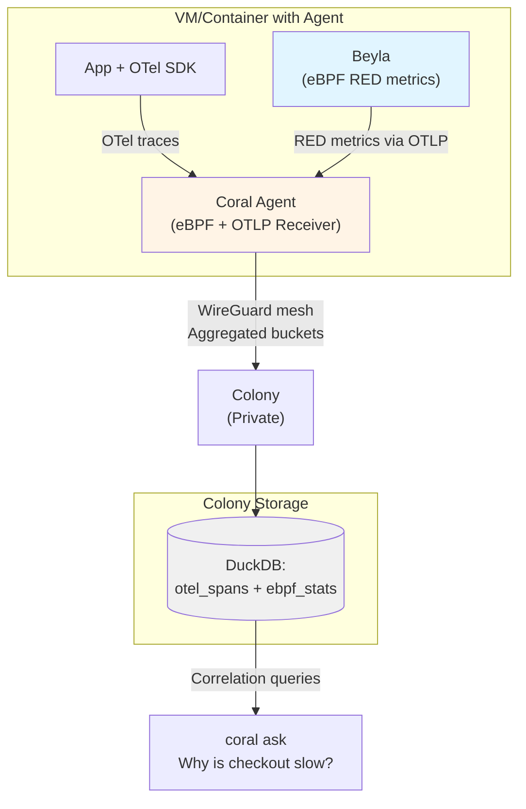

# RFD 025 - OpenTelemetry Ingestion for Observability Correlation

**Status:** 🚧 Draft

## Summary

Enable Coral agents to accept OpenTelemetry (OTel) data alongside eBPF signals, providing a unified data foundation for AI-driven correlation. Agents expose OTLP endpoints with static filtering and aggregation, allowing queries like "Why is checkout slow?" to combine application-level traces (from OTel SDKs and Beyla) with infrastructure metrics (from custom eBPF collectors).

## Problem

- **Current behavior/limitations**:
    - Coral collects eBPF metrics (network, CPU, syscalls) but lacks visibility into application-level behavior
    - Beyla (RFD 032) emits OpenTelemetry data, but Coral has no way to ingest it
    - Application traces from OTel SDKs cannot be correlated with Coral's eBPF data
    - The AI cannot answer questions like "Which API endpoint caused the CPU spike?" because it lacks application context

- **Why this matters**:
    - **Data correlation is Coral's core value**: Combining eBPF infrastructure metrics with application traces enables AI to diagnose issues that span multiple layers
    - **Beyla integration depends on this**: RFD 032's Beyla integration requires OTLP ingestion to receive RED (Rate, Errors, Duration) metrics
    - **Existing instrumentation reuse**: Teams already emit OTel from their applications; Coral should leverage this data rather than requiring separate instrumentation
    - **Unified observability pipeline**: Store eBPF and OTel data together in DuckDB, enabling powerful correlation queries

- **Use cases affected**:
    - **"Why is checkout slow?"** - AI needs both application span latency (OTel) and host CPU/network metrics (eBPF) to diagnose root cause
    - **Beyla RED metrics** - Ingest HTTP/gRPC latency and error rates from Beyla's OTLP export
    - **Custom application traces** - Correlate business transactions (e.g., "payment processing") with infrastructure events
    - **Multi-layer diagnostics** - Link "service X is slow" (app layer) to "disk I/O contention" (infrastructure layer)

## Solution

**Core principle:** Accept OTel data as an *additional* signal alongside eBPF metrics. Agents expose OTLP endpoints, apply static filtering, aggregate into time-aligned buckets, and store in DuckDB for correlation queries.

**Key Design Decisions:**

1. **OTLP endpoints**: Agents expose `localhost:4317` (gRPC) and `localhost:4318` (HTTP). Applications and Beyla export OTLP data to the local agent.

2. **Static filtering**: Simple rules (errors always captured, latency >500ms always captured, 10% sampling for normal spans). No adaptive sampling or control loops—predictable and debuggable.

3. **Time-bucketed aggregation**: Agents aggregate spans into 1-minute buckets with percentiles (p50, p95, p99) before forwarding to colony. This reduces data volume by ~95% while preserving correlation fidelity.

4. **Unified storage**: Colony stores OTel buckets alongside eBPF metrics in DuckDB, indexed by `(agent_id, timestamp, service_name)` for efficient correlation queries.

5. **Fan-out architecture**: Applications continue sending full traces to primary observability (Honeycomb, Grafana), while Coral receives filtered/aggregated copies for correlation.

**Benefits:**

- **Beyla integration**: RFD 032's Beyla can export RED metrics via OTLP to Coral agents
- **Application correlation**: AI can link "checkout API p99 latency = 950ms" (OTel) with "database connection pool exhausted" (eBPF)
- **Existing instrumentation**: Reuse OTel SDKs already deployed in applications
- **Zero disruption**: Coral is an additional export target, not a replacement for existing observability
- **Efficient storage**: 1-minute aggregation reduces colony storage by 95% vs. storing raw spans

**Architecture Overview:**



**Data flow:**
1. Application emits OTel traces → Coral agent (localhost:4317)
2. Beyla emits HTTP/gRPC RED metrics via OTLP → Coral agent (localhost:4317)
3. Agent filters + aggregates into 1-minute buckets
4. Agent forwards buckets to colony via WireGuard
5. Colony stores in DuckDB alongside eBPF metrics
6. AI correlates OTel + eBPF for "coral ask" queries

## Deployment Patterns

Coral supports two primary OTLP ingestion patterns. For serverless environments (Lambda, Cloud Run), see RFD 034.

### Architecture Overview

**Key principle:** Coral receives OTel data via OTLP endpoints, not per-pod
sidecars.

**Integration options:**

1. **Direct export**: Applications fan-out to [Honeycomb, Coral] directly
2. **Via existing collector**: App → Your OTel Collector → [Honeycomb, Coral]

**Deployment patterns:**

- **Native/VM**: Agent on each host, apps and Beyla export to `localhost:4317`
- **Kubernetes**: Centralized collector service, apps export to `coral-otel.namespace:4317`

**Note:** For serverless (AWS Lambda, Cloud Run, Azure Functions), see **RFD 034: Serverless OTLP Forwarding**

---

### Pattern 1: Native/VM Deployments (localhost)

**Use case:** Traditional VMs, bare metal, development machines

```
┌─────────────────────────────────────┐
│ Host                                │
│  ┌──────────┐    localhost:4317     │
│  │   app    │ ─────────────────>    │
│  └──────────┘                       │
│  ┌──────────────────┐               │
│  │ coral-agent      │               │
│  │ (eBPF + OTLP)    │               │
│  └──────────────────┘               │
└─────────────────────────────────────┘
```

**Integration:** Applications with OTel SDK export directly to local agent:

```yaml
# Application OTel SDK config
exporters:
    otlp/honeycomb:
        endpoint: api.honeycomb.io:443
    otlp/coral:
        endpoint: localhost:4317 # Local Coral agent
        tls:
            insecure: true

service:
    pipelines:
        traces:
            exporters: [ otlp/honeycomb, otlp/coral ]
```

**Why this works:** Coral agent runs on same host, localhost networking is
available. No existing OTel Collector needed - applications fan-out directly to
both backends.

---

### Pattern 2: Kubernetes Deployments (cluster-wide service)

**Use case:** Containerized apps in Kubernetes (preferred for K8s)

```
┌──────────────────┐   ┌──────────────────┐   ┌──────────────────┐
│ Pod 1: app       │   │ Pod 2: app       │   │ Pod 3: app       │
└────────┬─────────┘   └────────┬─────────┘   └────────┬─────────┘
         │                      │                       │
         └──────────────────────┴───────────────────────┘
                                │
                    coral-otel.coral-system:4317
                                │
                    ┌───────────▼────────────┐
                    │ Kubernetes Service     │
                    └───────────┬────────────┘
                                │
                    ┌───────────▼────────────┐
                    │ OTel Collector Pool    │
                    │ (Deployment/StatefulSet│
                    └───────────┬────────────┘
                                │
                                │ WireGuard mesh
                                ▼
                    ┌────────────────────────┐
                    │       Colony           │
                    └────────────────────────┘
```

**Installation:**

```yaml
# Deploy cluster-wide OTel collector
apiVersion: v1
kind: Service
metadata:
    name: coral-otel
    namespace: coral-system
spec:
    selector:
        app: coral-otel-collector
    ports:
        -   name: otlp-grpc
            port: 4317
        -   name: otlp-http
            port: 4318

---
apiVersion: apps/v1
kind: Deployment
metadata:
    name: coral-otel-collector
    namespace: coral-system
spec:
    template:
        spec:
            containers:
                -   name: collector
                    image: coral-io/agent:latest
                    args:
                        - agent
                        - serve
                        - --mode=otel-collector
                        - --telemetry.enabled=true
                        - --telemetry.endpoint=0.0.0.0:4317
                        - --colony.endpoint=colony.coral-system:9000
                    ports:
                        -   containerPort: 4317
                        -   containerPort: 4318
```

**Integration patterns:**

There are two ways to integrate Coral OTel collector with your existing
observability stack:

```
Option A: Direct Export (Greenfield)
┌─────────┐     ┌─────────┐     ┌─────────┐
│ Pod 1   │     │ Pod 2   │     │ Pod 3   │
│ + OTel  │     │ + OTel  │     │ + OTel  │
└────┬────┘     └────┬────┘     └────┬────┘
     ├───────────────┼───────────────┤
     ↓               ↓               ↓
 Honeycomb       Coral OTel      Honeycomb
                 Collector

Apps fan-out to both backends directly


Option B: Via Existing OTel Collector (Recommended)
┌─────────┐     ┌─────────┐     ┌─────────┐
│ Pod 1   │     │ Pod 2   │     │ Pod 3   │
│ + OTel  │     │ + OTel  │     │ + OTel  │
└────┬────┘     └────┬────┘     └────┬────┘
     └───────────────┼───────────────┘
                     ↓
         ┌───────────────────────┐
         │ Existing OTel         │
         │ Collector             │
         │ (monitoring namespace)│
         └───────────┬───────────┘
                     ├───────────────┐
                     ↓               ↓
                 Honeycomb       Coral OTel
                                 Collector

Apps → Existing collector → Fan-out
```

#### Option A: Direct Application Export (Greenfield)

Applications with OTel SDK export directly to both backends:

```yaml
# Application OTel SDK config (Go, Python, Java, etc.)
exporters:
    otlp/honeycomb:
        endpoint: api.honeycomb.io:443
    otlp/coral:
        endpoint: coral-otel.coral-system:4317 # Coral collector
        tls:
            insecure: true # Within cluster

service:
    pipelines:
        traces:
            exporters: [ otlp/honeycomb, otlp/coral ]
```

**Use when:**

- No existing OTel Collector in cluster
- Greenfield deployments
- Applications already using OTel SDK

#### Option B: Via Existing OTel Collector (Recommended)

If you already have an OTel Collector, add Coral as an additional exporter:

```yaml
# Existing OTel Collector config (NOT Coral collector)
# File: otel-collector-config.yaml
receivers:
    otlp:
        protocols:
            grpc: { }
            http: { }

exporters:
    otlp/honeycomb: # Existing exporter
        endpoint: api.honeycomb.io:443
        headers:
            x-honeycomb-team: ${HONEYCOMB_API_KEY}

    otlp/coral: # NEW: Add Coral
        endpoint: coral-otel.coral-system:4317
        tls:
            insecure: true

service:
    pipelines:
        traces:
            receivers: [ otlp ]
            exporters: [ otlp/honeycomb, otlp/coral ] # Fan-out
```

**Applications remain unchanged:**

```yaml
# Apps continue sending to existing collector
exporters:
    otlp:
        endpoint: otel-collector.monitoring:4317 # Existing collector
```

**Use when:**

- OTel Collector already deployed (most production clusters)
- Centralized telemetry configuration
- Don't want to modify application configs

---

**Key distinction:**

- **Coral OTel Collector** (`coral-otel.coral-system:4317`): Coral agent running
  in `--mode=otel-collector`. Receives OTLP, filters, aggregates, forwards to
  Colony.
- **Existing OTel Collector** (e.g., `otel-collector.monitoring:4317`): Your
  existing collector (vanilla OTel, Grafana Agent, etc.). Add Coral as an
  exporter.

**Both collectors can coexist:** Existing collector fans out to Honeycomb +
Coral collector. Coral collector then forwards to Colony.

---

**Why NOT per-pod sidecars:**

- ❌ High overhead: 50MB per pod × N pods
- ❌ Many agents: N agents instead of 1
- ❌ Redundant: OTel collection doesn't need per-pod isolation
- ✅ Centralized: Handles entire cluster efficiently
- ✅ Lower cost: ~150MB total vs 50MB × N

**Note:** This pattern is ONLY for OTel ingestion. If you need exec/shell
capabilities, those still require per-pod sidecars (see RFD 027 -
Client-Side K8s Installation).

---

### Pattern Comparison

| Pattern         | Use Case   | Endpoint                    | Overhead    | HA    |
|-----------------|------------|-----------------------------|-------------|-------|
| **localhost**   | Native/VM  | `localhost:4317`            | 50MB/host   | N/A   |
| **K8s Service** | Kubernetes | `coral-otel.namespace:4317` | 150MB total | ✅ Yes |
| ~~K8s Sidecar~~ | ❌ Not rec  | `localhost:4317`            | 50MB × pods | ❌ No  |

**Key Decisions:**
- **Kubernetes**: Always use Pattern 2 (cluster-wide service) for OTel ingestion. Per-pod sidecars are only needed for exec/shell capabilities (RFD 027), not for telemetry collection.
- **Serverless** (Lambda, Cloud Run): See **RFD 034: Serverless OTLP Forwarding** for regional forwarder architecture.

## Component Changes

1. **Agent**
    - Embed OTLP gRPC/HTTP receiver (using `go.opentelemetry.io/collector`), disabled by default via `agent.telemetry.enabled: false`
    - Support multiple operation modes:
        - `--mode=agent` (default): Full agent with optional OTLP receiver + eBPF collectors
        - `--mode=otel-collector`: OTLP-only mode (no eBPF, for K8s cluster-wide deployment)
    - Accept OTLP data from:
        - Application OTel SDKs (traces)
        - Beyla (HTTP/gRPC RED metrics via OTLP)
        - Other OTel collectors (fan-out)
    - Apply static filters (configured in `agent.yaml`): error spans, high-latency spans (>500ms), sample rate for normal spans (10%)
    - Aggregate spans into 1-minute buckets with percentiles: `(service, p50/p95/p99 latency, error_count, trace_ids[])`
    - Forward aggregated buckets to colony over WireGuard mesh (RFD 022)

2. **Colony**
    - Add `otel_spans` DuckDB table (schema below) with 24-hour TTL
    - Receive aggregated OTel buckets from agents over WireGuard mesh (existing RPC channels)
    - Store OTel data alongside eBPF metrics for correlation
    - Expose correlation queries to AI: "SELECT otel.p99_ms, ebpf.cpu_pct FROM otel_spans JOIN ebpf_stats WHERE agent_id = X AND bucket_time = Y"
    - Enable multi-layer diagnostics: link application latency with infrastructure metrics

3. **Kubernetes OTel Collector** (for K8s environments)
    - Centralized collector deployment (optional: 3 replicas for HA)
    - Exposed via Kubernetes Service (ClusterIP)
    - Runs agent in `--mode=otel-collector` (OTLP only, no eBPF)
    - Apply same static filters as regular agents
    - Forward aggregated buckets to colony via WireGuard mesh
    - Stateless and horizontally scalable

4. **CLI**
    - `coral ask` queries include OTel citations when available: "checkout p99 latency = 950ms (trace abc123, errors: 5)"
    - No new commands; OTel data appears automatically in AI responses
    - Correlation examples: "checkout p99=950ms + CPU 85% on agent-xyz" or "payment errors coincide with database connection timeouts"

## Database Schema

**Migration `007-otel-basic.sql`**

```sql
CREATE TABLE otel_spans
(
    bucket_time   TIMESTAMP NOT NULL, -- 1-minute aligned bucket
    agent_id      TEXT      NOT NULL,
    service_name  TEXT      NOT NULL,
    span_kind     TEXT,               -- CLIENT, SERVER, INTERNAL
    p50_ms        DOUBLE PRECISION,
    p95_ms        DOUBLE PRECISION,
    p99_ms        DOUBLE PRECISION,
    error_count   INTEGER   DEFAULT 0,
    total_spans   INTEGER   DEFAULT 0,
    sample_traces TEXT[],             -- Up to 5 representative trace IDs
    created_at    TIMESTAMP DEFAULT CURRENT_TIMESTAMP
);

CREATE INDEX idx_otel_spans_lookup
    ON otel_spans (agent_id, bucket_time, service_name);

-- TTL: DELETE FROM otel_spans WHERE bucket_time < NOW() - INTERVAL '24 HOURS';
```

**Correlation example:**

```sql
-- "Why was checkout slow at 14:23?"
SELECT e.cpu_pct,
       e.network_rx_mbps,
       o.p99_ms,
       o.error_count,
       o.sample_traces
FROM ebpf_stats e
         JOIN otel_spans o ON e.agent_id = o.agent_id
    AND e.bucket_time = o.bucket_time
WHERE o.service_name = 'checkout'
  AND o.bucket_time = '2024-11-08 14:23:00'
  AND o.p99_ms > 500;
```

## Implementation Plan

### Phase 1: Agent OTLP Receiver

- [ ] Embed OTel Collector receiver components in agent.
- [ ] Add config schema: `agent.telemetry.enabled`, `agent.telemetry.filters`.
- [ ] Implement static filtering: errors, latency threshold, sample rate.
- [ ] Aggregate spans into 1-minute buckets per service.
- [ ] Write `007-otel-basic` migration.

### Phase 2: Colony Storage & Correlation

- [ ] Add `otel_spans` DuckDB table to colony.
- [ ] Implement gRPC handler to receive aggregated buckets from agents.
- [ ] Implement 24-hour TTL cleanup job.
- [ ] Add correlation query helpers for AI context (join otel_spans +
  ebpf_stats).

### Phase 3: Kubernetes Collector Deployment

- [ ] Add `--mode=otel-collector` flag to agent binary (OTLP only, no eBPF).
- [ ] Create Kubernetes manifests (Service + Deployment) for cluster-wide
  collector.
- [ ] Document K8s collector installation (Helm chart optional).
- [ ] Test app pod → coral-otel.namespace:4317 → colony flow.
- [ ] Provide deployment examples for different namespaces.

### Phase 4: Beyla Integration & Correlation

- [ ] Test Beyla → agent OTLP ingestion flow (RFD 032).
- [ ] Implement correlation query helpers (join otel_spans + ebpf_stats).
- [ ] Add AI context builders that combine OTel + eBPF data.
- [ ] Validate RED metrics correlation (HTTP latency + CPU/network).
- [ ] Document Beyla → Coral integration pattern.

### Phase 5: Testing & Documentation

- [ ] Unit tests for filtering and aggregation logic.
- [ ] Integration test: app → agent → colony → DuckDB.
- [ ] E2E test: "checkout slow" query returns OTel + eBPF correlation.
- [ ] Beyla correlation test: HTTP RED metrics joined with infrastructure data.
- [ ] Tutorial: "Add Coral to existing OTel setup".

## API Changes

### Agent Configuration

```yaml
agent:
    telemetry:
        enabled: false  # Opt-in per agent
        endpoint: "127.0.0.1:4317"
        filters:
            -   always_capture: errors
            -   always_capture: latency_gt_ms:500
            -   sample_rate: 0.10  # 10% of normal spans
```

### Protobuf Messages

```protobuf
// Agent → Colony telemetry data
message TelemetryBucket {
    string agent_id = 1;
    int64 bucket_time = 2;         // Unix timestamp (minute-aligned)
    string service_name = 3;
    string span_kind = 4;

    double p50_ms = 5;
    double p95_ms = 6;
    double p99_ms = 7;
    int32 error_count = 8;
    int32 total_spans = 9;
    repeated string sample_traces = 10;  // Max 5 trace IDs
}

message IngestTelemetryRequest {
    repeated TelemetryBucket buckets = 1;
}

message IngestTelemetryResponse {
    int32 accepted = 1;
    int32 rejected = 2;
    string message = 3;
}
```

### Application OTel Configuration

**For apps on agent-managed hosts (VMs, containers):**

```yaml
# Go SDK example
exporters:
    otlp/honeycomb:
        endpoint: api.honeycomb.io:443
    otlp/coral:
        endpoint: localhost:4317
        tls:
            insecure: true

service:
    pipelines:
        traces:
            exporters: [ otlp/honeycomb, otlp/coral ]
```

**For Kubernetes deployments:**

```yaml
# Python SDK example
exporters:
    otlp/honeycomb:
        endpoint: api.honeycomb.io:443
    otlp/coral:
        endpoint: coral-otel.coral-system:4317
        tls:
            insecure: true  # Within cluster

service:
    pipelines:
        traces:
            exporters: [ otlp/honeycomb, otlp/coral ]
```

**For serverless functions (Lambda, Cloud Run, Azure Functions):** See **RFD 034: Serverless OTLP Forwarding** for regional forwarder deployment and configuration.

## Testing Strategy

### Unit Tests

- Filter logic: errors always captured, latency thresholds applied correctly.
- Aggregation: 100 spans → correct p50/p95/p99 buckets.
- Bucket alignment: spans at 14:23:45 and 14:23:58 → same bucket.

### Integration Tests

- Agent receives OTLP spans → forwards aggregated buckets to colony.
- Colony stores buckets in DuckDB with correct schema.
- TTL cleanup removes 25-hour-old data.

### E2E Tests

- Instrumented app on VM sends spans to localhost:4317, agent forwards to
  colony.
- `coral ask "why is checkout slow"` returns: "checkout p99=950ms at 14:23 (
  traces: abc, def), CPU 85% on agent-xyz".
- Beyla exports HTTP RED metrics to agent OTLP endpoint, data correlates with eBPF network metrics in AI queries.

## Security Considerations

- **Localhost binding**: OTLP receiver binds to `127.0.0.1` by default. Remote
  access requires explicit config and firewall rules.
- **Kubernetes cluster-internal**: Coral OTel collector service uses ClusterIP (not LoadBalancer), accessible only within cluster network.
- **PII in spans**: Document attribute scrubbing patterns. Agents can drop
  attributes matching regex (e.g., `email`, `ssn`).
- **Agent-to-colony authentication**: Agents authenticate to colony using step-ca client certs (RFD 022) over WireGuard mesh.
- **Data retention**: 24-hour TTL minimizes exposure. No long-term PII storage.

## Migration Strategy

1. **Rollout**:
    - Deploy agents with `telemetry.enabled: false` (no behavior change).
    - Operators opt in per agent/environment by setting `enabled: true`.
    - Update app OTel configs to add `localhost:4317` (VM/native) or `coral-otel.namespace:4317` (Kubernetes) as export target.
    - Enable Beyla OTLP export to Coral agents for HTTP/gRPC RED metrics (see RFD 032).

2. **Backward compatibility**:
    - No breaking changes. Agents without telemetry config continue eBPF-only
      operation.
    - Colony gracefully handles agents with/without OTel data.
    - Correlation queries degrade gracefully when OTel data is unavailable (fall back to eBPF-only insights).

3. **Rollback**:
    - Set `telemetry.enabled: false` and restart agents.
    - Remove OTLP exporter from app configs.
    - Data ages out in 24 hours; no manual cleanup needed.

## Future Enhancements

**Deferred to later RFDs:**

### Endpoint Discovery via Discovery Service

**Problem:** Applications must currently hardcode Coral OTel collector endpoints:

```yaml
# Current: Manual configuration
exporters:
    otlp/coral:
        endpoint: localhost:4317  # VMs
        # OR
        endpoint: coral-otel.coral-system:4317  # Kubernetes
```

**Solution:** Extend discovery service (RFD 001/023) to provide environment-aware OTLP endpoint discovery.

**How it would work:**

```bash
# App startup: Query discovery service
curl https://discovery.coral.io/v1/otlp-endpoint \
  -H "Authorization: Bearer ${CORAL_BOOTSTRAP_TOKEN}"

# Response for VM/native environment:
{
  "endpoint": "localhost:4317",
  "protocol": "grpc",
  "tls": {
    "insecure": true
  },
  "environment": "native",
  "selection_reason": "local_agent"
}

# Response for Kubernetes environment:
{
  "endpoint": "coral-otel.coral-system:4317",
  "protocol": "grpc",
  "tls": {
    "insecure": true
  },
  "environment": "kubernetes",
  "namespace": "coral-system",
  "selection_reason": "cluster_service"
}
```

**Benefits:**

- ✅ **Zero hardcoded endpoints**: Apps query discovery, get dynamic endpoint
- ✅ **Environment-aware**: Returns `localhost:4317` for native/VM, cluster service DNS for Kubernetes
- ✅ **Failover**: Discovery can redirect to backup collector if primary down
- ✅ **Simplified configuration**: Same application code works across environments

**Note:** For serverless endpoint discovery (regional forwarders, VPC endpoints), see **RFD 034: Serverless OTLP Forwarding**.

---

### Other Future Enhancements

- **Adaptive sampling**: Dynamic sampling based on AI query patterns (concept
  from superseded RFD 024, may be revisited).
- **Metrics ingestion**: Currently traces only; add OTLP metrics support.
- **Logs correlation**: Ingest OTLP logs and link to traces/metrics.
- **Real-time streaming**: Current design batches every 60s; explore sub-second
  latency.

---

## Relationship to Client-Side K8s Installation (RFD 027)

**Important**: This RFD (025) defines OpenTelemetry ingestion architecture. RFD
027 covers sidecar injection for exec/shell capabilities. These are
**complementary but separate concerns**.

### Why Separate Concerns?

**OTel ingestion (RFD 025)** uses:

- Cluster-wide collector service (`coral-otel.namespace:4317`)
- Centralized deployment (optional: 3 replicas, HA)
- Efficient: ~150MB total for entire cluster
- All applications export to same service

**Exec/shell capabilities (RFD 027)** require:

- Per-pod sidecars (with `shareProcessNamespace` or CRI socket)
- Process-level visibility within each pod
- `CAP_SYS_PTRACE` capability (Baseline PodSecurity)
- Necessary for: `coral exec`, `coral shell`

### Deployment Best Practice

For complete Coral functionality in Kubernetes:

1. **Deploy OTel collector once** (this RFD):
   ```yaml
   kubectl apply -f https://coral.io/k8s/otel-collector.yaml
   ```

2. **Inject sidecars only where exec/shell needed** (RFD 027):
   ```bash
   # Only for workloads needing exec/shell
   coral inject deployment.yaml --profile=standard | kubectl apply -f -
   ```

Most applications only need #1 (OTel ingestion). Only deploy sidecars (#2) for
workloads requiring interactive debugging capabilities.

---

## Rationale for Simplifications

This RFD intentionally omits complexity from RFD 024:

- **No adaptive sampling**: Static 10% sampling is predictable. Adaptive
  sampling adds control loops, latency, and edge cases (what if sampling changes
  mid-incident?).
- **No custom SDKs**: Standard OTel exporters work. Build SDKs only if adoption
  proves they're needed.
- **Aggregation, not raw storage**: 1-minute buckets vs. raw spans saves 95%
  storage and makes correlation queries fast. Detailed traces stay in primary
  observability.
- **24-hour retention**: AI queries are investigative, not long-term analytics.
  For historical queries, use Honeycomb/Grafana.

**Goal**: Prove correlation value with minimal operational burden. Add
complexity only when usage demonstrates clear need.
