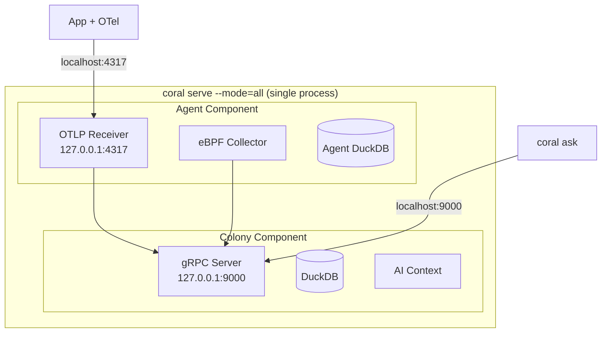

# RFD 026 - Multi-Role Single Binary for Desktop Development

**Status:** 🚧 Draft

## Summary

Enable the Coral binary to run both colony and agent roles simultaneously in a
single process, simplifying desktop development and local testing. Developers
can start a complete Coral environment with one command, eliminating the need to
deploy and configure separate colony and agent processes.

## Problem

- **Current behavior/limitations**:
    - Production deployment separates colony (central coordinator) and agents (
      host observers) into distinct processes.
    - Desktop developers need to run two separate processes (
      `coral colony serve`
        + `coral agent serve`) with separate configs.
    - Setting up local development requires understanding the colony-agent mesh,
      WireGuard networking, and coordination between processes.
    - Testing OTel ingestion (RFD 025) locally requires running agent for OTLP
      endpoint + colony for AI queries, increasing setup complexity.

- **Why this matters**:
    - Developer onboarding friction: "just run the binary" is simpler than "run
      two binaries and configure networking".
    - Local testing and demos need a simple "works offline" mode without network
      dependencies.
    - CI/CD integration tests benefit from single-process deployment (faster
      startup, easier resource management).

- **Use cases affected**:
    - Local development: developer wants to test app instrumentation with `coral
    ask` queries.
    - Demos and workshops: presenter wants reliable offline operation without
      cloud dependencies.
    - CI integration tests: GitHub Actions runners need ephemeral Coral
      environments.

## Solution

Add a `--mode=all` flag to the `coral serve` command that runs both colony and
agent components in the same process. Components communicate via in-process
channels (goroutines) or localhost loopback, avoiding network configuration.

**Key Design Decisions:**

1. **Single process, multiple goroutines**: Colony and agent run as separate
   goroutines within one process. Shared in-memory state where beneficial (e.g.,
   DuckDB connection pool).

2. **Unified configuration**: Single YAML config file with both colony and agent
   sections. Sensible defaults for local development (localhost only, no
   WireGuard setup needed).

3. **Loopback communication**: Agent OTLP endpoint on `127.0.0.1:4317`, colony
   gRPC on `127.0.0.1:9000`. Agent pushes data to colony via localhost RPC.

4. **No WireGuard in multi-role mode**: Skip WireGuard mesh setup when running
   all roles locally. Direct localhost communication is simpler and faster.

**Benefits:**

- One command to start: `coral serve --mode=all`
- Works offline (no discovery service, no public endpoints)
- Simplified testing (single process to start/stop)
- Same binary used in production (`--mode=colony` or `--mode=agent`)
- Lower resource usage than two separate processes

**Architecture Overview:**



## Component Changes

1. **CLI (`coral serve`)**
    - Add `--mode` flag: `colony` (default), `agent`, `all`
    - When `--mode=all`, start both colony and agent goroutines
    - Load unified config from `coral.yaml` with both sections

2. **Colony Component**
    - No changes to core logic
    - Accept `--bind-address=127.0.0.1:9000` for local-only binding
    - Skip WireGuard setup when running in multi-role mode

3. **Agent Component**
    - No changes to core logic
    - Use `--colony-endpoint=127.0.0.1:9000` for local colony
    - Skip WireGuard client setup when running in multi-role mode

4. **Configuration**
    - Unified `coral.yaml` supports both colony and agent sections
    - Multi-role mode applies sensible defaults (see config example below)

## Configuration Example

**Unified `coral.yaml` for multi-role mode:**

```yaml
# Multi-role configuration for local development
mode: all  # Run both colony and agent

colony:
    bind_address: "127.0.0.1:9000"
    dashboard_port: 3000
    database:
        path: "./data/colony.duckdb"
    llm:
        provider: "anthropic"
        api_key_env: "ANTHROPIC_API_KEY"

agent:
    colony_endpoint: "127.0.0.1:9000"
    database:
        path: "./data/agent.duckdb"
    telemetry:
        enabled: true
        endpoint: "127.0.0.1:4317"
        filters:
            -   always_capture: errors
            -   always_capture: latency_gt_ms:500
            -   sample_rate: 0.10
    ebpf:
        enabled: true
```

**Comparison with production configs:**

```yaml
# Production colony (separate process)
mode: colony

colony:
    bind_address: "0.0.0.0:9000"
    wireguard:
        enabled: true
        interface: "wg-coral0"
    # ... rest of colony config
```

```yaml
# Production agent (separate process)
mode: agent

agent:
    colony_endpoint: "<colony-wireguard-ip>:9000"
    wireguard:
        enabled: true
        interface: "wg-coral0"
    # ... rest of agent config
```

## Implementation Plan

### Phase 1: CLI Multi-Role Support

- [ ] Add `--mode` flag to `coral serve` command (colony, agent, all)
- [ ] Implement process coordinator that starts colony/agent goroutines based on
  mode
- [ ] Add graceful shutdown handling for multi-goroutine lifecycle
- [ ] Support unified config loading from single YAML file

### Phase 2: Networking Simplification

- [ ] Skip WireGuard setup when `mode=all` detected
- [ ] Agent uses localhost endpoint when colony endpoint is 127.0.0.1
- [ ] Validate OTLP → agent → colony flow over localhost

### Phase 3: Configuration & Defaults

- [ ] Define sensible defaults for `mode=all` (localhost bindings, local
  databases)
- [ ] Add config validation: warn if WireGuard config present in multi-role mode
- [ ] Generate default `coral.yaml` via `coral init --mode=all`

### Phase 4: Testing & Documentation

- [ ] Unit tests for mode detection and goroutine lifecycle
- [ ] Integration test: start multi-role → send OTLP → query colony → shutdown
- [ ] Tutorial: "Local Development with Coral" showing `mode=all` workflow
- [ ] Update architecture docs to show deployment patterns

## CLI Commands

### Start Multi-Role Server

```bash
# Start both colony and agent in one process
coral serve --mode=all

# Output:
# [INFO] Starting Coral in multi-role mode (colony + agent)
# [INFO] Colony: gRPC listening on 127.0.0.1:9000
# [INFO] Colony: Dashboard at http://localhost:3000
# [INFO] Agent: OTLP receiver on 127.0.0.1:4317
# [INFO] Agent: eBPF collection enabled
# [INFO] Coral ready. Try: coral ask "show me metrics"
```

### Start Individual Roles (Production)

```bash
# Colony only (production)
coral serve --mode=colony --config=colony.yaml

# Agent only (production)
coral serve --mode=agent --config=agent.yaml
```

### Initialize Configuration

```bash
# Generate default multi-role config
coral init --mode=all --output=coral.yaml

# Generate separate production configs
coral init --mode=colony --output=colony.yaml
coral init --mode=agent --output=agent.yaml
```

## Testing Strategy

### Unit Tests

- Mode flag parsing and validation
- Goroutine lifecycle (start both, stop gracefully on SIGTERM)
- Config merging for multi-role mode

### Integration Tests

- Start `mode=all` → verify both gRPC (colony) and OTLP (agent) endpoints
  respond
- Send spans to localhost:4317 → query colony localhost:9000 → verify
  otel_spans table populated
- Shutdown test: graceful termination of both goroutines

### E2E Tests

- Developer workflow: `coral serve --mode=all` + app with OTel + `coral ask`
  query
- CI workflow: GitHub Actions starts multi-role Coral, runs integration tests,
  shuts down

## Security Considerations

- **Localhost binding**: Multi-role mode defaults to `127.0.0.1` for all
  endpoints, not accessible remotely.
- **No authentication needed**: Since communication is within one process or
  localhost loopback, no step-ca certificates required.
- **Data isolation**: Colony and agent use separate DuckDB files to maintain
  production parity.
- **Production safety**: Multi-role mode is opt-in via `--mode=all`. Default
  production deployments remain separate processes with WireGuard mesh.

## Migration Strategy

**No migration needed** - this is a new deployment pattern, not a replacement:

1. **Development environments**: Adopt `mode=all` for simplicity
2. **Production environments**: Continue using separate `mode=colony`
   and `mode=agent` processes
3. **CI/CD**: Integrate tests can switch to `mode=all` for faster setup

**Config compatibility**: Existing production configs (`colony.yaml`
, `agent.yaml`) continue to work. Multi-role config is a new format for local
use only.

## Future Enhancements

**Deferred to later work:**

- **Hot reload**: Watch `coral.yaml` and restart components without full process
  restart
- **Role-specific resource limits**: Constrain agent CPU/memory in multi-role
  mode
- **Embedded mode for apps**: Library import that runs Coral in-process within
  application (e.g., `import coral; coral.Start()`)

---

## Rationale

Multi-role deployment addresses a specific pain point: **local development
complexity**. Production deployments benefit from separation (scale colony and
agents independently, isolate failures), but developers don't need that
complexity when testing locally.

This mirrors patterns in other distributed systems:

- **Kafka**: Can run all brokers + ZooKeeper in one JVM for testing
- **Kubernetes**: `minikube` runs control plane + worker in one VM
- **Consul**: Dev mode runs server + agent in one process

Coral adopts the same philosophy: **production uses separated roles, development
uses unified mode**.
