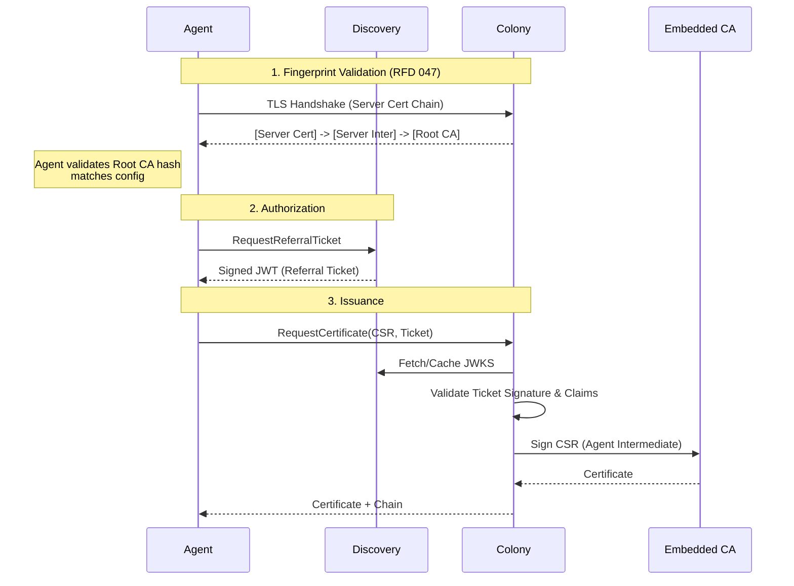

# RFD 047 - Colony CA Infrastructure & Policy Signing

**Status:** 🚧 Draft

## Summary

This RFD defines the server-side Certificate Authority (CA) infrastructure
required to support the Agent Certificate Bootstrap flow described in RFD 048.
It establishes a **Hierarchical CA** structure (Root → Intermediates) embedded
within the Colony service, and introduces a **Policy Signing** mechanism where
Colonies cryptographically sign authorization policies that are enforced by the
Discovery service.

This infrastructure replaces the flat, ad-hoc CA model and enables a trust model
based on **Root CA Fingerprint Validation** and **Referral Tickets**,
eliminating the need for long-lived shared secrets or manual per-agent token
management.

## Problem

- **Current behavior/limitations**:
    - Agent registration relies on shared `colony_secret` or simple bootstrap
      tokens.
    - No clear separation between long-term root trust and rotatable signing
      keys.
    - Discovery service has no cryptographic way to verify if a policy actually
      came from the Colony owner.
    - Lack of intermediate CAs makes rotation difficult without re-configuring
      every agent.

- **Why this matters**:
    - Security: Compromise of a signing key should not invalidate the root of
      trust.
    - Operations: Operators need to rotate keys without touching thousands of
      agents.
    - Trust: Discovery needs to be a dumb pipe that enforces policy without
      being the ultimate source of truth.

## Solution

Embed `step-ca` inside the Colony binary to manage a **Four-Level PKI Hierarchy
**. Implement a **Policy Signing** workflow where Colony signs its own admission
rules (policies) which Discovery then enforces.

### Key Design Decisions

1. **Hierarchical CA**:
    - **Root CA** (10y): Offline/HSM-ready, root of trust.
    - **Bootstrap Intermediate** (1y): Used *only* for fingerprint validation
      during bootstrap.
    - **Server Intermediate** (1y): Issues Colony's TLS server certificates.
    - **Agent Intermediate** (1y): Issues mTLS client certificates to agents.

2. **Policy Signing**:
    - Colony generates a **Policy Signing Keypair**.
    - Policies are canonicalized (RFC 8785) and signed.
    - Discovery validates the signature against the Colony's Policy Certificate
      before enforcing rules.

3. **Referral Ticket Support**:
    - Colony accepts "Referral Tickets" (JWTs) from Discovery as proof of
      authorization for certificate issuance.
    - Colony validates these tickets against Discovery's JWKS.

## Architecture Overview

### CA Hierarchy

#### Four-Level PKI Structure

```
Root CA (10-year validity, offline/HSM)
  ├─ Bootstrap Intermediate CA (1-year, rotatable)
  │   └─ Used ONLY for fingerprint validation during bootstrap
  │       (Does not issue any certificates)
  │       └─ Agents validate Root CA fingerprint via this chain
  │
  ├─ Server Intermediate CA (1-year, rotatable)
  │   └─ Colony TLS Server Certificate
  │       └─ SAN: spiffe://coral/colony/{colony-id}
  │       └─ Used for HTTPS endpoint
  │
  ├─ Agent Intermediate CA (1-year, rotatable)
  │   └─ Agent Client Certificates
  │       └─ SAN: spiffe://coral/colony/{colony-id}/agent/{agent-id}
  │       └─ Used for mTLS authentication
  │
  └─ Policy Signing Certificate (10-year, same lifetime as Root CA)
      └─ Signs policy documents
          └─ Used for authorization policies pushed to Discovery
```

**Why Hierarchical?**

- **Security**: Root CA private key stored offline/HSM, minimizes exposure
- **Rotation**: Rotate intermediates annually without changing agent configs
- **Operational**: Agents validate Root CA fingerprint (never changes)
- **Flexibility**: Can issue new intermediates/certificates for different
  purposes
- **Colony ID reservation**: Policy cert chains to Root CA, locking colony IDs
- **Best Practice**: Follows X.509/RFC 5280 standards

**Why Separate Bootstrap and Server Intermediates?**

- **Blast radius reduction**: Bootstrap Intermediate compromise cannot issue
  server certs
- **Security isolation**: Bootstrap Intermediate is untrusted for TLS server
  cert issuance
- **Purpose separation**: Bootstrap Intermediate only used for fingerprint
  validation
- **Server cert protection**: Server Intermediate handles all server certificate
  issuance

**Why Bootstrap Intermediate Exists:**

During the TLS handshake, the colony server presents its certificate chain:

```
[Server Certificate] → [Server Intermediate] → [Root CA]
```

The agent performs two validations:

1. **Fingerprint Validation**: Extract Root CA from chain, verify SHA256
   fingerprint matches expected value
2. **Chain Validation**: Verify Server Cert → Server Intermediate → Root CA is
   cryptographically valid

The Bootstrap Intermediate is NOT used in this chain. It exists for historical
reasons and potential future use cases (e.g., issuing short-lived bootstrap
credentials), but is not required for the current design.

**Important**: Even if an attacker compromises the Bootstrap Intermediate
private key, they cannot:

- Issue valid server certificates (separate Server Intermediate required)
- Bypass fingerprint validation (agents validate Root CA, not intermediates)
- Impersonate the colony (server cert must chain to Server Intermediate, not
  Bootstrap Intermediate)

### Colony Initialization

```bash
$ coral colony init my-app-prod

Initializing colony: my-app-prod...

Generated Certificate Authority:
  Root CA:                ~/.coral/colonies/my-app-prod/ca/root-ca.crt
  Root CA Key:            ~/.coral/colonies/my-app-prod/ca/root-ca.key (SECRET)
  Bootstrap Intermediate: ~/.coral/colonies/my-app-prod/ca/bootstrap-intermediate.crt
  Server Intermediate:    ~/.coral/colonies/my-app-prod/ca/server-intermediate.crt
  Agent Intermediate:     ~/.coral/colonies/my-app-prod/ca/agent-intermediate.crt
  Policy Signing Cert:    ~/.coral/colonies/my-app-prod/ca/policy-signing.crt

Root CA Fingerprint (distribute to agents):
  sha256:a3f2e1d4c5b6a7f8e9d0c1b2a3f4e5d6c7b8a9f0e1d2c3b4a5f6e7d8c9b0a1f2

Colony Server Identity:
  SPIFFE ID: spiffe://coral/colony/my-app-prod-a3f2e1

⚠️  IMPORTANT: Keep root-ca.key secure (offline storage or HSM recommended)

Deploy agents with:
  export CORAL_COLONY_ID=my-app-prod-a3f2e1
  export CORAL_CA_FINGERPRINT=sha256:a3f2e1d4c5b6a7f8e9d0c1b2a3f4e5d6...
  coral agent start

✓ Colony initialized successfully
```

### Colony Configuration

```yaml
# ~/.coral/colonies/my-app-prod-a3f2e1/config.yaml
colony_id: my-app-prod-a3f2e1
spiffe_id: spiffe://coral/colony/my-app-prod-a3f2e1

ca:
    root:
        certificate: ~/.coral/colonies/my-app-prod/ca/root-ca.crt
        private_key: ~/.coral/colonies/my-app-prod/ca/root-ca.key
        fingerprint: sha256:a3f2e1d4c5b6a7f8e9d0c1b2a3f4e5d6c7b8a9f0e1d2c3b4a5f6e7d8c9b0a1f2

    bootstrap_intermediate:
        certificate: ~/.coral/colonies/my-app-prod/ca/bootstrap-intermediate.crt
        private_key: ~/.coral/colonies/my-app-prod/ca/bootstrap-intermediate.key
        expires_at: 2025-11-21
        usage: fingerprint_validation_only

    server_intermediate:
        certificate: ~/.coral/colonies/my-app-prod/ca/server-intermediate.crt
        private_key: ~/.coral/colonies/my-app-prod/ca/server-intermediate.key
        expires_at: 2025-11-21

    agent_intermediate:
        certificate: ~/.coral/colonies/my-app-prod/ca/agent-intermediate.crt
        private_key: ~/.coral/colonies/my-app-prod/ca/agent-intermediate.key
        expires_at: 2025-11-21

tls:
    certificate: ~/.coral/colonies/my-app-prod/ca/server.crt
    private_key: ~/.coral/colonies/my-app-prod/ca/server.key
    # Server certificate contains SPIFFE ID in SAN

certificate_issuance:
    auto_issue: true
    rate_limits:
        per_agent_per_hour: 10
        per_colony_per_hour: 1000
    renewal_without_discovery: true  # Allow renewals without referral tickets

policy:
    signing_certificate: ~/.coral/colonies/my-app-prod/ca/policy-signing.crt
    signing_key: ~/.coral/colonies/my-app-prod/ca/policy-signing.key
    signing_key_id: policy-key-a3f2e1
    canonicalization: rfc8785-jcs  # Use RFC 8785 JSON Canonicalization Scheme
```

### Bootstrap Workflow (Server-Side View)



## Component Changes

### 1. Colony / Embedded CA

- **Initialization**: On first startup, generate the full hierarchy:
    - Generate Root CA (10-year validity)
    - Generate Bootstrap Intermediate CA (1-year validity, fingerprint
      validation only)
    - Generate Server Intermediate CA (1-year validity, for server certificates)
    - Generate Agent Intermediate CA (1-year validity, for client certificates)
    - Generate policy signing certificate (signed by Root CA, 10-year validity)
    - Generate policy signing Ed25519 keypair
    - Generate colony TLS server certificate with SPIFFE ID in SAN
      (`spiffe://coral/colony/{colony-id}`)
    - Compute and display Root CA fingerprint and Colony SPIFFE ID
    - Save CA hierarchy with proper permissions
- **Storage**: Store keys securely in `~/.coral/colonies/<id>/ca/`.
- **Serving**:
    - Present `[Server Cert] -> [Server Inter] -> [Root CA]` in TLS handshakes.
    - Expose `RequestCertificate` RPC.

### 2. Policy Management

- **Definition**: Define `ColonyPolicy` struct (rate limits, agent ID patterns,
  etc.).
- **Signing**:
    - Canonicalize JSON using **RFC 8785 (JCS)**.
    - Sign using Ed25519 Policy Signing Key.
- **Push**: RPC `UpsertColonyPolicy` to Discovery.

### 3. Certificate Issuance Service

- **Endpoint**: `RequestCertificate`
- **Logic**:
    - If `ReferralTicket` is present:
        - Fetch Discovery JWKS.
        - Validate JWT signature, expiry, `colony_id`, and `agent_id`.
        - Issue Certificate.
    - If `ReferralTicket` is missing (Renewal):
        - Validate mTLS client certificate.
        - Issue Certificate.

## API Changes

### Colony Service (gRPC)

```protobuf
service ColonyService {
    // Request a new certificate for an agent
    rpc RequestCertificate(RequestCertificateRequest) returns (RequestCertificateResponse);

    // Revoke an existing certificate
    rpc RevokeCertificate(RevokeCertificateRequest) returns (google.protobuf.Empty);
}

message RequestCertificateRequest {
    bytes csr = 1;              // PEM encoded CSR
    string referral_ticket = 2; // Optional JWT from Discovery (required for bootstrap)
}

message RequestCertificateResponse {
    bytes certificate = 1;      // PEM encoded client certificate
    bytes ca_chain = 2;         // PEM encoded CA chain (Agent Inter -> Root)
}
```

### Discovery Service (gRPC)

```protobuf
service DiscoveryService {
    // Colony pushes its signed policy
    rpc UpsertColonyPolicy(UpsertColonyPolicyRequest) returns (UpsertColonyPolicyResponse);

    // Agent requests permission to bootstrap
    rpc RequestReferralTicket(RequestReferralTicketRequest) returns (RequestReferralTicketResponse);

    // Public JWKS endpoint for ticket validation
    rpc GetJWKS(GetJWKSRequest) returns (GetJWKSResponse);
}

message UpsertColonyPolicyRequest {
    string colony_id = 1;
    bytes policy_json = 2;      // Canonical JSON
    bytes signature = 3;        // Ed25519 Signature
    bytes policy_cert = 4;      // Certificate verifying the signature key
    bytes root_cert = 5;        // Root CA to verify the policy cert
}
```

## Configuration

```yaml
security:
    ca:
        root_dir: "~/.coral/colonies/my-colony/ca"
        # Rotation schedules
        intermediate_validity: "8760h" # 1 year

discovery:
    policy:
        # Default policy settings
        max_agents: 1000
        allow_patterns: [ "production-*" ]

## CLI Commands

The `coral` CLI will be updated to manage the CA infrastructure.

### CA Management

```bash
# Display CA hierarchy status
$ coral colony ca status

Root CA:
  Path: ~/.coral/colonies/my-app-prod/ca/root-ca.crt
  Fingerprint: sha256:a3f2e1...
  Expires: 2034-11-21 (10 years)

Intermediates:
  Bootstrap: Valid (Expires 2025-11-21)
  Server:    Valid (Expires 2025-11-21)
  Agent:     Valid (Expires 2025-11-21)

Policy Signing:
  Certificate: Valid (Expires 2034-11-21)
```

```bash
# Rotate intermediate certificates
$ coral colony ca rotate-intermediate --type server

Rotating Server Intermediate CA...
  Generated new intermediate (valid until 2026-11-21)
  Old intermediate remains valid for 7 days (overlap)
  Server certificate re-issued
✓ Rotation complete
```

## Implementation Plan

### Phase 1: Colony CA Infrastructure

- [ ] Implement `internal/colony/ca/init.go`
    - Root CA generation (10-year validity)
    - Bootstrap Intermediate CA generation (fingerprint validation only)
    - **Server Intermediate CA generation (for server certificates)**
    - Agent Intermediate CA generation (for client certificates)
    - Policy signing certificate generation (signed by Root CA, 10-year
      validity)
    - Policy signing Ed25519 keypair generation
    - **Colony TLS server certificate with SPIFFE ID in SAN**
    - Root CA fingerprint computation
    - **Display Colony SPIFFE ID**
    - Save CA hierarchy with proper permissions
- [ ] Update `coral colony init` to generate CA hierarchy
- [ ] Add `coral colony ca status` command
- [ ] Add `coral colony ca rotate-intermediate` command
- [ ] **Add RFC 8785 JCS canonicalization library dependency**
- [ ] Add unit tests for CA generation
- [ ] **Add unit tests for SPIFFE ID generation and validation**
```

## Security Considerations

- **Root Key Protection**: The Root CA key is critical. It should be generated
  offline or stored in an HSM in production. For the embedded version, file
  system permissions (0600) are the baseline.
- **Intermediate Isolation**: Compromise of the *Bootstrap Intermediate* does
  not allow an attacker to issue valid server or client certificates.
- **Policy Integrity**: RFC 8785 ensures that the JSON policy document cannot be
  semantically modified without invalidating the signature.
- **Ticket Replay**: Referral tickets are single-use (tracked by JTI) and
  short-lived (1 min), minimizing replay windows.

## Migration Strategy

1. **Deploy Updated Colony**: New binary generates the CA hierarchy on startup
   if missing.
2. **Push Policy**: Colony automatically signs and pushes default policy to
   Discovery.
3. **Deploy Agents**: Agents (per RFD 047) configured with
   `CORAL_CA_FINGERPRINT` will begin using the new flow.
4. **Legacy Support**: Existing `colony_secret` auth remains active until
   explicitly disabled in configuration.
