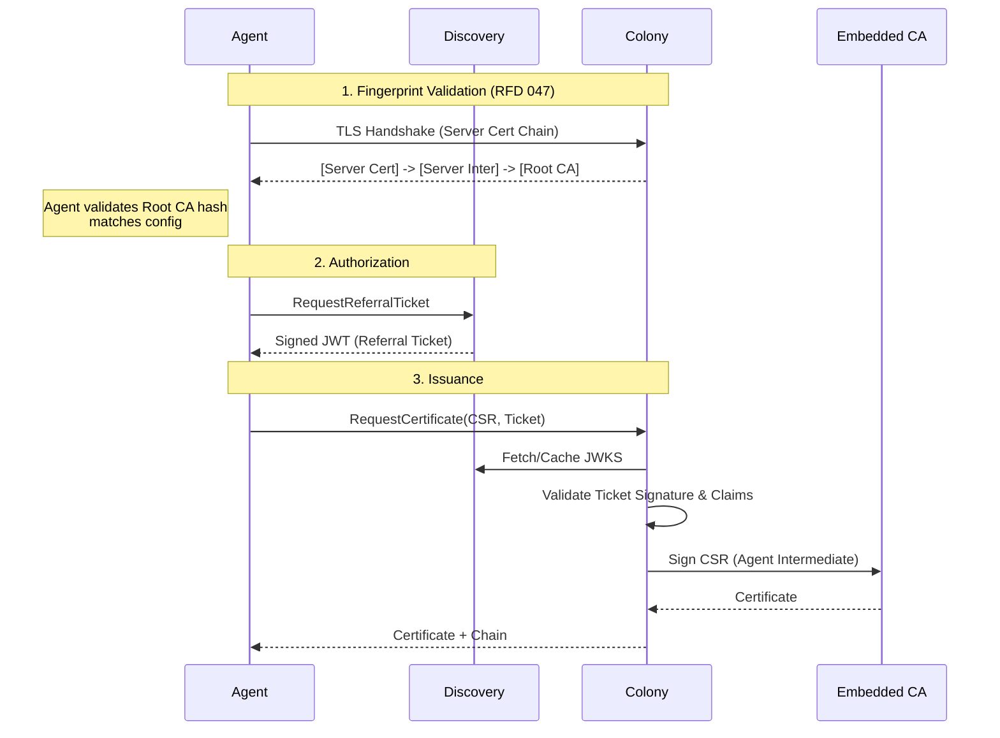

# RFD 047 - Colony CA Infrastructure

**Status:** ✅ Implemented

## Summary

This RFD defines the server-side Certificate Authority (CA) infrastructure
required to support the Agent Certificate Bootstrap flow described in RFD 048.
It establishes a **Hierarchical CA** structure (Root → Intermediates) embedded
within the Colony service.

This infrastructure replaces the flat, ad-hoc CA model and enables a trust model
based on **Root CA Fingerprint Validation**, eliminating the need for long-lived
shared secrets or manual per-agent token management.

**Note:** Policy Signing (RFC 8785 canonicalization, signed policies for
Discovery) is covered in **RFD 049 - Discovery-Based Agent Authorization**.

## Problem

- **Current behavior/limitations**:
    - Agent registration relies on shared `colony_secret` or simple bootstrap
      tokens.
    - No clear separation between long-term root trust and rotatable signing
      keys.
    - Discovery service has no cryptographic way to verify if a policy actually
      came from the Colony owner.
    - Lack of intermediate CAs makes rotation difficult without re-configuring
      every agent.

- **Why this matters**:
    - Security: Compromise of a signing key should not invalidate the root of
      trust.
    - Operations: Operators need to rotate keys without touching thousands of
      agents.
    - Trust: Discovery needs to be a dumb pipe that enforces policy without
      being the ultimate source of truth.

## Solution

Embed a CA inside the Colony binary to manage a **Three-Level PKI Hierarchy**.

### Key Design Decisions

1. **Hierarchical CA**:
    - **Root CA** (10y): Offline/HSM-ready, root of trust.
    - **Server Intermediate** (1y): Issues Colony's TLS server certificates.
    - **Agent Intermediate** (1y): Issues mTLS client certificates to agents.
    - **Policy Signing Certificate** (10y): For signing authorization policies
      (see RFD 049).

2. **Certificate Issuance**:
    - Colony issues server certificates for its own TLS endpoints.
    - Colony issues agent certificates upon valid bootstrap requests.
    - All certificates include SPIFFE IDs in SAN for identity verification.

## Architecture Overview

### CA Hierarchy

#### Three-Level PKI Structure

```
Root CA (10-year validity, offline/HSM)
  ├─ Server Intermediate CA (1-year, rotatable)
  │   └─ Colony TLS Server Certificate
  │       └─ SAN: spiffe://coral/colony/{colony-id}
  │       └─ Used for HTTPS endpoint
  │
  ├─ Agent Intermediate CA (1-year, rotatable)
  │   └─ Agent Client Certificates
  │       └─ SAN: spiffe://coral/colony/{colony-id}/agent/{agent-id}
  │       └─ Used for mTLS authentication
  │
  └─ Policy Signing Certificate (10-year, same lifetime as Root CA)
      └─ Signs policy documents
          └─ Used for authorization policies pushed to Discovery
```

**Why Hierarchical?**

- **Security**: Root CA private key stored offline/HSM, minimizes exposure
- **Rotation**: Rotate intermediates annually without changing agent configs
- **Operational**: Agents validate Root CA fingerprint (never changes)
- **Flexibility**: Can issue new intermediates/certificates for different
  purposes
- **Colony ID reservation**: Policy cert chains to Root CA, locking colony IDs
- **Best Practice**: Follows X.509/RFC 5280 standards

**Why Separate Server and Agent Intermediates?**

- **Blast radius reduction**: Compromise of one intermediate cannot issue certs
  for the other purpose
- **Purpose separation**: Server Intermediate for TLS server certs, Agent
  Intermediate for mTLS client certs
- **Independent rotation**: Can rotate each intermediate independently

**Trust Establishment:**

During the TLS handshake, the colony server presents its certificate chain:

```
[Server Certificate] → [Server Intermediate] → [Root CA]
```

The agent performs two validations:

1. **Fingerprint Validation**: Extract Root CA from chain, verify SHA256
   fingerprint matches expected value
2. **Chain Validation**: Verify Server Cert → Server Intermediate → Root CA is
   cryptographically valid

### Colony Initialization

```bash
$ coral colony init my-app-prod

Initializing colony: my-app-prod...

Generated Certificate Authority:
  Root CA:              ~/.coral/colonies/my-app-prod/ca/root-ca.crt
  Root CA Key:          ~/.coral/colonies/my-app-prod/ca/root-ca.key (SECRET)
  Server Intermediate:  ~/.coral/colonies/my-app-prod/ca/server-intermediate.crt
  Agent Intermediate:   ~/.coral/colonies/my-app-prod/ca/agent-intermediate.crt
  Policy Signing Cert:  ~/.coral/colonies/my-app-prod/ca/policy-signing.crt

Root CA Fingerprint (distribute to agents):
  sha256:a3f2e1d4c5b6a7f8e9d0c1b2a3f4e5d6c7b8a9f0e1d2c3b4a5f6e7d8c9b0a1f2

Colony Server Identity:
  SPIFFE ID: spiffe://coral/colony/my-app-prod-a3f2e1

⚠️  IMPORTANT: Keep root-ca.key secure (offline storage or HSM recommended)

Deploy agents with:
  export CORAL_COLONY_ID=my-app-prod-a3f2e1
  export CORAL_CA_FINGERPRINT=sha256:a3f2e1d4c5b6a7f8e9d0c1b2a3f4e5d6...
  coral agent start

✓ Colony initialized successfully
```

### Colony Configuration

```yaml
# ~/.coral/colonies/my-app-prod-a3f2e1/config.yaml
colony_id: my-app-prod-a3f2e1
spiffe_id: spiffe://coral/colony/my-app-prod-a3f2e1

ca:
    root:
        certificate: ~/.coral/colonies/my-app-prod/ca/root-ca.crt
        private_key: ~/.coral/colonies/my-app-prod/ca/root-ca.key
        fingerprint: sha256:a3f2e1d4c5b6a7f8e9d0c1b2a3f4e5d6c7b8a9f0e1d2c3b4a5f6e7d8c9b0a1f2

    server_intermediate:
        certificate: ~/.coral/colonies/my-app-prod/ca/server-intermediate.crt
        private_key: ~/.coral/colonies/my-app-prod/ca/server-intermediate.key
        expires_at: 2025-11-21

    agent_intermediate:
        certificate: ~/.coral/colonies/my-app-prod/ca/agent-intermediate.crt
        private_key: ~/.coral/colonies/my-app-prod/ca/agent-intermediate.key
        expires_at: 2025-11-21

tls:
    certificate: ~/.coral/colonies/my-app-prod/ca/server.crt
    private_key: ~/.coral/colonies/my-app-prod/ca/server.key
    # Server certificate contains SPIFFE ID in SAN

certificate_issuance:
    auto_issue: true
    rate_limits:
        per_agent_per_hour: 10
        per_colony_per_hour: 1000
    renewal_without_discovery: true  # Allow renewals without referral tickets

policy:
    signing_certificate: ~/.coral/colonies/my-app-prod/ca/policy-signing.crt
    signing_key: ~/.coral/colonies/my-app-prod/ca/policy-signing.key
    signing_key_id: policy-key-a3f2e1
    canonicalization: rfc8785-jcs  # Use RFC 8785 JSON Canonicalization Scheme
```

### Bootstrap Workflow (Server-Side View)



## Component Changes

### 1. Colony / Embedded CA ✅

- **Initialization** (`internal/colony/ca/manager.go`, `ca.Initialize()`):
    - Generate Root CA (10-year validity)
    - Generate Server Intermediate CA (1-year validity)
    - Generate Agent Intermediate CA (1-year validity)
    - Generate policy signing certificate (10-year validity)
    - Generate colony TLS server certificate with SPIFFE ID in SAN
    - Compute Root CA fingerprint and Colony SPIFFE ID
    - Save CA hierarchy with proper permissions
- **Storage**: Keys stored in `~/.coral/colonies/<id>/ca/`.
- **Serving**: Present full certificate chain in TLS handshakes.

### 2. Certificate Issuance Service ✅

- **Endpoint**: `IssueCertificate`, `IssueServerCertificate`
- **Logic**:
    - Issue agent certificates with SPIFFE ID in SAN
    - Issue server certificates for colony TLS
    - Revoke certificates (`RevokeCertificate`)

### 3. Policy Management → RFD 049

Policy signing (RFC 8785 canonicalization, `UpsertColonyPolicy`) is defined in
**RFD 049 - Discovery-Based Agent Authorization**.

## API Changes

### Colony Service (gRPC)

```protobuf
service ColonyService {
    // Request a new certificate for an agent
    rpc RequestCertificate(RequestCertificateRequest) returns (RequestCertificateResponse);

    // Revoke an existing certificate
    rpc RevokeCertificate(RevokeCertificateRequest) returns (google.protobuf.Empty);
}

message RequestCertificateRequest {
    bytes csr = 1;              // PEM encoded CSR
    string referral_ticket = 2; // Optional JWT from Discovery (see RFD 049)
}

message RequestCertificateResponse {
    bytes certificate = 1;      // PEM encoded client certificate
    bytes ca_chain = 2;         // PEM encoded CA chain (Agent Inter -> Root)
}
```

### Discovery Service API → RFD 049

Discovery Service API changes (`UpsertColonyPolicy`, `RequestReferralTicket`,
`GetJWKS`) are defined in **RFD 049 - Discovery-Based Agent Authorization**.

## Configuration

```yaml
security:
    ca:
        root_dir: "~/.coral/colonies/my-colony/ca"
        # Rotation schedules
        intermediate_validity: "8760h" # 1 year
```

## CLI Commands

The `coral` CLI will be updated to manage the CA infrastructure.

### CA Management

```bash
# Display CA hierarchy status
$ coral colony ca status

Root CA:
  Path: ~/.coral/colonies/my-app-prod/ca/root-ca.crt
  Fingerprint: sha256:a3f2e1...
  Expires: 2034-11-21 (10 years)

Intermediates:
  Server: Valid (Expires 2025-11-21)
  Agent:  Valid (Expires 2025-11-21)

Policy Signing:
  Certificate: Valid (Expires 2034-11-21)
```

```bash
# Rotate intermediate certificates
$ coral colony ca rotate-intermediate --type server

Rotating Server Intermediate CA...
  Generated new intermediate (valid until 2026-11-21)
  Old intermediate remains valid for 7 days (overlap)
  Server certificate re-issued
✓ Rotation complete
```

## Implementation Plan

### Implemented

- [x] **CA Manager** (`internal/colony/ca/manager.go`)
    - [x] Root CA generation (10-year validity)
    - [x] Server Intermediate CA generation (1-year validity)
    - [x] Agent Intermediate CA generation (1-year validity)
    - [x] Policy signing certificate generation (10-year validity, ECDSA P-256)
    - [x] Colony TLS server certificate with SPIFFE ID in SAN
    - [x] Root CA fingerprint computation (`GetCAFingerprint`)
    - [x] Save CA hierarchy with proper permissions (0700 dir, 0600 keys, 0644
      certs)
    - [x] Load existing CA from filesystem (`loadCA`)
- [x] **Standalone Initialization** (`ca.Initialize()`) for use during
    `coral init`
- [x] **CLI Integration**
    - [x] `coral init` generates CA hierarchy (`internal/cli/init/init.go`)
    - [x] `coral colony ca status` command (`internal/cli/colony/ca.go`)
- [x] **Colony Startup Integration** (`internal/colony/ca_init.go`)
- [x] **Certificate Issuance**
    - [x] `IssueCertificate` method for agent certificates
    - [x] `IssueServerCertificate` method for colony TLS
    - [x] `RevokeCertificate` method
    - [x] Referral ticket validation (`ValidateReferralTicket`)

### Deferred to Other RFDs

- **Certificate Renewal via mTLS** (without referral ticket) → **RFD 048**
- **Policy Signing** (RFC 8785 canonicalization, signed policies) → **RFD 049**
- **Referral Ticket Validation** (Discovery JWKS integration) → **RFD 049**

### Future Work

- [x] `coral colony ca rotate-intermediate` command
- [x] Unit tests for CA generation (`internal/colony/ca/manager_test.go`)

## Security Considerations

- **Root Key Protection**: The Root CA key is critical. It should be generated
  offline or stored in an HSM in production. For the embedded version, file
  system permissions (0600) are the baseline.
- **Intermediate Isolation**: Compromise of the Server Intermediate does not
  allow issuing agent certificates (and vice versa). Each intermediate has a
  specific purpose.
- **SPIFFE Identity**: All certificates include SPIFFE IDs in SAN, enabling
  identity-based access control and audit logging.

## Migration Strategy

1. **Deploy Updated Colony**: New binary generates the CA hierarchy on startup
   if missing (via `coral init`).
2. **Deploy Agents**: Agents (per RFD 048) configured with
   `CORAL_CA_FINGERPRINT` will use fingerprint-based trust establishment.
3. **Legacy Support**: Existing `colony_secret` auth remains active until
   explicitly disabled in configuration.

---

## Implementation Status

**Core Capability:** ✅ Complete

Colony CA infrastructure implemented with hierarchical PKI (Root → Server
Intermediate → Agent Intermediate). Colony can initialize its CA hierarchy,
issue certificates for agents and servers, and present proper certificate chains
for fingerprint-based trust establishment.

**Operational Components:**

- ✅ Root CA generation (10-year validity)
- ✅ Server Intermediate CA (1-year validity)
- ✅ Agent Intermediate CA (1-year validity)
- ✅ Policy signing certificate (10-year validity)
- ✅ Server TLS certificate with SPIFFE ID
- ✅ CLI: `coral init` generates CA hierarchy
- ✅ CLI: `coral colony ca status`
- ✅ CLI: `coral colony ca rotate-intermediate`

**What Works Now:**

- Colony initialization creates full CA hierarchy
- Server presents certificate chain for fingerprint validation
- Agent and server certificates can be issued with SPIFFE IDs
- CA status inspection via CLI
- Intermediate CA rotation via CLI

## Deferred Features

**Agent Certificate Bootstrap** (RFD 048)

- Agent-side certificate request flow
- Certificate renewal via existing mTLS connection

**Policy Signing & Discovery Integration** (RFD 049)

- RFC 8785 JSON canonicalization for policy signing
- `UpsertColonyPolicy` to Discovery service
- Referral ticket validation via Discovery JWKS

**CLI Enhancements** (Future)

- Intermediate CA rotation with overlap period (graceful transition)
