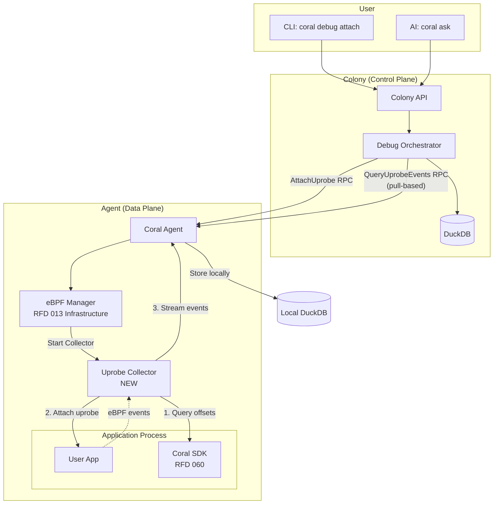

# RFD 059 - Live Debugging Implementation Plan

**Status:** 🔄 In Progress (Started 2025-11-28)

**Parent RFD:** [059-live-debugging-architecture.md](059-live-debugging-architecture.md)

**Progress:** Phase 1.1 Complete ✅ | Phase 1.2 In Progress 🔄

**Context:** This document provides a detailed implementation plan for RFD 059, updated to account for:
- ✅ Beyla integration (RFD 032) handles protocol-level observability
- ✅ RFD 013 infrastructure available (Manager, Collector interface, capabilities)
- ✅ Pull-based architecture established (agents store locally, Colony queries)

---

## Overview

RFD 059 enables **on-demand application-level debugging** via SDK-integrated eBPF uprobes. Unlike Beyla (which monitors HTTP/gRPC/SQL at the protocol layer), RFD 059 allows debugging **specific Go functions** within user applications.

**Key differentiator from Beyla:**
```
Beyla (RFD 032):
  "POST /api/v1/charge is slow (P95=450ms, 5% errors)"
  → Protocol-level visibility

RFD 059 Uprobes:
  "payments.ValidateCard() is slow (380ms avg, 67 calls >1s)"
  → Application-level visibility
  → Shows arguments, return values, call frequency
```

---

## Architecture Recap



---

## Phase 1: Foundation (Week 1-2)

### 1.1 Protobuf Definitions

**Goal:** Define uprobe-specific RPC messages extending existing eBPF protobuf.

**Files to modify:**
- `proto/coral/mesh/v1/ebpf.proto` (add uprobe messages)
- `proto/coral/colony/v1/debug.proto` (Colony → Agent RPC)

**New messages:**

```protobuf
// proto/coral/mesh/v1/ebpf.proto

enum EbpfCollectorKind {
  EBPF_COLLECTOR_KIND_UNSPECIFIED = 0;
  EBPF_COLLECTOR_KIND_SYSCALL_STATS = 3;  // Existing (deprecated)
  EBPF_COLLECTOR_KIND_UPROBE = 5;          // NEW
}

message StartUprobeCollectorRequest {
  string agent_id = 1;
  string service_name = 2;
  string function_name = 3;         // e.g., "github.com/myapp/pkg.ValidateCard"
  google.protobuf.Duration duration = 4;  // Max 600s
  UprobeConfig config = 5;
}

message UprobeConfig {
  bool capture_args = 1;            // Capture function arguments
  bool capture_return = 2;          // Capture return values
  uint32 sample_rate = 3;           // Sample every Nth call (0 = all)
  uint32 max_events = 4;            // Max events to collect (safety limit)
}

message UprobeEvent {
  google.protobuf.Timestamp timestamp = 1;
  string collector_id = 2;
  string agent_id = 3;
  string service_name = 4;
  string function_name = 5;

  string event_type = 6;            // "entry" or "return"
  uint64 duration_ns = 7;           // Only for "return" events

  int32 pid = 8;
  int32 tid = 9;

  // Argument/return value capture (optional, based on config)
  repeated FunctionArgument args = 10;
  FunctionReturnValue return_value = 11;

  map<string, string> labels = 12;
}

message FunctionArgument {
  string name = 1;                  // Argument name from DWARF
  string type = 2;                  // Go type
  string value = 3;                 // String representation (limited depth)
}

message FunctionReturnValue {
  string type = 1;
  string value = 2;
  bool is_error = 3;                // For Go error returns
  string error_message = 4;
}
```

**Colony RPC:**

```protobuf
// proto/coral/colony/v1/debug.proto

service DebugService {
  // Start uprobe debug session
  rpc AttachUprobe(AttachUprobeRequest) returns (AttachUprobeResponse);

  // Stop uprobe session
  rpc DetachUprobe(DetachUprobeRequest) returns (DetachUprobeResponse);

  // Query uprobe events (pull-based, like Beyla)
  rpc QueryUprobeEvents(QueryUprobeEventsRequest) returns (QueryUprobeEventsResponse);

  // List active debug sessions
  rpc ListDebugSessions(ListDebugSessionsRequest) returns (ListDebugSessionsResponse);
}

message AttachUprobeRequest {
  string service_name = 1;
  string function_name = 2;
  google.protobuf.Duration duration = 3;  // Default: 60s, Max: 600s
  UprobeConfig config = 4;
}

message AttachUprobeResponse {
  string session_id = 1;
  google.protobuf.Timestamp expires_at = 2;
  bool success = 3;
  string error = 4;
}

message QueryUprobeEventsRequest {
  string session_id = 1;
  google.protobuf.Timestamp start_time = 2;
  google.protobuf.Timestamp end_time = 3;
  int32 max_events = 4;             // Pagination
}

message QueryUprobeEventsResponse {
  repeated UprobeEvent events = 1;
  bool has_more = 2;                // Pagination indicator
}
```

**Tasks:**
- [x] Add uprobe messages to `ebpf.proto`
- [x] Create `debug.proto` for Colony RPC
- [x] Create `debug.proto` for SDK RPC
- [x] Run `buf generate` to generate Go code
- [x] Verify generated code compiles and tests pass

**Status:** ✅ Complete (2025-11-28)

**Implementation Notes:**
- Added `EBPF_COLLECTOR_KIND_UPROBE = 5` to `coral/agent/v1/agent.proto`
- Extended `coral/mesh/v1/ebpf.proto` with uprobe messages:
  - `StartUprobeCollectorRequest`, `UprobeConfig`, `StartUprobeCollectorResponse`
  - `UprobeEvent`, `FunctionArgument`, `FunctionReturnValue`
  - Added `UprobeEvent` to `EbpfEvent` oneof payload (field 30)
- Created `coral/colony/v1/debug.proto` with `DebugService` (4 RPCs)
- Created `coral/sdk/v1/debug.proto` with `SDKDebugService` (2 RPCs)
- Generated Go code in `./coral/colony/v1/debug.pb.go` and `./coral/sdk/v1/debug.pb.go`
- All tests passing with `make test`

**Estimated effort:** 2-3 days

---

### 1.2 SDK Function Metadata API (RFD 060 Dependency)

**Goal:** Define how SDK exposes function metadata to the agent.

**Approach:** SDK runs an embedded gRPC server that agent queries for function offsets.

**SDK gRPC service:**

```protobuf
// proto/coral/sdk/v1/debug.proto

service SDKDebugService {
  // Get function metadata for uprobe attachment
  rpc GetFunctionMetadata(GetFunctionMetadataRequest) returns (GetFunctionMetadataResponse);

  // List all instrumentable functions
  rpc ListFunctions(ListFunctionsRequest) returns (ListFunctionsResponse);
}

message GetFunctionMetadataRequest {
  string function_name = 1;  // Fully qualified: "github.com/myapp/pkg.ValidateCard"
}

message GetFunctionMetadataResponse {
  bool found = 1;
  FunctionMetadata metadata = 2;
  string error = 3;
}

message FunctionMetadata {
  string name = 1;                  // Fully qualified name
  string binary_path = 2;           // Path to executable
  uint64 offset = 3;                // Function offset in binary
  uint32 pid = 4;                   // Process ID

  // Argument metadata (from DWARF debug info)
  repeated ArgumentMetadata arguments = 5;
  repeated ReturnValueMetadata return_values = 6;
}

message ArgumentMetadata {
  string name = 1;
  string type = 2;                  // Go type string
  uint64 offset = 3;                // Stack/register offset
}

message ReturnValueMetadata {
  string type = 1;
  uint64 offset = 2;
}

message ListFunctionsRequest {
  string package_pattern = 1;       // e.g., "github.com/myapp/*"
}

message ListFunctionsResponse {
  repeated string functions = 1;    // List of fully qualified function names
}
```

**SDK implementation (Go):**

```go
// pkg/sdk/debug/server.go

package debug

import (
    "debug/dwarf"
    "debug/elf"
    "os"
    "runtime/debug"
)

type FunctionMetadataProvider struct {
    binaryPath string
    pid        int
    dwarf      *dwarf.Data
}

func NewFunctionMetadataProvider() (*FunctionMetadataProvider, error) {
    // Get current binary path
    binaryPath, err := os.Executable()
    if err != nil {
        return nil, err
    }

    // Open ELF file
    elfFile, err := elf.Open(binaryPath)
    if err != nil {
        return nil, err
    }
    defer elfFile.Close()

    // Extract DWARF debug info
    dwarfData, err := elfFile.DWARF()
    if err != nil {
        return nil, err
    }

    return &FunctionMetadataProvider{
        binaryPath: binaryPath,
        pid:        os.Getpid(),
        dwarf:      dwarfData,
    }, nil
}

func (p *FunctionMetadataProvider) GetFunctionOffset(funcName string) (uint64, error) {
    reader := p.dwarf.Reader()

    for {
        entry, err := reader.Next()
        if err != nil || entry == nil {
            break
        }

        if entry.Tag == dwarf.TagSubprogram {
            name, _ := entry.Val(dwarf.AttrName).(string)
            if name == funcName {
                lowPC, _ := entry.Val(dwarf.AttrLowpc).(uint64)
                return lowPC, nil
            }
        }
    }

    return 0, fmt.Errorf("function %s not found", funcName)
}
```

**Tasks:**
- [ ] Define SDK debug protobuf service
- [ ] Implement DWARF parsing in SDK
- [ ] Implement function offset resolution
- [ ] Add gRPC server to SDK (embedded, port auto-selected)
- [ ] SDK reports its gRPC address to agent during registration

**Estimated effort:** 4-5 days

**Blocker:** This is a prerequisite for uprobe attachment. Without function offsets, we can't attach probes.

---

## Phase 2: Uprobe Collector Implementation (Week 2-3)

### 2.1 Uprobe Collector using cilium/ebpf

**Goal:** Implement `UprobeCollector` that attaches uprobes to Go functions.

**Library choice:** `github.com/cilium/ebpf` (pure Go, no cgo, CO-RE support)

**Files to create:**
- `internal/agent/ebpf/uprobe_collector.go`
- `internal/agent/ebpf/uprobe_program.go` (eBPF program in C)
- `internal/agent/ebpf/uprobe_bpf.go` (generated by bpf2go)

**eBPF program (C):**

```c
// internal/agent/ebpf/bpf/uprobe.c

//go:build ignore

#include "vmlinux.h"
#include <bpf/bpf_helpers.h>
#include <bpf/bpf_tracing.h>

// Event structure (must match Go struct)
struct uprobe_event {
    __u64 timestamp_ns;
    __u32 pid;
    __u32 tid;
    __u8  event_type;  // 0=entry, 1=return
    __u64 duration_ns;
    char  function_name[128];
};

// Ring buffer for events
struct {
    __uint(type, BPF_MAP_TYPE_RINGBUF);
    __uint(max_entries, 256 * 1024);
} events SEC(".maps");

// Map to track function entry timestamps (for duration calculation)
struct {
    __uint(type, BPF_MAP_TYPE_HASH);
    __type(key, __u64);    // tid
    __type(value, __u64);  // entry timestamp
    __uint(max_entries, 1024);
} entry_times SEC(".maps");

// Uprobe entry point
SEC("uprobe/function_entry")
int uprobe_entry(struct pt_regs *ctx) {
    __u64 pid_tid = bpf_get_current_pid_tgid();
    __u32 pid = pid_tid >> 32;
    __u32 tid = (__u32)pid_tid;

    __u64 ts = bpf_ktime_get_ns();

    // Store entry timestamp for duration calculation
    bpf_map_update_elem(&entry_times, &pid_tid, &ts, BPF_ANY);

    // Create event
    struct uprobe_event *event;
    event = bpf_ringbuf_reserve(&events, sizeof(*event), 0);
    if (!event) {
        return 0;
    }

    event->timestamp_ns = ts;
    event->pid = pid;
    event->tid = tid;
    event->event_type = 0;  // entry
    event->duration_ns = 0;

    bpf_ringbuf_submit(event, 0);
    return 0;
}

// Uretprobe (function return)
SEC("uretprobe/function_return")
int uprobe_return(struct pt_regs *ctx) {
    __u64 pid_tid = bpf_get_current_pid_tgid();
    __u32 pid = pid_tid >> 32;
    __u32 tid = (__u32)pid_tid;

    __u64 ts = bpf_ktime_get_ns();

    // Calculate duration
    __u64 *entry_ts = bpf_map_lookup_elem(&entry_times, &pid_tid);
    __u64 duration = 0;
    if (entry_ts) {
        duration = ts - *entry_ts;
        bpf_map_delete_elem(&entry_times, &pid_tid);
    }

    // Create event
    struct uprobe_event *event;
    event = bpf_ringbuf_reserve(&events, sizeof(*event), 0);
    if (!event) {
        return 0;
    }

    event->timestamp_ns = ts;
    event->pid = pid;
    event->tid = tid;
    event->event_type = 1;  // return
    event->duration_ns = duration;

    bpf_ringbuf_submit(event, 0);
    return 0;
}

char LICENSE[] SEC("license") = "GPL";
```

**Uprobe Collector (Go):**

```go
// internal/agent/ebpf/uprobe_collector.go

package ebpf

import (
    "context"
    "fmt"
    "time"

    "github.com/cilium/ebpf"
    "github.com/cilium/ebpf/link"
    "github.com/cilium/ebpf/ringbuf"
    "github.com/rs/zerolog"

    meshv1 "github.com/coral-mesh/coral/coral/mesh/v1"
)

//go:generate go run github.com/cilium/ebpf/cmd/bpf2go -type uprobe_event uprobe ./bpf/uprobe.c -- -I./bpf/headers

type UprobeCollector struct {
    logger       zerolog.Logger
    config       *UprobeConfig
    functionName string

    // SDK metadata
    sdkClient    SDKDebugClient  // gRPC client to SDK
    funcOffset   uint64
    binaryPath   string
    pid          int

    // eBPF resources
    objs         uprobeObjects   // Generated by bpf2go
    entryLink    link.Link
    returnLink   link.Link
    reader       *ringbuf.Reader

    // Event collection
    ctx          context.Context
    cancel       context.CancelFunc
    events       []*meshv1.UprobeEvent
    mu           sync.Mutex
}

type UprobeConfig struct {
    ServiceName   string
    FunctionName  string
    CaptureArgs   bool
    CaptureReturn bool
    SampleRate    uint32
    MaxEvents     uint32
    Duration      time.Duration
}

func NewUprobeCollector(logger zerolog.Logger, config *UprobeConfig, sdkClient SDKDebugClient) (*UprobeCollector, error) {
    return &UprobeCollector{
        logger:       logger.With().Str("collector", "uprobe").Str("function", config.FunctionName).Logger(),
        config:       config,
        functionName: config.FunctionName,
        sdkClient:    sdkClient,
        events:       make([]*meshv1.UprobeEvent, 0),
    }, nil
}

func (c *UprobeCollector) Start(ctx context.Context) error {
    c.ctx, c.cancel = context.WithCancel(ctx)

    // Step 1: Query SDK for function metadata
    c.logger.Info().Msg("Querying SDK for function metadata")
    metadata, err := c.sdkClient.GetFunctionMetadata(ctx, c.functionName)
    if err != nil {
        return fmt.Errorf("failed to get function metadata: %w", err)
    }

    c.funcOffset = metadata.Offset
    c.binaryPath = metadata.BinaryPath
    c.pid = int(metadata.Pid)

    c.logger.Info().
        Str("binary", c.binaryPath).
        Uint64("offset", c.funcOffset).
        Int("pid", c.pid).
        Msg("Got function metadata from SDK")

    // Step 2: Load eBPF program
    if err := loadUprobeObjects(&c.objs, nil); err != nil {
        return fmt.Errorf("failed to load eBPF objects: %w", err)
    }

    // Step 3: Attach uprobe (function entry)
    c.entryLink, err = link.Uprobe(link.UprobeOptions{
        PID:    c.pid,
        Offset: c.funcOffset,
        Symbol: c.functionName,
    }, c.objs.UprobeEntry)
    if err != nil {
        c.objs.Close()
        return fmt.Errorf("failed to attach uprobe: %w", err)
    }

    // Step 4: Attach uretprobe (function return)
    c.returnLink, err = link.Uretprobe(link.UprobeOptions{
        PID:    c.pid,
        Offset: c.funcOffset,
        Symbol: c.functionName,
    }, c.objs.UprobeReturn)
    if err != nil {
        c.entryLink.Close()
        c.objs.Close()
        return fmt.Errorf("failed to attach uretprobe: %w", err)
    }

    // Step 5: Start reading events from ring buffer
    c.reader, err = ringbuf.NewReader(c.objs.Events)
    if err != nil {
        c.returnLink.Close()
        c.entryLink.Close()
        c.objs.Close()
        return fmt.Errorf("failed to create ringbuf reader: %w", err)
    }

    go c.readEvents()

    c.logger.Info().Msg("Uprobe collector started successfully")
    return nil
}

func (c *UprobeCollector) Stop() error {
    c.logger.Info().Msg("Stopping uprobe collector")

    if c.cancel != nil {
        c.cancel()
    }

    if c.reader != nil {
        c.reader.Close()
    }

    if c.returnLink != nil {
        c.returnLink.Close()
    }

    if c.entryLink != nil {
        c.entryLink.Close()
    }

    c.objs.Close()

    c.logger.Info().Msg("Uprobe collector stopped")
    return nil
}

func (c *UprobeCollector) GetEvents() ([]*meshv1.EbpfEvent, error) {
    c.mu.Lock()
    defer c.mu.Unlock()

    // Convert UprobeEvents to generic EbpfEvents
    events := make([]*meshv1.EbpfEvent, len(c.events))
    for i, uprobeEvent := range c.events {
        events[i] = &meshv1.EbpfEvent{
            Timestamp:   uprobeEvent.Timestamp,
            CollectorId: "uprobe-" + c.functionName,
            Payload: &meshv1.EbpfEvent_UprobeEvent{
                UprobeEvent: uprobeEvent,
            },
        }
    }

    // Clear buffer
    c.events = make([]*meshv1.UprobeEvent, 0)

    return events, nil
}

func (c *UprobeCollector) readEvents() {
    c.logger.Info().Msg("Started event reader goroutine")

    for {
        select {
        case <-c.ctx.Done():
            c.logger.Info().Msg("Event reader stopped")
            return
        default:
        }

        record, err := c.reader.Read()
        if err != nil {
            if errors.Is(err, ringbuf.ErrClosed) {
                return
            }
            c.logger.Error().Err(err).Msg("Failed to read event")
            continue
        }

        // Parse event
        var rawEvent uprobeUprobeEvent
        if err := binary.Read(bytes.NewBuffer(record.RawSample), binary.LittleEndian, &rawEvent); err != nil {
            c.logger.Error().Err(err).Msg("Failed to parse event")
            continue
        }

        // Convert to protobuf
        event := &meshv1.UprobeEvent{
            Timestamp:    timestamppb.New(time.Unix(0, int64(rawEvent.TimestampNs))),
            FunctionName: c.functionName,
            ServiceName:  c.config.ServiceName,
            EventType:    eventTypeString(rawEvent.EventType),
            DurationNs:   rawEvent.DurationNs,
            Pid:          int32(rawEvent.Pid),
            Tid:          int32(rawEvent.Tid),
        }

        // Store event
        c.mu.Lock()
        c.events = append(c.events, event)

        // Enforce max events limit
        if c.config.MaxEvents > 0 && len(c.events) > int(c.config.MaxEvents) {
            c.events = c.events[1:] // Drop oldest
        }
        c.mu.Unlock()

        c.logger.Debug().
            Str("event_type", event.EventType).
            Uint64("duration_ns", event.DurationNs).
            Msg("Collected uprobe event")
    }
}

func eventTypeString(eventType uint8) string {
    if eventType == 0 {
        return "entry"
    }
    return "return"
}
```

**Tasks:**
- [ ] Write eBPF program in C (`bpf/uprobe.c`)
- [ ] Set up bpf2go code generation
- [ ] Implement `UprobeCollector` in Go
- [ ] Add collector to manager's `createCollector()` switch
- [ ] Add unit tests for collector lifecycle
- [ ] Add integration test with simple Go binary

**Estimated effort:** 5-7 days

---

## Phase 3: Agent & Colony Integration (Week 3-4)

### 3.1 Agent RPC Handlers

**Goal:** Agent handles uprobe requests from Colony.

**Files to modify:**
- `internal/agent/agent.go` (add uprobe handlers)
- `internal/agent/ebpf/manager.go` (extend for uprobes)

**Agent handler:**

```go
// internal/agent/agent.go

func (a *Agent) StartUprobeCollector(ctx context.Context, req *meshv1.StartUprobeCollectorRequest) (*meshv1.StartUprobeCollectorResponse, error) {
    a.logger.Info().
        Str("service", req.ServiceName).
        Str("function", req.FunctionName).
        Msg("Starting uprobe collector")

    // Forward to eBPF manager
    return a.ebpfManager.StartCollector(ctx, &meshv1.StartEbpfCollectorRequest{
        AgentId:     a.config.AgentID,
        ServiceName: req.ServiceName,
        Kind:        agentv1.EbpfCollectorKind_EBPF_COLLECTOR_KIND_UPROBE,
        Duration:    req.Duration,
        Config: map[string]string{
            "function_name":   req.FunctionName,
            "capture_args":    fmt.Sprintf("%t", req.Config.CaptureArgs),
            "capture_return":  fmt.Sprintf("%t", req.Config.CaptureReturn),
            "sample_rate":     fmt.Sprintf("%d", req.Config.SampleRate),
            "max_events":      fmt.Sprintf("%d", req.Config.MaxEvents),
        },
    })
}
```

**Manager extension:**

```go
// internal/agent/ebpf/manager.go

func (m *Manager) createCollector(kind agentv1.EbpfCollectorKind, config map[string]string) (Collector, error) {
    switch kind {
    case agentv1.EbpfCollectorKind_EBPF_COLLECTOR_KIND_UPROBE:
        // Parse config
        uprobeConfig := &UprobeConfig{
            ServiceName:   config["service_name"],
            FunctionName:  config["function_name"],
            CaptureArgs:   parseBool(config["capture_args"]),
            CaptureReturn: parseBool(config["capture_return"]),
            SampleRate:    parseUint32(config["sample_rate"]),
            MaxEvents:     parseUint32(config["max_events"]),
        }

        // Create SDK client (query service discovery for SDK address)
        sdkClient, err := m.createSDKClient(uprobeConfig.ServiceName)
        if err != nil {
            return nil, fmt.Errorf("failed to create SDK client: %w", err)
        }

        return NewUprobeCollector(m.logger, uprobeConfig, sdkClient), nil

    case agentv1.EbpfCollectorKind_EBPF_COLLECTOR_KIND_SYSCALL_STATS:
        return NewSyscallStatsCollector(m.logger, config), nil

    default:
        return nil, fmt.Errorf("unsupported collector kind: %v", kind)
    }
}
```

**Tasks:**
- [ ] Add `StartUprobeCollector` RPC handler to agent
- [ ] Extend manager to create uprobe collectors
- [ ] Implement SDK client factory (queries service discovery for SDK address)
- [ ] Add local DuckDB storage for uprobe events (similar to Beyla storage)
- [ ] Implement `QueryUprobeEvents` RPC handler (pull-based)

**Estimated effort:** 3-4 days

---

### 3.2 Colony Orchestration

**Goal:** Colony routes debug requests to correct agents and manages sessions.

**Files to create:**
- `internal/colony/debug/orchestrator.go`
- `internal/colony/database/debug_sessions.go`

**Debug orchestrator:**

```go
// internal/colony/debug/orchestrator.go

package debug

import (
    "context"
    "fmt"
    "time"

    "github.com/google/uuid"
    debugpb "github.com/coral-mesh/coral/coral/colony/v1"
    meshv1 "github.com/coral-mesh/coral/coral/mesh/v1"
)

type Orchestrator struct {
    logger        zerolog.Logger
    agentRegistry *registry.ServiceRegistry
    db            *database.Database
}

func (o *Orchestrator) AttachUprobe(ctx context.Context, req *debugpb.AttachUprobeRequest) (*debugpb.AttachUprobeResponse, error) {
    // Step 1: Find agent for service
    service, err := o.agentRegistry.GetService(req.ServiceName)
    if err != nil {
        return &debugpb.AttachUprobeResponse{
            Success: false,
            Error:   fmt.Sprintf("service not found: %v", err),
        }, nil
    }

    // Step 2: Check if service has SDK enabled
    if !service.SdkEnabled {
        return &debugpb.AttachUprobeResponse{
            Success: false,
            Error:   "service does not have Coral SDK integrated",
        }, nil
    }

    // Step 3: Generate session ID
    sessionID := uuid.New().String()

    // Step 4: Calculate expiration
    duration := req.Duration
    if duration == nil || duration.AsDuration() > 10*time.Minute {
        duration = durationpb.New(60 * time.Second) // Default: 60s, Max: 10min
    }
    expiresAt := time.Now().Add(duration.AsDuration())

    // Step 5: Send RPC to agent
    agentClient := o.getAgentClient(service.AgentID)
    agentResp, err := agentClient.StartUprobeCollector(ctx, &meshv1.StartUprobeCollectorRequest{
        AgentId:      service.AgentID,
        ServiceName:  req.ServiceName,
        FunctionName: req.FunctionName,
        Duration:     duration,
        Config: &meshv1.UprobeConfig{
            CaptureArgs:   req.Config.CaptureArgs,
            CaptureReturn: req.Config.CaptureReturn,
            SampleRate:    req.Config.SampleRate,
            MaxEvents:     100000, // Safety limit
        },
    })

    if err != nil {
        return &debugpb.AttachUprobeResponse{
            Success: false,
            Error:   fmt.Sprintf("agent RPC failed: %v", err),
        }, nil
    }

    if !agentResp.Supported {
        return &debugpb.AttachUprobeResponse{
            Success: false,
            Error:   agentResp.Error,
        }, nil
    }

    // Step 6: Store session in database
    if err := o.db.CreateDebugSession(ctx, &database.DebugSession{
        SessionID:    sessionID,
        CollectorID:  agentResp.CollectorId,
        ServiceName:  req.ServiceName,
        FunctionName: req.FunctionName,
        AgentID:      service.AgentID,
        StartedAt:    time.Now(),
        ExpiresAt:    expiresAt,
        Status:       "active",
        RequestedBy:  getUserFromContext(ctx),
    }); err != nil {
        o.logger.Error().Err(err).Msg("Failed to store debug session")
        // Continue anyway - session will work, just won't be tracked
    }

    return &debugpb.AttachUprobeResponse{
        SessionID: sessionID,
        ExpiresAt: timestamppb.New(expiresAt),
        Success:   true,
    }, nil
}

func (o *Orchestrator) QueryUprobeEvents(ctx context.Context, req *debugpb.QueryUprobeEventsRequest) (*debugpb.QueryUprobeEventsResponse, error) {
    // Step 1: Get session from database
    session, err := o.db.GetDebugSession(ctx, req.SessionID)
    if err != nil {
        return nil, fmt.Errorf("session not found: %w", err)
    }

    // Step 2: Query agent for events (pull-based, like Beyla)
    agentClient := o.getAgentClient(session.AgentID)
    events, err := agentClient.QueryUprobeEvents(ctx, &meshv1.QueryUprobeEventsRequest{
        CollectorId: session.CollectorID,
        StartTime:   req.StartTime,
        EndTime:     req.EndTime,
        MaxEvents:   req.MaxEvents,
    })
    if err != nil {
        return nil, fmt.Errorf("failed to query agent: %w", err)
    }

    return &debugpb.QueryUprobeEventsResponse{
        Events:  events.Events,
        HasMore: len(events.Events) >= int(req.MaxEvents),
    }, nil
}
```

**Tasks:**
- [ ] Implement debug orchestrator
- [ ] Add debug session storage in DuckDB
- [ ] Implement session lifecycle management (auto-cleanup on expiry)
- [ ] Add audit logging for all debug operations
- [ ] Implement `ListDebugSessions` RPC

**Estimated effort:** 4-5 days

---

## Phase 4: CLI Integration (Week 4-5)

### 4.1 CLI Commands

**Goal:** User-friendly CLI for debug sessions.

**Commands:**

```bash
# Attach uprobe to function
$ coral debug attach payments-api \
    --function github.com/myapp/payments.ValidateCard \
    --duration 60s \
    --capture-args \
    --capture-return

🔍 Debug session started (session: debug-01H...)
📊 Function: payments.ValidateCard
⏱️  Duration: 60s
🎯 Capturing: arguments, return values

Streaming events...

[12:34:56.123] ENTRY   pid=12345 tid=12346
[12:34:56.145] RETURN  pid=12345 tid=12346 duration=22ms
[12:34:56.167] ENTRY   pid=12345 tid=12347
[12:34:56.892] RETURN  pid=12345 tid=12347 duration=725ms ⚠️  SLOW
  └─ error: "fraud check timeout"

✓ Session completed. Collected 1,234 events.
📄 Events saved to: ./debug-sessions/debug-01H.../events.json

Summary:
  Total calls: 1,234
  Avg duration: 45ms
  P95 duration: 180ms
  P99 duration: 850ms
  Errors: 67 (5.4%)
  Slow calls (>500ms): 89 (7.2%)


# List active sessions
$ coral debug sessions

Active debug sessions:
  Session ID      Service        Function              Started    Expires
  debug-01H...    payments-api   ValidateCard          2m ago     58s
  debug-02J...    checkout-api   ProcessOrder          5s ago     55s


# Query historical session
$ coral debug events debug-01H... --since 5m

Showing 1,234 events from last 5 minutes...
[timestamps and events...]


# Detach session early
$ coral debug detach debug-01H...
✓ Debug session detached
```

**Implementation:**

```go
// internal/cli/debug/attach.go

package debug

import (
    "github.com/spf13/cobra"
)

func NewAttachCmd() *cobra.Command {
    var (
        functionName  string
        duration      time.Duration
        captureArgs   bool
        captureReturn bool
        sampleRate    uint32
    )

    cmd := &cobra.Command{
        Use:   "attach <service>",
        Short: "Attach uprobe to function for debugging",
        Args:  cobra.ExactArgs(1),
        RunE: func(cmd *cobra.Command, args []string) error {
            serviceName := args[0]

            // Connect to colony
            client, err := colony.NewClient(colonyURL)
            if err != nil {
                return err
            }

            // Start debug session
            resp, err := client.AttachUprobe(cmd.Context(), &debugpb.AttachUprobeRequest{
                ServiceName:  serviceName,
                FunctionName: functionName,
                Duration:     durationpb.New(duration),
                Config: &meshv1.UprobeConfig{
                    CaptureArgs:   captureArgs,
                    CaptureReturn: captureReturn,
                    SampleRate:    sampleRate,
                },
            })

            if err != nil || !resp.Success {
                return fmt.Errorf("failed to start debug session: %v", resp.Error)
            }

            fmt.Printf("🔍 Debug session started (session: %s)\n", resp.SessionID)
            fmt.Printf("📊 Function: %s\n", functionName)
            fmt.Printf("⏱️  Duration: %s\n", duration)

            // Stream events in real-time
            return streamEvents(cmd.Context(), client, resp.SessionID, duration)
        },
    }

    cmd.Flags().StringVar(&functionName, "function", "", "Fully qualified function name")
    cmd.Flags().DurationVar(&duration, "duration", 60*time.Second, "Debug session duration")
    cmd.Flags().BoolVar(&captureArgs, "capture-args", false, "Capture function arguments")
    cmd.Flags().BoolVar(&captureReturn, "capture-return", false, "Capture return values")
    cmd.Flags().Uint32Var(&sampleRate, "sample-rate", 0, "Sample every Nth call (0=all)")

    cmd.MarkFlagRequired("function")

    return cmd
}

func streamEvents(ctx context.Context, client *colony.Client, sessionID string, duration time.Duration) error {
    fmt.Println("\nStreaming events...\n")

    ticker := time.NewTicker(1 * time.Second)
    defer ticker.Stop()

    timeout := time.After(duration)
    lastTimestamp := time.Now()

    for {
        select {
        case <-ctx.Done():
            return ctx.Err()
        case <-timeout:
            fmt.Println("\n✓ Session completed")
            return printSummary(ctx, client, sessionID)
        case <-ticker.C:
            // Query new events since last poll
            events, err := client.QueryUprobeEvents(ctx, &debugpb.QueryUprobeEventsRequest{
                SessionID: sessionID,
                StartTime: timestamppb.New(lastTimestamp),
                EndTime:   timestamppb.Now(),
                MaxEvents: 1000,
            })

            if err != nil {
                return err
            }

            // Print events
            for _, event := range events.Events {
                printEvent(event)
                lastTimestamp = event.Timestamp.AsTime()
            }
        }
    }
}

func printEvent(event *meshv1.UprobeEvent) {
    timestamp := event.Timestamp.AsTime().Format("15:04:05.000")

    if event.EventType == "entry" {
        fmt.Printf("[%s] ENTRY   pid=%d tid=%d\n", timestamp, event.Pid, event.Tid)
    } else {
        durationMs := float64(event.DurationNs) / 1e6
        slowMarker := ""
        if durationMs > 500 {
            slowMarker = " ⚠️  SLOW"
        }

        fmt.Printf("[%s] RETURN  pid=%d tid=%d duration=%.1fms%s\n",
            timestamp, event.Pid, event.Tid, durationMs, slowMarker)

        // Print error if present
        if event.ReturnValue != nil && event.ReturnValue.IsError {
            fmt.Printf("  └─ error: %q\n", event.ReturnValue.ErrorMessage)
        }
    }
}
```

**Tasks:**
- [ ] Implement `coral debug attach` command
- [ ] Implement `coral debug sessions` command
- [ ] Implement `coral debug events` command
- [ ] Implement `coral debug detach` command
- [ ] Add real-time event streaming with nice formatting
- [ ] Add summary statistics (avg/P95/P99 duration, error rate)
- [ ] Save events to JSON file for later analysis

**Estimated effort:** 4-5 days

---

## Phase 5: Testing & Documentation (Week 5-6)

### 5.1 Testing Strategy

**Unit tests:**
- [ ] Protobuf message serialization
- [ ] Uprobe collector lifecycle
- [ ] SDK metadata provider
- [ ] Debug orchestrator session management

**Integration tests:**
- [ ] End-to-end: CLI → Colony → Agent → SDK → eBPF → Events
- [ ] Test with simple Go application
- [ ] Verify argument/return value capture
- [ ] Test session expiration and cleanup
- [ ] Test concurrent debug sessions

**E2E test scenario:**

```go
// test/e2e/debug_test.go

func TestUprobeDebugging(t *testing.T) {
    // Setup: Start test application with SDK
    app := startTestApp(t, "testdata/simpleapp")
    defer app.Stop()

    // Setup: Start agent monitoring the app
    agent := startAgent(t, app.Port)
    defer agent.Stop()

    // Setup: Start colony
    colony := startColony(t)
    defer colony.Stop()

    // Test: Attach uprobe
    sessionID := attachUprobe(t, colony, "simpleapp", "main.calculateTotal")

    // Test: Trigger function calls in app
    for i := 0; i < 100; i++ {
        triggerCalculation(t, app)
    }

    // Test: Query events
    events := queryEvents(t, colony, sessionID)

    // Verify: Got entry/return pairs
    assert.Equal(t, 200, len(events)) // 100 entry + 100 return

    // Verify: Durations are reasonable
    for _, event := range events {
        if event.EventType == "return" {
            assert.Greater(t, event.DurationNs, uint64(0))
            assert.Less(t, event.DurationNs, uint64(100*time.Millisecond))
        }
    }

    // Verify: Session auto-expires
    time.Sleep(65 * time.Second)
    session := getSession(t, colony, sessionID)
    assert.Equal(t, "expired", session.Status)
}
```

**Estimated effort:** 5-6 days

---

### 5.2 Documentation

**Documents to create:**

1. **User Guide** (`docs/guides/live-debugging.md`)
   - How to integrate Coral SDK
   - How to attach uprobes
   - Examples with real applications
   - Troubleshooting guide

2. **SDK Integration Guide** (`docs/sdk/integration.md`)
   - Adding Coral SDK to Go applications
   - Compiling with debug symbols
   - SDK configuration options

3. **Architecture Doc** (`docs/architecture/live-debugging.md`)
   - System design
   - Data flow
   - Security model
   - Performance impact

4. **API Reference** (`docs/api/debug-service.md`)
   - Protobuf API documentation
   - RPC examples
   - Error codes

**Estimated effort:** 3-4 days

---

## Implementation Timeline

| Phase | Description | Duration | Dependencies |
|-------|-------------|----------|--------------|
| **Phase 1** | Protobuf + SDK API | 2 weeks | None |
| **Phase 2** | Uprobe Collector | 1.5 weeks | Phase 1 |
| **Phase 3** | Agent/Colony Integration | 1.5 weeks | Phase 2 |
| **Phase 4** | CLI | 1 week | Phase 3 |
| **Phase 5** | Testing & Docs | 1.5 weeks | Phase 4 |
| **Total** | | **7.5 weeks** | |

**Critical path:**
1. SDK metadata API (blocker for all eBPF work)
2. Uprobe collector (core functionality)
3. Colony orchestration (user-facing API)

---

## Success Criteria

**Functional:**
- ✅ User can attach uprobe to Go function via CLI
- ✅ Agent captures function entry/return events
- ✅ Colony stores events and serves queries
- ✅ Sessions auto-expire and clean up resources
- ✅ Works with SDK-integrated applications

**Non-functional:**
- ✅ <1% CPU overhead per active uprobe
- ✅ <50MB memory per debug session
- ✅ <100μs latency impact per function call
- ✅ Supports 10+ concurrent debug sessions per agent
- ✅ Audit logging for all debug operations

**Security:**
- ✅ Time-limited sessions (max 10 minutes)
- ✅ Read-only probes (no state modification)
- ✅ Audit trail (who, what, when)
- ✅ Requires SDK integration (no arbitrary process attachment)

---

## Future Enhancements (Post-RFD 059)

**RFD 060**: SDK Runtime Monitoring
- Automatic service registration
- Health reporting
- Runtime metrics

**RFD 061**: Advanced eBPF Features
- Argument/return value capture (DWARF parsing)
- Stack traces
- Conditional probes (e.g., "only when error != nil")

**RFD 062**: Live Debugging UX
- AI-driven debug session recommendations
- MCP tool integration
- Visual flamegraphs

**Future**: Multi-language support
- Python (bcc/bpftrace)
- Node.js (V8 JIT support)
- Java (JVM TI + uprobes)

---

## Open Questions

1. **SDK Discovery**: How does agent discover SDK gRPC address?
   - Option A: SDK reports address during service registration
   - Option B: Agent scans localhost ports
   - **Recommendation**: Option A (explicit registration)

2. **Argument Capture**: Should we capture function arguments in Phase 1?
   - Requires DWARF parsing (complex)
   - **Recommendation**: Defer to Phase 2, start with entry/return timing only

3. **Storage**: Pull-based (like Beyla) or push-based?
   - **Recommendation**: Pull-based (consistent with Beyla architecture)

4. **Session Limits**: How many concurrent debug sessions per agent?
   - **Recommendation**: 10 sessions max (configurable)

5. **Binary Requirements**: Require debug symbols (-gcflags="all=-N -l")?
   - **Recommendation**: Yes, document in SDK integration guide

---

## Dependencies

**External libraries:**
- `github.com/cilium/ebpf` - eBPF program loading (pure Go)
- DWARF parsing (stdlib `debug/dwarf`, `debug/elf`)

**Internal dependencies:**
- RFD 013 infrastructure (Manager, Collector, capabilities)
- RFD 032 pull-based architecture pattern
- Service discovery (registry lookup)

**Tooling:**
- `bpf2go` for eBPF C → Go code generation
- Clang/LLVM for compiling eBPF programs

---

## Risk Mitigation

| Risk | Likelihood | Impact | Mitigation |
|------|------------|--------|------------|
| **SDK adoption barrier** | Medium | High | Clear docs, simple integration, example apps |
| **eBPF compatibility issues** | Low | Medium | Capability detection, graceful fallback |
| **Performance overhead** | Low | Medium | Strict resource limits, sampling support |
| **Security concerns** | Medium | High | Audit logging, time limits, read-only probes |
| **DWARF parsing complexity** | High | Low | Start without arg capture, add incrementally |

---

## Conclusion

This implementation plan provides a **pragmatic path** to RFD 059 by:
1. Reusing proven infrastructure from RFD 013
2. Following Beyla's pull-based architecture (RFD 032)
3. Focusing on Go-only support initially (simplifies DWARF handling)
4. Deferring complex features (arg capture, multi-language) to future phases

**Next step:** Begin Phase 1 (Protobuf definitions + SDK metadata API).
