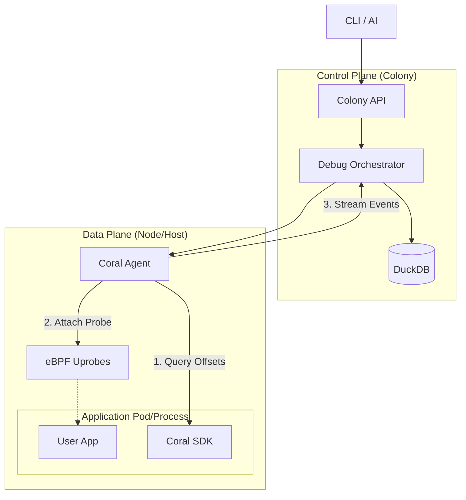

# RFD 059 - Live Debugging Architecture

**Status:** ✅ Implemented

## Summary

This RFD defines the high-level architecture for on-demand live debugging of
applications via SDK-integrated eBPF uprobes. It establishes the control plane,
service discovery mechanisms, and data model required to coordinate debugging
sessions between the Colony, Agents, and Applications.

Detailed implementation specifications are split into:

- **RFD 060**: [SDK Runtime Monitoring](060-sdk-runtime-monitoring.md) (
  Application side)
- **RFD 061**: [eBPF Uprobe Mechanism](061-ebpf-uprobe-mechanism.md) (Agent
  side)
- **RFD 062**: [Live Debugging UX & AI](062-live-debugging-ux.md) (User side)

## Problem

Production incidents often require deep visibility into specific function
executions (latency, arguments, call counts) that standard metrics and
distributed tracing cannot provide. Traditional debuggers (gdb, delve) are
unsafe for production due to process pausing and high overhead.

We need a system that allows:

1. **Dynamic Instrumentation**: Attaching probes to specific functions without
   redeployment.
2. **Safety**: Ensuring low overhead and automatic cleanup.
3. **Orchestration**: Managing debug sessions across distributed services.

## Solution

The solution uses a coordinated approach where the **Coral SDK** (embedded in
the app) provides function metadata, the **Coral Agent** attaches eBPF uprobes
to the process, and the **Coral Colony** orchestrates the sessions and stores
the data.

### Architecture Overview



### Key Components

1. **Application (SDK)**: Exposes function names and memory offsets. (
   See [RFD 060](060-sdk-runtime-monitoring.md))
2. **Agent**: Manages the eBPF lifecycle, attaching probes to target PIDs and
   streaming events. (See [RFD 061](061-ebpf-uprobe-mechanism.md))
3. **Colony**: Central registry for active sessions, routing requests to the
   correct agents, and storing historical data.
4. **CLI/AI**: The interface for users to request debug sessions. (
   See [RFD 062](062-live-debugging-ux.md))

## Service Discovery & Capabilities

To route debug requests, the Colony must know which services support live
debugging. We extend the service discovery model (RFD 018) to include SDK
capabilities.

### Service SDK Capabilities

Each monitored service reports its SDK status to the Agent, which forwards it to
the Colony.

```protobuf
// Defined in proto/coral/agent/v1/agent.proto

message ServiceSdkCapabilities {
    string service_name = 1;           // Service identifier
    string process_id = 2;             // PID of service process

    // SDK integration status
    bool sdk_enabled = 3;              // SDK detected and reachable
    string sdk_version = 4;            // SDK version (e.g., "v1.0.0")
    string sdk_addr = 5;               // SDK gRPC address (reachable by Agent)

    // Debug symbol availability
    bool has_dwarf_symbols = 6;        // DWARF debug info present
    uint32 function_count = 7;         // Number of discoverable functions

    // Binary information
    string binary_path = 10;           // Path to executable
    string binary_hash = 11;           // Hash for cache invalidation
}
```

### Colony Service Registry

The Colony stores these capabilities in DuckDB to enable fast lookups and
validation before routing requests.

```sql
-- DuckDB schema for service registry extensions
ALTER TABLE services
    ADD COLUMN sdk_enabled BOOLEAN DEFAULT false;
ALTER TABLE services
    ADD COLUMN sdk_version VARCHAR;
ALTER TABLE services
    ADD COLUMN has_dwarf_symbols BOOLEAN;
ALTER TABLE services
    ADD COLUMN function_count INTEGER;
```

## Colony RPC API

The Colony exposes a `DebugService` for the CLI and AI agents.

```protobuf
// proto/coral/colony/v1/debug.proto

service DebugService {
    // Start a debug session (attach uprobe)
    rpc AttachUprobe(AttachUprobeRequest) returns (stream UprobeEvent);

    // Stop a debug session
    rpc DetachUprobe(DetachUprobeRequest) returns (DetachUprobeResponse);

    // List active sessions
    rpc ListDebugSessions(ListDebugSessionsRequest) returns (ListDebugSessionsResponse);

    // Trace a request path (higher-level abstraction)
    rpc TraceRequestPath(TraceRequestPathRequest) returns (stream TraceEvent);
}

message AttachUprobeRequest {
    string service_name = 1;
    string function_name = 2;
    google.protobuf.Duration duration = 3; // Max 600s
    UprobeConfig config = 4;
}

message UprobeConfig {
    bool capture_args = 1;
    bool capture_return = 2;
    uint32 sample_rate = 3;
}
```

## Data Storage

Debug session metadata and collected events are stored in DuckDB for analysis
and audit trails.

```sql
CREATE TABLE debug_sessions
(
    session_id    VARCHAR PRIMARY KEY,
    service_name  VARCHAR     NOT NULL,
    function_name VARCHAR     NOT NULL,
    agent_id      VARCHAR     NOT NULL,
    started_at    TIMESTAMPTZ NOT NULL,
    expires_at    TIMESTAMPTZ NOT NULL,
    status        VARCHAR     NOT NULL, -- 'active', 'expired', 'detached'
    requested_by  VARCHAR     NOT NULL  -- User ID for audit
);

CREATE TABLE uprobe_events
(
    timestamp     TIMESTAMPTZ NOT NULL,
    session_id    VARCHAR     NOT NULL,
    agent_id      VARCHAR     NOT NULL,
    service_name  VARCHAR     NOT NULL,
    function_name VARCHAR     NOT NULL,
    event_type    VARCHAR     NOT NULL, -- 'entry', 'exit'
    duration_ns   BIGINT,
    pid           INTEGER     NOT NULL,
    tid           INTEGER     NOT NULL,
    labels        MAP(VARCHAR, VARCHAR)
);
```

## Security & Privacy

1. **Time-Limited**: All sessions have a hard expiry (max 10 minutes) enforced
   by both Agent and Colony.
2. **Read-Only**: Uprobes are strictly read-only; they cannot modify state.
3. **Audit Log**: Every attachment is logged in `debug_sessions` with the
   requester's identity.
4. **Resource Limits**: The Agent enforces limits on the number of concurrent
   probes and event rates (see RFD 060).

---

## Implementation Plan

The implementation is divided into five phases to deliver a complete vertical
slice before hardening for production.

### Phase 1: Foundation (Completed)

- [x] **Protobuf Definitions**: Define RPC messages for uprobe collection and
  debug orchestration.
- [x] **SDK Implementation**: Implement DWARF parsing and embedded gRPC server
  for function metadata exposure.

### Phase 2: Uprobe Collector (Completed)

- [x] **eBPF Program**: Develop C program for `kprobe`/`kretprobe` attachment
  and event streaming.
- [x] **Agent Collector**: Implement Go collector to manage eBPF lifecycle and
  stream events.

### Phase 3: Agent & Colony Integration (Completed)

- [x] **Agent RPCs**: Implement `StartUprobeCollector` and `QueryUprobeEvents`
  handlers.
- [x] **Colony Orchestrator**: Implement session management and routing logic (
  MVP).

### Phase 4: CLI Integration (Completed)

- [x] **Debug Commands**: Implement `coral debug` commands (`attach`, `detach`,
  `sessions`, `events`).
- [x] **User Experience**: Ensure real-time event streaming and intuitive
  session management.

---

## Implementation Status

**Status:** ✅ Implemented (MVP Complete)

Phases 1 through 4 are complete, delivering a functional end-to-end live
debugging experience.

- **SDK**: Fully functional with DWARF parsing and gRPC server.
- **Agent**: Successfully attaches uprobes and streams events using eBPF.
- **Colony**: Orchestrates sessions and routes requests (in-memory MVP).
- **CLI**: Provides full control over debug sessions.

---

## Deferred Features

The following features are deferred from the initial MVP scope and will be
addressed in future hardening phases:

- **Persistence**: Store debug sessions and audit logs in DuckDB.
- **Service Discovery**: Integrate with service registry for automatic agent/SDK
  resolution.
- **Agent Pool**: Robust connection management between Colony and Agents.
- **Security**: Implement audit logging and access control.

## Future Work

- **Distributed Tracing Correlation**: Linking uprobe events with OTel spans.
- **Multi-Language Support**: Extending the architecture to support Python and
  Node.js agents.
