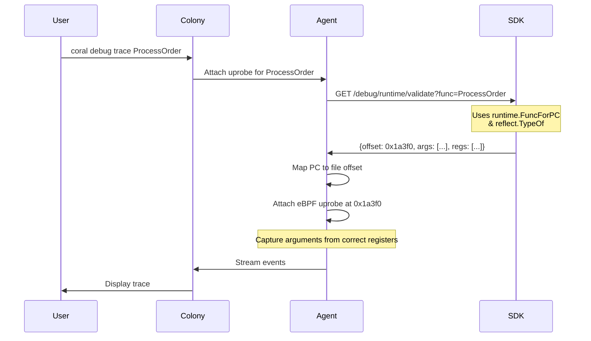

# RFD 075 - Hybrid Function Metadata - DWARF + Runtime Reflection

**Status:** 🚧 Draft

## Summary

Implement a runtime validation layer in the Coral SDK to provide 100% accurate
function offsets and argument locations for uprobe attachment. By querying the
Go runtime reflection API at attachment time, this system bypasses the
limitations of static DWARF data—which is often incomplete or incorrect in
optimized production builds and under register-based calling conventions (Go
1.17+).
This ensures that uprobes are attached to the correct memory addresses and read
function arguments from the correct registers/stack locations every time.

## Problem

The current DWARF-only metadata extraction (RFD 066) has several critical
accuracy problems that break uprobe-based debugging in real-world scenarios:

### 1. Optimized Builds Break DWARF

**Problem**: Production builds use optimizations by default:

- Register allocation changes.
- Arguments may be optimized away or moved.
- DWARF locations become incomplete or inaccurate.

**Impact**: In production-optimized binaries, DWARF is often a "best guess" that
fails to reflect the true state of the CPU registers at the function entry
point.

### 2. Function Offsets Can Be Unreliable

**Problem**: DWARF function offsets (`DW_AT_low_pc`) may not match actual
runtime addresses due to:

- ASLR (Address Space Layout Randomization)
- PIE (Position Independent Executables)
- Dynamic linking

**Impact**: Attaching a uprobe to a static file offset often misses the actual
memory location in a running process, leading to silent capture failures.

### 3. Go 1.17+ Register ABI Issues

**Problem**: Go 1.17 introduced register-based calling convention. DWARF
generation for register-based arguments (RAX, RBX, etc.) has been historically
buggy and incomplete (
e.g., [Go #49646](https://github.com/golang/go/issues/49646)).

**Impact**: Even if DWARF is present, it may lack the correct
register-to-argument mapping for modernized Go binaries.

### 4. Register Overflow to Stack

**Problem**: The Go internal ABI uses a fixed number of registers (9 integer, 15
float). Functions exceeding these limits pass overflow arguments on the stack.

**Impact**: DWARF-only tools often struggle with the correct 8-byte alignment
and stack pointer offsets required to read overflow arguments from the live
stack.

### 5. Inlining Breaks Uprobes

**Problem**: The Go compiler aggressively inlines small functions. An inlined
function no longer has an independent entry point or a dedicated stack frame.

**Impact**: DWARF may reference a symbol address that is actually inside a
different containing function. Attaching there leads to incorrect context or
execution failures.

### 6. Type Information Incomplete

**Problem**: Current DWARF extraction (RFD 066) focuses on basic primitives. It
lacks size information and structural details for complex types (structs,
slices, interfaces).

**Impact**: eBPF programs cannot correctly calculate buffer sizes or traverse
pointer indirections without precise type size and layout metadata.

## Solution

Implement a **runtime verification layer** that acts as the final source of
truth
for uprobe attachment, augmenting the existing DWARF-based discovery:

**Runtime Validation Endpoint** (PROPOSED):

- Agent queries the SDK via a new `GET /debug/runtime/validate?func=...`
  endpoint immediately before uprobe attachment.
- **Function Resolution**: Since the standard `reflect` package cannot look up
  absolute function names directly (e.g., `github.com/myapp/pkg.ProcessOrder`),
  the SDK will index the binary's `pclntab` (Process Call Line Table) at
  startup.
- **Inlining Detection**: The SDK uses `runtime.FuncForPC(addr).Name()` to
  verify if the resolved address strictly belongs to the requested function. If
  the address is part of an inlined block inside another function, the SDK marks
  it with an `is_inlined: true` flag.
- **Hybrid Argument Locations**: The system handles Go's register-to-stack
  overflow. For functions with many arguments, the SDK returns a mix of
  `type: register` and `type: stack` locations. Stack offsets are calculated
  relative to the stack pointer (e.g., `SP+8` for the 10th integer argument).
- **Accuracy Guarantee**: By resolving metadata at runtime, the system
  automatically handles ASLR, inlining detection, and register-based ABI
  assignments (AMD64/ARM64).

> [!IMPORTANT] > **Performance Note**: While calling `reflect` and iterating the
> `pclntab` is relatively cheap, it is not free. These operations must not be
> performed in high-frequency loops within the target application.

- **Validation Caching**: To minimize overhead, the Agent implements a \*
  \*Validation Cache\*\*. Once a function has been validated for a specific `PID`
  and `BuildID`, the Agent caches the metadata for the lifetime of that process.

### Benefits

- **100% Execution Accuracy**: Ensures uprobes are attached to the exact
  function entry point, avoiding "silent failures" where probes never fire.
- **Production Debugging**: Enables reliable argument capture in
  production-optimized binaries (where DWARF is typically stripped or
  inaccurate).
- **Register ABI Support**: Deep integration with the Go internal ABI ensures
  correct register-to-argument mapping for Go 1.17+ versions.
- **Seamless Integration**: Automatically enhances existing debugging workflows
  without requiring changes to application code.

### Key Design Decisions

**Why Runtime Validation?**

- Static analysis (DWARF/Symbols) is a "best guess" for optimized binaries.
- ASLR and dynamic linking make static offsets unreliable at runtime.
- Go's runtime already knows exactly where functions are and how parameters are
  passed; the SDK merely exposes this truth to the Agent.

**Verification at Attachment Time**

- On-demand validation avoids the overhead of indexing millions of runtime
  offsets.
- Provides a "check-before-attach" safety mechanism that validates the function
  still exists in the currently running process.

**Trade-offs**:

- ✅ **Accuracy**: Runtime reflection is always correct
- ✅ **Compatibility**: Works with all Go versions and build modes
- ⚠️ **Latency**: Extra HTTP round-trip per uprobe attachment (~1ms)
- ⚠️ **SDK Dependency**: Requires SDK running for validation (already required
  per RFD 066)

### Architecture Overview



### Component Changes

1. **SDK** (Runtime Metadata Provider): [NEW]

   - Implement a reflection-based provider using `runtime` and `reflect`.
   - Resolve live memory addresses and map them to file offsets for the Agent.
   - Provide exact argument-to-register mappings based on the Go internal ABI.

2. **SDK** (HTTP API): [MODIFY]

   - Introduce the `GET /debug/runtime/validate` endpoint.
   - Wire the endpoint to the `RuntimeMetadataProvider`.

3. **Agent**: [MODIFY]

   - Update the uprobe attachment logic to call the SDK validation endpoint.
   - **Validation Cache**: Implement a local cache (indexed by `PID` +
     `BuildID` + `FunctionName`) to store validated metadata and avoid
     redundant network/reflection calls.
   - Check the `is_inlined` flag in the SDK response; if `true`, warn the user
     that tracing this function may be inaccurate or incomplete due to compiler
     optimizations.
   - Use the returned runtime offset, register mapping, and **type sizes** for
     eBPF attachment. This ensures the eBPF program reads the correct number of
     bytes (e.g., 4 bytes for `int32` vs 8 bytes for `int64`).

4. **Colony**: [NO CHANGE]
   - Function discovery and semantic search are already implemented. No changes
     required to support runtime validation.

**Configuration Example:**

```yaml
# No new configuration required; enabled by default in SDK/Agent
```

### Integration Flow

The system uses a "lazy validation" model:

1. **Discovery**: Functions are discovered and indexed via DWARF (already
   implemented).
2. **Request**: User requests a trace on a function found in the index.
3. **Validation**: Before attaching, the Agent calls the SDK to get the _live_
   runtime metadata.
4. **Execution**: eBPF uprobe is attached to the validated offset with
   guaranteed register accuracy.

This ensures that even if DWARF data is old or inaccurate, the final debugging
session uses the current state of the running process.

## API Changes

### SDK HTTP API Extensions

**New endpoint**: `GET /debug/runtime/validate`

**Purpose**: Validate function and return runtime metadata for uprobe
attachment.

**Request**:

```http
GET /debug/runtime/validate?func=github.com/myapp/pkg.ProcessOrder HTTP/1.1
```

**Response** (200 OK):

```json
{
    "name": "github.com/myapp/pkg.ProcessOrder",
    "offset": 107092,
    "file": "/app/pkg/orders.go",
    "line": 42,
    "is_inlined": false,
    "arguments": [
        {
            "name": "userID",
            "type": "int64",
            "size": 8,
            "location": {
                "type": "register",
                "register": 0,
                "register_name": "RAX"
            }
        },
        {
            "name": "overflowArg",
            "type": "int32",
            "size": 4,
            "location": {
                "type": "stack",
                "offset": 8,
                "base": "SP"
            }
        }
    ],
    "validated_at": "2025-12-03T10:00:00Z"
}
```

**Response** (404 Not Found):

```json
{
    "error": "function not found",
    "name": "github.com/myapp/pkg.NotExist"
}
```

## Testing Strategy

### Unit Tests

**SDK Runtime Metadata**:

- Test `RuntimeMetadataProvider.ValidateFunction()` with sample functions.
- Verify register assignments match Go ABI (AMD64, ARM64).
- Test with 1-15 argument functions (register spillover to stack).
- Validate error handling (function not found, reflection errors).

**Agent Validation Query**:

- Mock SDK HTTP endpoint for `/debug/runtime/validate`.
- Test offset and location parsing logic in the Agent.
- Verify error handling (SDK offline, malformed response).

### Integration Tests

**End-to-End Uprobe Attachment**:

1. Build sample Go app with 10-argument function
2. Start SDK HTTP server
3. Agent queries `/debug/runtime/validate`
4. Verify returned offset matches actual runtime address
5. Attach uprobe and verify it fires
6. Read arguments from registers (verify values match)

**DuckDB Indexing**:

1. Build sample app with 100+ functions
2. SDK sends index to Colony
3. Query DuckDB for "order processing functions"
4. Verify semantic search returns relevant results

**Go Version Compatibility**:

- Test with Go 1.17, 1.19, 1.21
- Test with optimized (`go build`) and debug builds (`-gcflags="-N -l"`)
- Verify runtime validation works regardless of build mode

### E2E Tests

**Scenario**: Debug production issue

1. User: "Trace the checkout flow for failed payments"
2. Colony AI searches DuckDB, finds `ProcessPayment`
3. Agent queries SDK runtime validation
4. Uprobe attached with correct offset and register reads
5. eBPF captures argument values (card number, amount)
6. Trace shows payment flow with accurate data

## Security Considerations

**Runtime Reflection Exposure**:

- `/debug/runtime/validate` exposes function internals
- **Mitigation**: Bind to `localhost:9002` only (no remote access)
- Already required per RFD 066 security model

**DuckDB Index Data**:

- Function names and signatures stored in Colony
- **Mitigation**: Colony already has access to service metadata
- No new security boundary

**eBPF Argument Capture**:

- May capture sensitive data (passwords, credit cards)
- **Mitigation**: Existing eBPF security applies (BPF_PROG_TYPE_KPROBE
  permissions)
- Out of scope for this RFD

## Implementation Plan

### Phase 1: SDK Enhancements

- [ ] Implement `RuntimeMetadataProvider` using `runtime` and `reflect`
      packages.
- [ ] Implement `pclntab` / `go.pcheader` parsing to build a `name -> PC` lookup
      table at startup.
- [ ] Implement Go internal ABI register mapping for AMD64/ARM64.
- [ ] Add `GET /debug/runtime/validate` to the SDK HTTP server.

### Phase 2: Agent Integration

- [ ] Implement SDK validation client in the Agent's uprobe attacher.
- [ ] **Implement Validation Cache** (PID + BuildID lookup).
- [ ] Update eBPF program loader to use runtime-validated offsets and registers.
- [ ] Add functional tests for optimized production builds.

### Phase 3: Verification

- [ ] Verify support for ASLR-enabled processes.
- [ ] Perform E2E tests with Go 1.17+ register ABI functions.
- [ ] Update documentation and CLI reference.

## Migration Strategy

### 1. Deployment Steps

- Update SDK in application codebases to enable runtime validation endpoints.
- Rotate Agents to pick up the updated uprobe attachment logic.
- Perform Colony database migration to add `function_index` table.

### 2. Rollback Plan

- Revert Agent/SDK changes; Agent will fallback to DWARF if runtime validation
  is unavailable.
- DWARF-based metadata remains compatible with the search index schema.

## Implementation Status

**Status:** ⏳ PROPOSED (Draft)

**Core Focus**: Adding high-accuracy runtime validation for uprobe attachment.

**Pre-requisites**:

- ✅ RFD 063 (Function Registry) - COMPLETED
- ✅ RFD 066 (SDK Debug API) - COMPLETED

## Future Work

### Advanced Type Handling (Future RFD)

Complex type extraction from runtime reflection:

- Struct field offsets for eBPF reading
- Interface value extraction (type + data pointers)
- Slice/map internals (len, cap, data pointer)
- Channel state inspection

**Blocked by**: Need eBPF program generation framework (separate RFD)

### Caching & Performance (Low Priority)

Runtime validation results could be cached:

- Cache validated metadata for frequently-traced functions
- Invalidate on binary reload or ASLR change
- Reduce HTTP round-trips

**Rationale for deferring**: Validation is fast (~1ms), not a bottleneck.

### Multi-Language Support (Future)

Extend hybrid approach to other languages:

- Rust: DWARF + proc macros
- C++: DWARF + debug symbols
- Python: AST + runtime introspection

**Rationale for deferring**: Go-only for MVP, expand based on demand.

## Appendix

### Go Runtime Package APIs

Key APIs used for runtime reflection and function resolution:

```go
// High-level PC lookup
func runtime.FuncForPC(pc uintptr) *runtime.Func
func (*runtime.Func).Entry() uintptr // Function entry point (offset)
func (*runtime.Func).Name() string // Fully qualified name

// Iterating through pclntab (Internal/Unsafe required for some fields)
// See cmd/link/internal/ld/pcln.go and runtime/pclntab.go
// 1. Get first and last PC from pcheader
// 2. Iterate and build name index
```

### Go ABI Documentation

**Official Go 1.17 Register ABI**:

- [Proposal](https://go.googlesource.com/proposal/+/refs/heads/master/design/40724-register-calling.md)
- [Internal ABI](https://github.com/golang/go/blob/master/src/cmd/compile/abi-internal.md)

**Register Assignments (AMD64)**:

- Integer args (9): RAX, RBX, RCX, RDI, RSI, R8, R9, R10, R11
- Float args (15): X0-X14 (SSE registers)
- Return values: RAX, RBX, RCX, ... (same as args)

**Stack Overflow (AMD64)**:

- Arguments exceeding available registers are passed on the stack.
- The first stack argument is at `SP + 8` (immediately above the return
  address).
- All stack arguments are 8-byte aligned on AMD64.

**Register Assignments (ARM64)**:

- Integer args (16): R0-R15
- Float args (16): F0-F15
- Return values: R0-R15

### DWARF vs Runtime Tradeoffs

| Aspect           | DWARF                         | Runtime Reflection      |
| ---------------- | ----------------------------- | ----------------------- |
| **Availability** | Requires debug symbols        | Always available        |
| **Accuracy**     | Unreliable with optimizations | Always accurate         |
| **Offsets**      | Static, may be wrong (ASLR)   | Dynamic, always correct |
| **Arguments**    | Incomplete (Go 1.17-1.18)     | Complete (uses ABI)     |
| **Types**        | Detailed (struct fields)      | Basic (type names)      |
| **File/Line**    | ✅ Available                  | ❌ Not available        |
| **Signatures**   | ✅ Available                  | ❌ Partial              |
| **Performance**  | Fast (parse once)             | Fast (runtime lookup)   |

**Conclusion**: Use DWARF for **discovery**, runtime for **accuracy**.

---

### Reference Implementations

- [Go Register ABI Proposal](https://go.googlesource.com/proposal/+/refs/heads/master/design/40724-register-calling.md)
- [Go Internal ABI Documentation](https://github.com/golang/go/blob/master/src/cmd/compile/abi-internal.md)
- [Delve's pclntab parser](https://github.com/go-delve/delve/blob/master/pkg/proc/bininfo.go) (
  Reference for name resolution)
