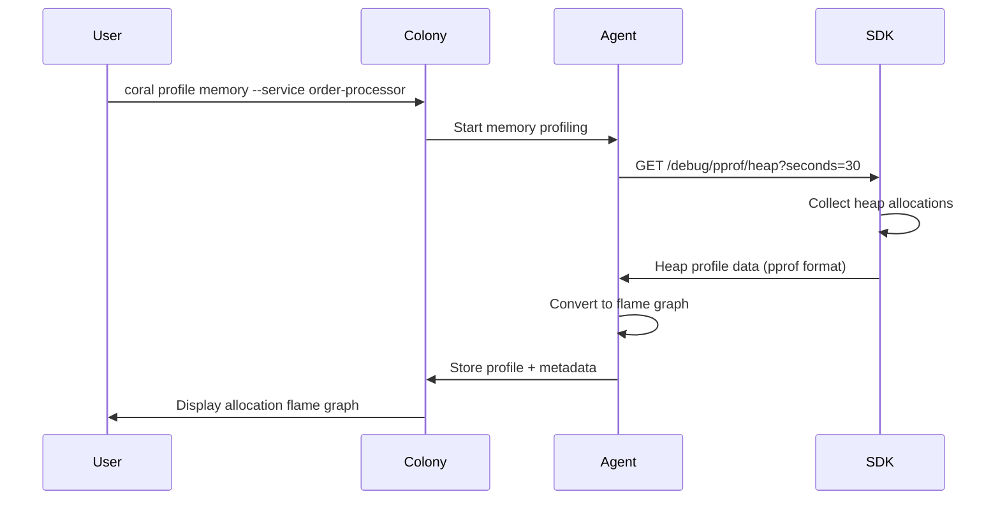

# RFD 077 - Memory Profiling and Allocation Flame Graphs

**Status:** 🚧 Draft

## Summary

Implement memory allocation profiling and heap analysis to complement the
existing CPU profiling infrastructure (RFD 070, RFD 072). This RFD introduces:

- **Allocation Flame Graphs**: Visualize where memory is allocated in the
  codebase
- **Continuous Memory Profiling**: Low-overhead always-on heap sampling (similar
  to RFD 072's continuous CPU profiling)
- **Memory Leak Detection**: Track allocation growth trends across time windows
- **GC Pressure Correlation**: Correlate memory allocation hotspots with GC CPU
  overhead
- **LLM Integration**: Enrich `coral_query_summary` with memory diagnostics for
  AI-driven root cause analysis

This completes Coral's profiling stack, enabling comprehensive performance
analysis of both CPU and memory resources in production Go applications.

## Problem

Production memory issues are common and difficult to diagnose without profiling:

### 1. Memory Leaks

**Problem**: Gradual memory growth over hours/days leads to OOM kills or
performance degradation as GC struggles.

**Current Gap**: Coral can show system memory metrics (RFD 071) but cannot
identify which functions or types are leaking memory.

**Impact**: Operators see memory growth in dashboards but lack the code-level
attribution needed for fixes.

### 2. High Allocation Rate

**Problem**: Functions allocating millions of objects per second cause GC
pressure, visible as CPU overhead in flame graphs (RFD 070).

**Current Gap**: CPU profiles show `runtime.mallocgc` and `runtime.scanobject`
but don't reveal _what_ is being allocated or _where_ in the code.

**Impact**: Developers know GC is slow but can't identify the allocation sources
driving the problem.

### 3. Large Object Allocations

**Problem**: Single large allocations (e.g., unbounded slice growth, large
buffers) spike memory usage and trigger immediate GC.

**Current Gap**: No visibility into per-allocation size distribution.

**Impact**: Hard to distinguish between "many small allocations" vs "few huge
allocations" without profiling.

### 4. Type-Level Attribution

**Problem**: Understanding which _types_ consume the most heap space is critical
for optimization.

**Current Gap**: No breakdown of heap composition by Go type (e.g., `[]byte` vs
`map[string]interface{}`).

**Impact**: Developers resort to manual instrumentation or local `pprof` runs
that don't reflect production traffic patterns.

### 5. Correlation with CPU Profiling

**Problem**: Memory issues manifest as CPU problems (GC overhead shows up in CPU
flame graphs).

**Current Gap**: RFD 074's LLM-driven RCA can detect GC CPU hotspots but lacks
the memory allocation context to explain _why_ GC is running frequently.

**Impact**: Incomplete diagnostics: "GC is using 30% CPU" without "because
function X allocates 500MB/sec".

## Solution

Implement a **dual-mode memory profiling system** modeled after RFD 070/072:

### On-Demand Memory Profiling (High-Resolution)

Similar to `coral profile cpu` (RFD 070), provide:

```bash
coral profile memory --service order-processor --duration 30
```

- **Mechanism**: Go's `runtime/pprof.WriteHeapProfile()`
- **Sampling**: Default `runtime.MemProfileRate = 512KB` (Go default)
- **Output**: Allocation flame graph showing bytes allocated per function
- **Duration**: 10s-60s (user-specified)
- **Overhead**: ~2-5% CPU overhead during profiling window

### Continuous Memory Profiling (Low-Resolution)

Extend RFD 072's continuous profiling to memory:

```bash
coral query memory-profile --service order-processor --since 1h
```

- **Mechanism**: Periodic heap snapshots via `runtime.ReadMemStats()` +
  allocation sampling
- **Sampling Rate**: Adjusted to ~4MB (lower frequency to reduce overhead)
- **Frequency**: Snapshot every 60 seconds (vs 15s for CPU)
- **Retention**: Same as RFD 072 (1hr agent, 30 days colony)
- **Overhead**: <1% CPU, minimal memory footprint

**Tiered Storage (following RFD 072 pattern):**

- **Agent-Side**:
  - Collect heap snapshots every 60 seconds
  - Frame dictionary encoding (stores stacks as integer arrays)
  - Store in local DuckDB with 1-hour retention
  - Storage: ~120KB/hour per service

- **Colony-Side**:
  - Poll agents for memory profiles
  - Merge identical stacks across time windows
  - Frame dictionary compression (85% reduction vs string storage)
  - DuckDB columnar storage with automatic compression
  - Store aggregated profiles with 30-day retention
  - Storage: ~174MB per service for 30 days (see Performance & Overhead section)

### Memory Leak Detection

Track heap growth trends:

- **Baseline**: Compare heap size at T-1h vs T-now
- **Growth Rate**: Bytes/sec increase over rolling 1-hour window
- **Leak Threshold**: Alert if heap grows >10% without corresponding traffic
  increase
- **Attribution**: Flame graph showing allocation sites contributing to growth

### GC Pressure Correlation

Integrate with RFD 074's enriched query summary:

```json
{
    "gc_cpu_overhead_pct": 28.5,
    "top_memory_hotspots": [
        {
            "function": "ProcessOrder",
            "alloc_bytes_per_sec": 524288000,
            "alloc_objects_per_sec": 2000000,
            "top_types": [
                "[]byte",
                "map[string]interface{}"
            ]
        }
    ],
    "heap_growth_rate_mb_per_hour": 150,
    "diagnosis": "High GC overhead caused by ProcessOrder allocating 500MB/sec"
}
```

**Architecture Overview:**



### Component Changes

1. **SDK** (Profile Provider): [MODIFY]

    - Already exposes `/debug/pprof/heap` (standard Go `net/http/pprof`)
    - Add `/debug/pprof/allocs` for allocation-specific profiling
    - Add runtime configuration endpoint to adjust `runtime.MemProfileRate`

2. **Agent** (Profile Collector): [MODIFY]

    - Extend `ProfileCollector` to support `profile_type: MEMORY`
    - Implement heap snapshot collection every 60s for continuous mode
    - Parse `pprof` heap profiles and convert to flame graph format
    - Store profiles in local DuckDB with frame dictionary encoding (1hr retention)
    - Track heap growth trends and detect leaks

3. **Colony** (Profile Storage & Query): [MODIFY]

    - Implement `MemoryProfilePoller` to poll agents for memory snapshots
    - Merge identical stacks across time windows (following RFD 072 pattern)
    - Extend DuckDB schema with `memory_profiles` table (parallel to
      `cpu_profiles`)
    - Use frame dictionary encoding for 85% compression vs string storage
    - Add `memory_hotspots` aggregation view for LLM queries
    - Implement 30-day retention cleanup
    - Integrate with RFD 074's `coral_query_summary` tool

4. **CLI**: [MODIFY]
    - Add `coral profile memory` command (parallel to `coral profile cpu`)
    - Add `coral query memory-profile` for historical queries
    - Display allocation flame graphs in terminal (text-based visualization)

## Implementation Plan

### Phase 1: SDK Memory Profile Collection

- [x] Verify `/debug/pprof/heap` and `/debug/pprof/allocs` endpoints work
  correctly
- [x] Add `POST /debug/config/memory-profile` for runtime sampling rate
  adjustment
- [x] Add unit tests for memory profile generation with various allocation
  patterns

### Phase 2: Agent Collection & Parsing

- [x] Extend `ProfileCollector` to support `MEMORY` profile type
- [x] Implement `pprof` heap profile parser (convert to flame graph format)
- [x] Add continuous memory profiling with 60s snapshot interval
- [x] Implement heap growth tracking (compare snapshots over time)
- [x] Add functional tests with mock Go applications allocating memory

### Phase 3: Colony Storage & Query

- [x] Create `MemoryProfilePoller` to poll agents for memory snapshots
- [x] Implement stack merging logic (combine identical stacks across time windows)
- [x] Add `memory_profiles` table to DuckDB schema with frame dictionary support
- [x] Add `profile_frame_dictionary` table for compression
- [x] Implement `memory_hotspots` aggregation view
- [x] Add retention policy (1hr agent, 30 days colony with cleanup)
- [x] Implement frame dictionary encoding (85% compression)

### Phase 4: CLI Integration

- [x] Implement `coral profile memory` command
- [x] Implement `coral query memory-profile` command
- [x] Add text-based flame graph rendering
- [x] Add allocation type breakdown display

### Phase 5: LLM Integration

- [x] Extend `coral_query_summary` with `memory_hotspots` field
- [x] Add `heap_growth` and `gc_correlation` fields
- [ ] Update LLM prompt templates to interpret memory diagnostics
- [x] Add integration tests for memory leak scenario detection

### Phase 6: Documentation & E2E Testing

- [ ] Update Coral documentation with memory profiling examples
- [ ] Create runbook for common memory issues (leaks, high allocation)
- [x] E2E tests with realistic Go applications (web servers, data processors)
- [ ] Performance benchmarking: verify <1% overhead for continuous mode

## API Changes

### Database Schema

**DuckDB Table**: `memory_profiles`

```sql
CREATE TABLE memory_profiles
(
    profile_id        UUID PRIMARY KEY,
    service_id        UUID      NOT NULL REFERENCES services (service_id),
    process_id        UUID      NOT NULL REFERENCES processes (process_id),
    build_id          STRING    NOT NULL,
    timestamp         TIMESTAMP NOT NULL,
    duration_sec      INTEGER   NOT NULL,
    profile_type      STRING    NOT NULL, -- 'on_demand' or 'continuous'

    -- Heap statistics
    alloc_bytes       BIGINT    NOT NULL, -- Total bytes allocated
    total_alloc_bytes BIGINT    NOT NULL, -- Cumulative total allocated
    sys_bytes         BIGINT    NOT NULL, -- Bytes from OS
    num_gc            BIGINT    NOT NULL, -- Number of GC runs

    -- Flame graph (frame dictionary + counts)
    frames            JSON      NOT NULL, -- [{frame_id, function, file, line}]
    stacks            JSON      NOT NULL, -- [{stack_id, frame_ids: [1,2,3], bytes, objects}]

    -- Top allocators (pre-computed for LLM queries)
    top_functions     JSON      NOT NULL, -- [{function, bytes, objects, pct}]
    top_types         JSON      NOT NULL, -- [{type, bytes, objects, pct}]

    -- Growth tracking
    heap_growth_bytes_per_sec DOUBLE,     -- Calculated from previous snapshot

    FOREIGN KEY (service_id) REFERENCES services (service_id),
    FOREIGN KEY (process_id) REFERENCES processes (process_id)
);

CREATE INDEX idx_memory_profiles_service ON memory_profiles (service_id, timestamp DESC);
CREATE INDEX idx_memory_profiles_build ON memory_profiles (build_id, timestamp DESC);
```

**Retention Policy**: Same as RFD 072

- **Agent**: 1 hour raw profiles (~120KB per service)
- **Colony**: 30 days aggregated profiles with frame dictionary encoding (~174MB per
  service)

**Storage Architecture**:

- Frame dictionary encoding (stores stacks as integer arrays)
- DuckDB columnar storage with automatic compression
- Same proven approach as RFD 072 CPU profiling
- See "Performance & Overhead" section for detailed storage calculations

### SDK HTTP API Extensions

**Existing Endpoint** (no change required):

```http
GET /debug/pprof/heap HTTP/1.1
```

**New Endpoint**: Allocation-specific profiling

```http
GET /debug/pprof/allocs?seconds=30 HTTP/1.1
```

**Response**: Standard Go `pprof` format (gzip-compressed protobuf)

**New Endpoint**: Runtime configuration

```http
POST /debug/config/memory-profile HTTP/1.1
Content-Type: application/json

{
  "sample_rate_bytes": 4194304
}
```

**Response**:

```json
{
    "previous_rate": 524288,
    "current_rate": 4194304
}
```

### Agent gRPC API Extensions

**New RPC** in `ProfileService`:

```protobuf
message StartMemoryProfileRequest {
    string service_id = 1;
    string process_id = 2;
    int32 duration_sec = 3;  // 0 = continuous mode snapshot
    int32 sample_rate_bytes = 4;  // Optional, default 512KB
}

message MemoryProfileResponse {
    string profile_id = 1;
    MemoryStats stats = 2;
    repeated Frame frames = 3;
    repeated Stack stacks = 4;
    repeated TopFunction top_functions = 5;
    repeated TopType top_types = 6;
}

message MemoryStats {
    int64 alloc_bytes = 1;
    int64 total_alloc_bytes = 2;
    int64 sys_bytes = 3;
    int64 num_gc = 4;
    double heap_growth_bytes_per_sec = 5;
}

message Stack {
    string stack_id = 1;
    repeated int32 frame_ids = 2;
    int64 bytes = 3;
    int64 objects = 4;
}

message TopFunction {
    string function = 1;
    int64 bytes = 2;
    int64 objects = 3;
    double pct = 4;
}

message TopType {
    string type = 1;
    int64 bytes = 2;
    int64 objects = 3;
    double pct = 4;
}

service ProfileService {
    rpc StartMemoryProfile(StartMemoryProfileRequest) returns (MemoryProfileResponse);
    rpc GetMemoryProfile(GetProfileRequest) returns (MemoryProfileResponse);
}
```

### Colony MCP Tool Extensions

**Extend** `coral_query_summary` (RFD 074):

```json
{
    "memory_hotspots": [
        {
            "function": "github.com/myapp/orders.ProcessOrder",
            "alloc_bytes_per_sec": 524288000,
            "alloc_objects_per_sec": 2000000,
            "pct_of_total": 45.2,
            "top_types": [
                "[]byte",
                "map[string]interface{}"
            ]
        }
    ],
    "heap_growth": {
        "current_mb": 2048,
        "baseline_mb": 1024,
        "growth_rate_mb_per_hour": 150,
        "is_leak": true
    },
    "gc_correlation": {
        "gc_cpu_pct": 28.5,
        "gc_triggered_by": "high allocation rate in ProcessOrder"
    }
}
```

### CLI Commands

**New Command**: On-demand memory profiling

```bash
coral profile memory [flags]

Flags:
  --service string      Service name or ID (required)
  --duration duration   Profile duration (default 30s)
  --sample-rate bytes   Allocation sampling rate (default 512KB)
  --output string       Output format: flamegraph, text, json (default flamegraph)
  --top int             Show top N allocators (default 10)
```

**Example**:

```bash
$ coral profile memory --service order-processor --duration 30

Collecting memory profile for 30 seconds...

Top Memory Allocators:
  45.2%  523.3 MB/s  github.com/myapp/orders.ProcessOrder
  22.1%  256.7 MB/s  encoding/json.Marshal
  12.5%  145.2 MB/s  github.com/myapp/cache.Store

Allocation Flame Graph:
  github.com/myapp/orders.ProcessOrder (45.2%, 523.3 MB/s)
  ├─ encoding/json.Marshal (22.1%, 256.7 MB/s)
  │  └─ reflect.ValueOf (12.3%, 142.8 MB/s)
  └─ github.com/myapp/cache.Store (12.5%, 145.2 MB/s)
     └─ make([]byte) (12.5%, 145.2 MB/s)
```

**New Command**: Historical memory profile query

```bash
coral query memory-profile [flags]

Flags:
  --service string      Service name or ID (required)
  --since duration      Look back duration (default 1h)
  --build-id string     Filter by specific build ID
  --show-growth         Show heap growth trends
  --show-types          Show allocation breakdown by type
```

**Example**:

```bash
$ coral query memory-profile --service order-processor --since 1h --show-growth

Memory Profile (last 1 hour):

Heap Growth:
  Current:  2048 MB
  1h ago:   1024 MB
  Growth:   +150 MB/hour (⚠️  potential leak detected)

Top Allocators (avg over 1h):
  ProcessOrder:     425 MB/s
  json.Marshal:     210 MB/s
  cache.Store:      120 MB/s

Top Types:
  []byte:                    55.2%
  map[string]interface{}:    22.8%
  *github.com/myapp/Order:   12.1%
```

## Testing Strategy

### Unit Tests

**SDK Memory Profile Generation**:

- Test heap profile collection with controlled allocation patterns
- Verify sampling rate adjustment via HTTP endpoint
- Test error handling (SDK not running, invalid parameters)

**Agent Profile Parsing**:

- Parse sample `pprof` heap profiles and verify flame graph conversion
- Test heap growth calculation with synthetic time-series data
- Test type extraction and aggregation (top types by bytes)

### Integration Tests

**End-to-End Memory Profiling**:

1. Start sample Go app with known allocation pattern (e.g., allocate 100MB/sec)
2. Agent requests memory profile from SDK
3. Verify returned flame graph matches expected allocators
4. Verify `top_functions` and `top_types` are correct

**Continuous Memory Profiling**:

1. Start sample Go app with gradual memory leak (grow 10MB/min)
2. Agent collects snapshots every 60s for 10 minutes
3. Verify heap growth detection triggers leak alert
4. Verify flame graph shows leak source function

**GC Correlation**:

1. Start app with high allocation rate (trigger frequent GC)
2. Collect both CPU profile (RFD 070) and memory profile
3. Verify `coral_query_summary` correlates GC CPU overhead with allocation
   hotspots

### E2E Tests

E2E tests extend the existing **ProfilingSuite** (
`tests/e2e/distributed/profiling_test.go`) to validate memory profiling
alongside CPU profiling within the same test infrastructure.

**Test Application: memory-app**

Create a test application with controlled memory allocation patterns:

- **Purpose**: Generate predictable memory allocation patterns for profiling
  validation
- **Deployment**: Runs in agent-1's network namespace (cpu-app uses agent-0)
- **Port**: 8083 (exposed to host for test traffic generation)
- **Endpoints**:
    - `GET /` - Allocate 100MB/sec (steady allocation rate)
    - `GET /leak` - Gradual memory leak at 10MB/min
    - `GET /spike` - Single large allocation (500MB)
    - `GET /types` - Allocate diverse Go types ([]byte, map, struct)
    - `GET /health` - Health check

**Test Cases** (extend ProfilingSuite):

1. **Continuous Memory Profiling**
    - Start memory-app with steady allocation pattern
    - Wait for continuous profiler snapshot (15s interval in e2e)
    - Verify memory profile captured with heap stats and top allocators

2. **On-Demand Memory Profiling**
    - Connect memory-app to agent
    - Trigger on-demand profile via colony debug API (30s @ 512KB sampling)
    - Generate allocation load during profiling window
    - Verify profile contains frames, stacks, top functions, and type
      attribution

3. **Memory Leak Detection**
    - Start memory-app /leak endpoint (10MB/min growth)
    - Collect snapshots over time window
    - Verify heap growth calculation and leak detection threshold
    - Verify flame graph attribution to leak source

4. **GC Correlation**
    - Generate high allocation rate (trigger frequent GC)
    - Collect both CPU profile and memory profile
    - Verify `coral_query_summary` correlates GC CPU overhead with allocation
      sources

5. **Type Attribution**
    - Generate allocations of specific types via /types endpoint
    - Verify top_types field contains expected type breakdown

**Scenario**: Diagnose memory leak in production

1. User: "Why is the order-processor using 10GB of RAM?"
2. Colony AI queries `coral_query_summary` (includes memory hotspots)
3. AI detects: "Heap growing 200MB/hour, leak in `cache.Store`"
4. User runs: `coral profile memory --service order-processor`
5. Flame graph confirms: `cache.Store` not evicting old entries
6. Fix: Add TTL-based eviction to cache

## Performance & Overhead

### On-Demand Profiling

- **CPU Overhead**: 2-5% during profiling window (acceptable for 30s-60s)
- **Memory Overhead**: ~10MB for profile data (scales with unique allocation
  sites)
- **Latency Impact**: Minimal (profiling runs asynchronously)

### Continuous Profiling

- **CPU Overhead**: <1% (60s snapshot interval, low sampling rate)
- **Memory Overhead**: ~2KB per snapshot (frame dictionary encoding)
- **Storage**:
  - **Agent**: ~120KB/hour per service (1-hour retention)
  - **Colony**: ~5.8MB/day per service (with frame dictionary + DuckDB compression)
  - **30-day retention**: ~174MB per service
  - **10 services**: ~1.74GB for 30 days

**Storage Details:**

- Snapshots: 60/hour × 24 hours = 1,440 per day
- Frame dictionary encoding: Stores stacks as integer arrays (85% compression vs
  strings)
- DuckDB columnar storage: Additional 2-3x compression on repeated patterns
- Effective storage: ~4KB per snapshot (after all compression layers)
- Total: 1,440 snapshots/day × 4KB = ~5.8MB/day per service

**Comparison to CPU Profiling (RFD 072):**

| Metric                      | CPU Profiling (RFD 072) | Memory Profiling (RFD 077) |
|-----------------------------|-------------------------|----------------------------|
| Collection Frequency        | 15s                     | 60s                        |
| Agent Storage (1hr)         | ~480KB                  | ~120KB                     |
| Colony Storage (30d)        | ~174MB per service      | ~174MB per service         |
| Compression Strategy        | Frame dictionary        | Frame dictionary           |
| DuckDB Columnar Compression | Yes                     | Yes                        |

Both profiling types use the same proven storage architecture for consistency and
efficiency.

### Sampling Rate Trade-offs

| Sample Rate      | Overhead | Accuracy  | Use Case                |
|------------------|----------|-----------|-------------------------|
| 512KB (default)  | 2-3%     | High      | On-demand profiling     |
| 4MB (continuous) | <1%      | Medium    | Always-on monitoring    |
| 128KB (high-res) | 5-8%     | Very High | Deep leak investigation |

## Security Considerations

**Memory Profile Exposure**:

- Memory profiles may reveal sensitive data structures (e.g., user objects,
  passwords in memory)
- **Mitigation**: Same as RFD 070 - SDK binds to `localhost:9002` only, no
  remote access
- **Mitigation**: Profiles contain stack traces and byte counts, not actual
  object contents

**Heap Snapshot Privacy**:

- Full heap dumps could leak secrets
- **Mitigation**: Use allocation sampling, not full heap dumps
- **Mitigation**: Type names are safe (e.g., `[]byte` vs actual byte contents)

**DuckDB Storage**:

- Memory profiles stored in Colony DuckDB
- **Mitigation**: Same access controls as CPU profiles (RFD 072)
- **Mitigation**: 30-day retention limit reduces exposure window

## Implementation Status

**Status:** 🚧 In Progress (Phases 1-5 implemented, Phase 6 pending)

## Future Work

### Heap Snapshot Diff Analysis (Future RFD)

Compare heap snapshots across time to isolate leak sources:

- **Diff View**: "What objects exist at T+1h that didn't exist at T?"
- **Retention Analysis**: "Which allocation sites have the longest-lived
  objects?"
- **Type Growth**: "Which types are growing fastest over time?"

**Blocked by**: Need efficient heap diff algorithm for large heaps (>1GB)

### Goroutine Leak Detection (Future RFD)

Extend memory profiling to track goroutine counts:

- **Mechanism**: `runtime.NumGoroutine()` sampling
- **Leak Detection**: Alert if goroutine count grows unbounded
- **Attribution**: Stack traces of goroutine creation sites

**Blocked by**: Requires goroutine profiling support (separate from heap
profiling)

### Live Heap Inspection (Future RFD)

Deep inspection of live heap objects:

- **Object Explorer**: Navigate heap graph (object → references → sub-objects)
- **Dominator Trees**: Find objects retaining the most memory
- **Leak Path Analysis**: "Why is this object still reachable?"

**Blocked by**: Requires eBPF-based heap traversal or SDK-side heap walker

### Multi-Language Support (Future)

Extend memory profiling to other languages:

- **Rust**: `jemalloc` profiling via heap sampling
- **C++**: `tcmalloc` or `gperftools` integration
- **Python**: `tracemalloc` support

**Rationale for deferring**: Go-only for MVP, expand based on demand

## Appendix

### Go Memory Profiling Internals

**Heap Profile (`/debug/pprof/heap`)**:

- Samples allocations at `runtime.MemProfileRate` intervals (default 512KB)
- Records stack traces for each sampled allocation
- Output: `pprof` protobuf format with `alloc_space` and `alloc_objects` counts

**Allocation Profile (`/debug/pprof/allocs`)**:

- Same as heap profile but includes all allocations since program start
- Shows cumulative allocation totals (not live heap)
- Useful for finding high-churn allocation sites

**Runtime Memory Stats (`runtime.ReadMemStats`)**:

```go
var m runtime.MemStats
runtime.ReadMemStats(&m)

// Key fields:
// - Alloc: bytes currently allocated
// - TotalAlloc: cumulative bytes allocated
// - Sys: bytes from OS
// - NumGC: number of GC runs
// - PauseTotalNs: total GC pause time
```

### Flame Graph Format

Memory flame graphs use the same format as CPU flame graphs (RFD 070):

- **X-axis**: Percentage of total bytes allocated
- **Y-axis**: Call stack depth (root at top)
- **Color**: Function name hash (consistent across profiles)
- **Tooltip**: Function name, bytes, objects, percentage

### Correlation with CPU Profiling

Memory allocation often drives CPU overhead:

| CPU Symptom                   | Memory Cause         | Flame Graph Evidence               |
|-------------------------------|----------------------|------------------------------------|
| High `runtime.mallocgc`       | Frequent allocations | Caller functions allocating often  |
| High `runtime.scanobject`     | Large heap size      | Many live objects retained         |
| High `runtime.gcBgMarkWorker` | GC pressure          | High allocation rate triggering GC |
| High `runtime.memmove`        | Large object copies  | Allocation of big slices/arrays    |

RFD 074's LLM can correlate these patterns:

```
Diagnosis: High GC CPU (30%) caused by ProcessOrder allocating 500MB/sec.
Fix: Reduce allocations by reusing buffers (sync.Pool) or optimizing serialization.
```

### Reference Implementations

- [Go pprof Package](https://pkg.go.dev/runtime/pprof)
- [Go Memory Model](https://go.dev/ref/mem)
- [Google's pprof Tool](https://github.com/google/pprof)
- [Continuous Profiling at Datadog](https://www.datadoghq.com/blog/engineering/how-we-optimized-our-akka-application-using-datadogs-continuous-profiler/)
