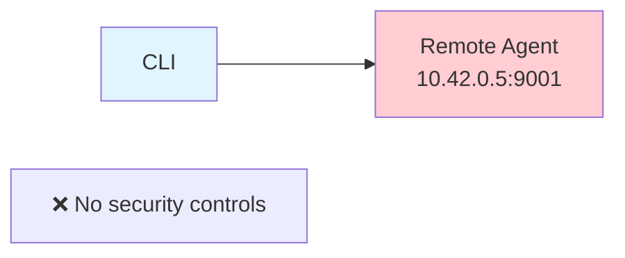
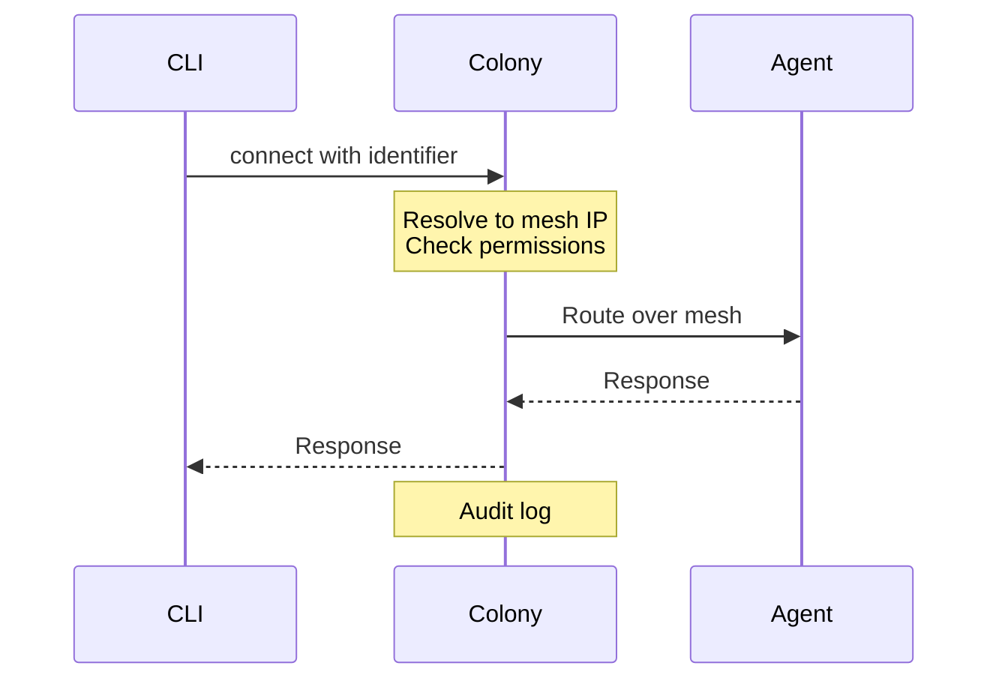
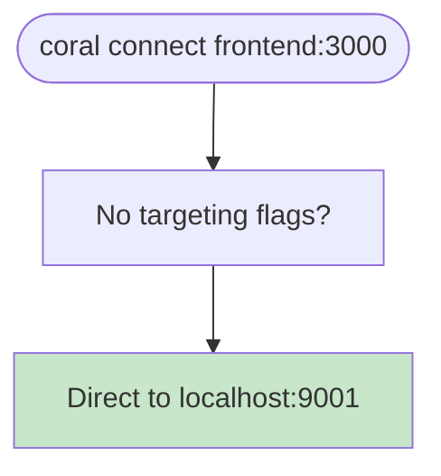
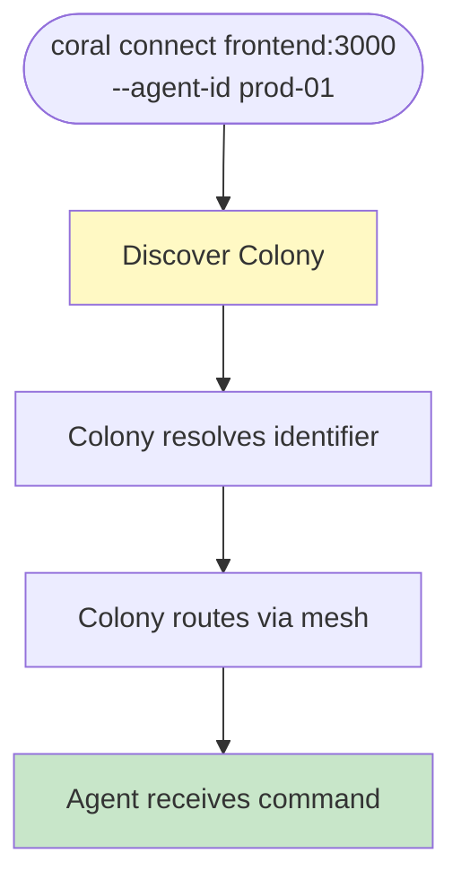
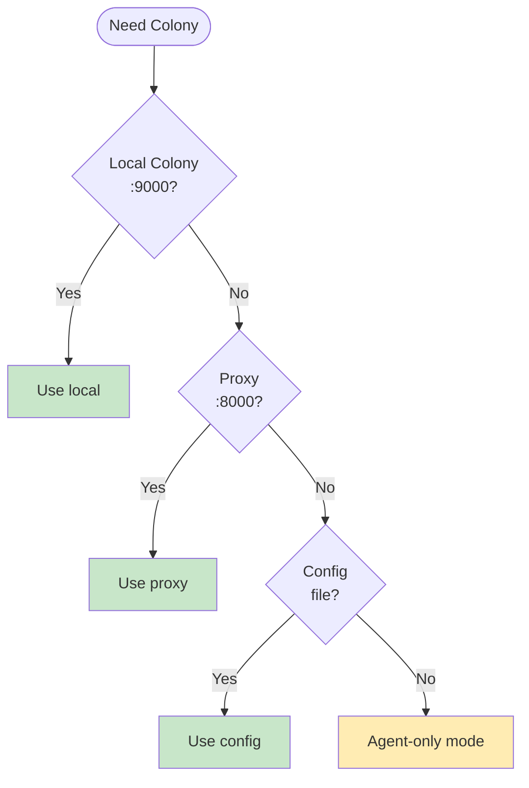
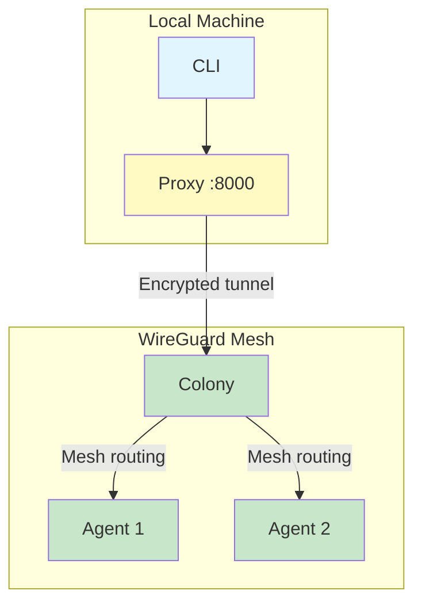

# Agent Routing Architecture

**Purpose**: Explain how the Coral CLI communicates with agents
**Status**: Conceptual overview
**Related
**: [RFD 016 - Unified Operations UX](../RFDs/016-unified-operations-ux.md)

## Overview

When you run `coral connect frontend:3000`, the CLI needs to talk to an agent.
This document explains how that communication works, why it's designed this way,
and what changes are planned.

## Core Principle

**The CLI should never speak directly to remote agents.**

All remote agent access must go through the Colony for:

- **Security** - RBAC enforcement and encryption
- **Auditability** - Logging who did what
- **Discoverability** - No need to know agent IPs

The only exception is localhost for development convenience.

## Current Behavior

### Local Agent (Development)

```bash
coral connect frontend:3000
```

```
CLI → Auto-discover → http://localhost:9001 (Agent)
```

**Works**: Direct HTTP connection to localhost agent.

### Remote Agent (Current Problem)

```bash
coral connect frontend:3000 --agent http://10.42.0.5:9001
```



**Problem**: Direct connection bypasses all security controls.

## Intended Behavior

### Local Agent (Unchanged)

```bash
coral connect frontend:3000
```

Direct connection remains for development workflow efficiency.

### Remote Agent (Future)

```bash
# By agent ID
coral connect frontend:3000 --agent-id prod-server-01

# By service name
coral connect frontend:3000 --service checkout-api --env production

# By labels
coral connect frontend:3000 --label region=us-east
```



**Benefits**: Colony enforces RBAC, logs access, routes over encrypted mesh.

## How It Works

### Local Development



Simple and fast for local development.

### Remote Access



Colony acts as secure router for all remote access.

## Colony Discovery

When the CLI needs Colony, it tries these in order:



1. **Local Colony** - localhost:9000, unix socket
2. **Local Proxy** - localhost:8000 (if running)
3. **Config/Environment** - User-specified endpoint
4. **Fallback** - Local operations only

## Remote Colony Access

To reach a remote Colony, use `coral proxy`:

```bash
# Terminal 1
coral proxy start https://colony.company.internal

# Terminal 2
coral connect frontend:3000 --agent-id prod-01
```



The proxy establishes a WireGuard tunnel and provides a local endpoint.

## Security Model

### Local (Development)

| Aspect     | Value                   |
|------------|-------------------------|
| Connection | Direct HTTP             |
| RBAC       | None                    |
| Audit      | None                    |
| Use Case   | Single-user dev machine |

### Remote (Production)

| Aspect     | Value                           |
|------------|---------------------------------|
| Connection | Colony-mediated, encrypted mesh |
| RBAC       | Enforced by Colony              |
| Audit      | All commands logged             |
| Use Case   | Multi-user, production access   |

## What's Changing

### Removing Insecure Direct Access

The `--agent http://...` flag for remote IPs will be restricted:

**Before**:

```bash
coral connect frontend:3000 --agent http://10.42.0.5:9001  # ❌ Bypasses security
```

**After**:

```bash
coral connect frontend:3000 --agent-id prod-server-01  # ✅ Via Colony
```

**Why**: Remote access must go through Colony for security and audit.

### Adding Logical Identifiers

Instead of IPs, use meaningful identifiers:

```bash
# By agent ID
coral connect frontend:3000 --agent-id prod-server-01

# By service running on agent
coral connect frontend:3000 --service checkout-api --env production

# By labels
coral connect frontend:3000 --label region=us-east
```

The Colony resolves these to agent mesh IPs and routes accordingly.

## Common Scenarios

### Scenario 1: Local Development

```bash
coral agent start
coral connect frontend:3000
```

Direct connection, no Colony needed.

### Scenario 2: Same Network as Colony

```bash
coral colony start  # Local or accessible
coral connect frontend:3000 --agent-id prod-01
```

CLI discovers Colony automatically, routes through it.

### Scenario 3: Remote Colony Behind NAT

```bash
coral proxy start https://colony.company.internal
coral connect frontend:3000 --agent-id prod-01
```

Proxy bridges the network gap.

## Key Takeaways

1. **Local development** stays simple and direct
2. **Remote access** requires Colony for security
3. **Logical identifiers** replace IP addresses
4. **`coral proxy`** bridges to remote Colonies
5. **No direct remote connections** for security and audit

## References

- [RFD 016 - Unified Operations UX](../RFDs/016-unified-operations-ux.md) - Full
  architecture
- [RFD 005 - CLI Access via Proxy](../RFDs/005-cli-access-via-proxy.md) - Proxy
  design

---

**Last Updated**: 2025-01-07
