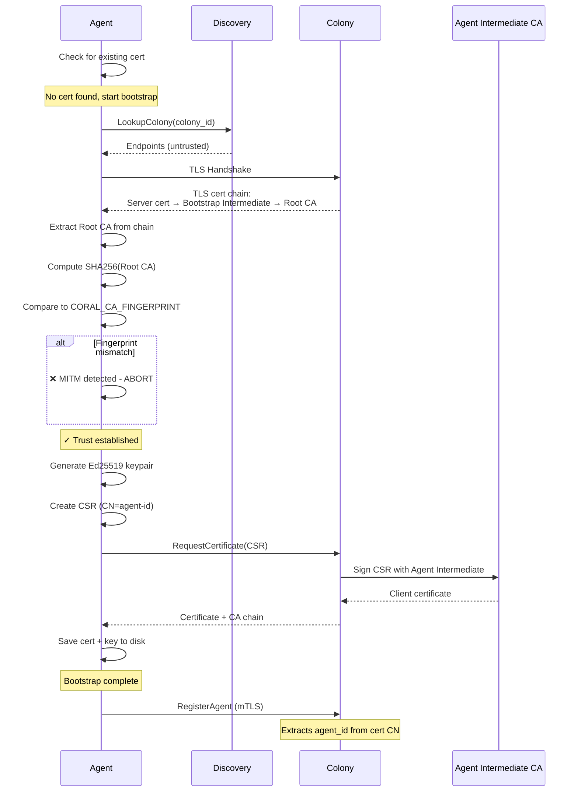

# CA Fingerprint Bootstrap Design

**Status:** Proposed
**Replaces:** JWT bootstrap tokens from RFD 022
**Updates:** RFD 022, RFD 047

## Overview

Agents bootstrap using a **Root CA fingerprint** distributed via configuration, eliminating the need for per-agent bootstrap tokens while maintaining MITM protection. This follows Kubernetes kubelet's `--discovery-token-ca-cert-hash` pattern.

## CA Hierarchy

### Three-Level PKI Structure

```
Root CA (10-year validity, offline/HSM)
  ├─ Bootstrap Intermediate CA (1-year, rotatable)
  │   └─ Colony TLS Server Certificate
  │       └─ Used for HTTPS endpoint
  │
  └─ Agent Intermediate CA (1-year, rotatable)
      └─ Agent Client Certificates
          └─ Used for mTLS authentication
```

**Root CA Fingerprint:** `sha256:a3f2e1d4c5b6a7f8e9d0c1b2a3f4e5d6c7b8a9f0e1d2c3b4a5f6e7d8c9b0a1f2`

### Why Hierarchical?

| Aspect | Benefit |
|--------|---------|
| **Security** | Root CA key stored offline/HSM, minimizes exposure |
| **Rotation** | Rotate intermediates without changing agent configs |
| **Operational** | Intermediates expire annually, root lasts 10+ years |
| **Flexibility** | Can issue new intermediates for different purposes |
| **Best Practice** | Follows PKI standards (X.509, RFC 5280) |

## Colony Initialization

### CLI Workflow

```bash
$ coral colony init my-app-prod

Initializing colony: my-app-prod...

Generated Certificate Authority:
  Root CA:                ~/.coral/colonies/my-app-prod/ca/root-ca.crt
  Root CA Key:            ~/.coral/colonies/my-app-prod/ca/root-ca.key (SECRET)

  Bootstrap Intermediate: ~/.coral/colonies/my-app-prod/ca/bootstrap-intermediate.crt
  Agent Intermediate:     ~/.coral/colonies/my-app-prod/ca/agent-intermediate.crt

Root CA Fingerprint (distribute to agents):
  sha256:a3f2e1d4c5b6a7f8e9d0c1b2a3f4e5d6c7b8a9f0e1d2c3b4a5f6e7d8c9b0a1f2

⚠️  IMPORTANT: Keep root-ca.key secure (offline storage or HSM recommended)

Deploy agents with:
  export CORAL_COLONY_ID=my-app-prod-a3f2e1
  export CORAL_CA_FINGERPRINT=sha256:a3f2e1d4c5b6a7f8e9d0c1b2a3f4e5d6...
  coral agent start

✓ Colony initialized successfully
```

### File Structure

```
~/.coral/colonies/my-app-prod-a3f2e1/
├── config.yaml
└── ca/
    ├── root-ca.crt                    # Public (10-year validity)
    ├── root-ca.key                    # SECRET - store offline/HSM
    ├── bootstrap-intermediate.crt     # Public (1-year validity)
    ├── bootstrap-intermediate.key     # Used for TLS server certs
    ├── agent-intermediate.crt         # Public (1-year validity)
    ├── agent-intermediate.key         # Used for agent client certs
    ├── server.crt                     # Colony's TLS certificate
    └── server.key                     # Colony's TLS private key
```

### Colony Config

```yaml
colony_id: my-app-prod-a3f2e1

ca:
  root:
    certificate: ~/.coral/colonies/my-app-prod/ca/root-ca.crt
    private_key: ~/.coral/colonies/my-app-prod/ca/root-ca.key
    fingerprint: sha256:a3f2e1d4c5b6a7f8e9d0c1b2a3f4e5d6c7b8a9f0e1d2c3b4a5f6e7d8c9b0a1f2

  bootstrap_intermediate:
    certificate: ~/.coral/colonies/my-app-prod/ca/bootstrap-intermediate.crt
    private_key: ~/.coral/colonies/my-app-prod/ca/bootstrap-intermediate.key
    expires_at: 2025-11-21

  agent_intermediate:
    certificate: ~/.coral/colonies/my-app-prod/ca/agent-intermediate.crt
    private_key: ~/.coral/colonies/my-app-prod/ca/agent-intermediate.key
    expires_at: 2025-11-21

tls:
  certificate: ~/.coral/colonies/my-app-prod/ca/server.crt
  private_key: ~/.coral/colonies/my-app-prod/ca/server.key

auto_issue_certificates: true
```

## Agent Bootstrap Flow

### Deployment

**Kubernetes:**
```yaml
apiVersion: v1
kind: Secret
metadata:
  name: coral-colony-ca
data:
  colony_id: bXktYXBwLXByb2QtYTNmMmUx
  ca_fingerprint: c2hhMjU2OmEzZjJlMWQ0YzViNmE3ZjhlOWQwYzFiMmEzZjRlNWQ2...
---
apiVersion: apps/v1
kind: Deployment
spec:
  template:
    spec:
      containers:
      - name: coral-agent
        image: coral/agent:latest
        env:
        - name: CORAL_COLONY_ID
          valueFrom:
            secretKeyRef:
              name: coral-colony-ca
              key: colony_id
        - name: CORAL_CA_FINGERPRINT
          valueFrom:
            secretKeyRef:
              name: coral-colony-ca
              key: ca_fingerprint
        volumeMounts:
        - name: coral-certs
          mountPath: /var/lib/coral/certs
      volumes:
      - name: coral-certs
        emptyDir: {}
```

**Environment Variables:**
```bash
CORAL_COLONY_ID=my-app-prod-a3f2e1
CORAL_CA_FINGERPRINT=sha256:a3f2e1d4c5b6a7f8e9d0c1b2a3f4e5d6...
coral agent start
```

### Bootstrap Process



### Code Example

```go
func (a *Agent) Bootstrap() error {
    expectedRootFingerprint := os.Getenv("CORAL_CA_FINGERPRINT")
    if expectedRootFingerprint == "" {
        return fmt.Errorf("CORAL_CA_FINGERPRINT required")
    }

    // 1. Query discovery for colony endpoints
    colonyInfo, err := a.discovery.LookupColony(a.colonyID)
    if err != nil {
        return fmt.Errorf("colony not found: %w", err)
    }

    // 2. Connect with InsecureSkipVerify (we'll validate manually)
    colonyURL := fmt.Sprintf("https://%s:%d",
        colonyInfo.Endpoints[0], colonyInfo.ConnectPort)

    conn, err := tls.Dial("tcp", colonyURL, &tls.Config{
        InsecureSkipVerify: true,
    })
    if err != nil {
        return fmt.Errorf("failed to connect: %w", err)
    }
    defer conn.Close()

    // 3. Extract certificate chain
    peerCerts := conn.ConnectionState().PeerCertificates
    if len(peerCerts) == 0 {
        return fmt.Errorf("no certificates received")
    }

    // 4. Get Root CA (last cert in chain)
    rootCA := peerCerts[len(peerCerts)-1]

    // 5. Compute and validate fingerprint
    actualFingerprint := computeCAFingerprint(rootCA)

    if actualFingerprint != expectedRootFingerprint {
        return fmt.Errorf(
            "Root CA fingerprint mismatch - MITM detected!\n"+
            "Expected: %s\n"+
            "Received: %s",
            expectedRootFingerprint,
            actualFingerprint,
        )
    }

    log.Info().Msg("✓ Root CA fingerprint verified - trust established")

    // 6. Validate certificate chain integrity
    if err := validateCertChain(peerCerts, rootCA); err != nil {
        return fmt.Errorf("certificate chain validation failed: %w", err)
    }

    // 7. Save validated Root CA for future use
    if err := saveCertificate("/var/lib/coral/certs/root-ca.crt", rootCA); err != nil {
        return fmt.Errorf("failed to save root CA: %w", err)
    }

    // 8. Generate keypair and CSR
    privateKey, err := ecdsa.GenerateKey(elliptic.P256(), rand.Reader)
    if err != nil {
        return fmt.Errorf("failed to generate keypair: %w", err)
    }

    csr, err := createCSR(a.agentID, a.colonyID, privateKey)
    if err != nil {
        return fmt.Errorf("failed to create CSR: %w", err)
    }

    // 9. Request certificate from colony
    certPool := x509.NewCertPool()
    certPool.AddCert(rootCA)

    secureClient := &http.Client{
        Transport: &http.Transport{
            TLSClientConfig: &tls.Config{
                RootCAs: certPool, // Now we trust this CA
            },
        },
    }

    cert, err := requestCertificate(secureClient, colonyURL, csr)
    if err != nil {
        return fmt.Errorf("certificate request failed: %w", err)
    }

    // 10. Save certificate and key
    if err := saveCertificateAndKey(cert, privateKey); err != nil {
        return fmt.Errorf("failed to save credentials: %w", err)
    }

    log.Info().
        Str("agent_id", a.agentID).
        Time("expires_at", cert.NotAfter).
        Msg("✓ Bootstrap complete")

    return nil
}

func computeCAFingerprint(cert *x509.Certificate) string {
    hash := sha256.Sum256(cert.Raw)
    return "sha256:" + hex.EncodeToString(hash[:])
}

func validateCertChain(peerCerts []*x509.Certificate, rootCA *x509.Certificate) error {
    // Build intermediate pool
    intermediates := x509.NewCertPool()
    for i := 1; i < len(peerCerts)-1; i++ {
        intermediates.AddCert(peerCerts[i])
    }

    // Verify chain
    opts := x509.VerifyOptions{
        Roots:         x509.NewCertPool(),
        Intermediates: intermediates,
    }
    opts.Roots.AddCert(rootCA)

    if _, err := peerCerts[0].Verify(opts); err != nil {
        return fmt.Errorf("chain verification failed: %w", err)
    }

    return nil
}
```

## Colony Certificate Issuance

### Auto-Issuance Policy

Colony automatically issues certificates on valid CSRs:

```go
func (s *ColonyServer) RequestCertificate(
    ctx context.Context,
    req *connect.Request[colonyv1.RequestCertificateRequest],
) (*connect.Response[colonyv1.RequestCertificateResponse], error) {

    // Parse CSR
    csr, err := x509.ParseCertificateRequest(req.Msg.Csr)
    if err != nil {
        return nil, connect.NewError(connect.CodeInvalidArgument, err)
    }

    // Validate CSR signature
    if err := csr.CheckSignature(); err != nil {
        return nil, connect.NewError(connect.CodeInvalidArgument, err)
    }

    // Extract agent ID from CN
    agentID := csr.Subject.CommonName

    // Rate limiting check
    if s.rateLimiter.IsExceeded(agentID) {
        return nil, connect.NewError(
            connect.CodeResourceExhausted,
            fmt.Errorf("rate limit exceeded for agent %s", agentID),
        )
    }

    log.Info().
        Str("agent_id", agentID).
        Msg("Issuing certificate")

    // Sign with Agent Intermediate CA
    cert, err := s.issueAgentCertificate(csr)
    if err != nil {
        return nil, connect.NewError(connect.CodeInternal, err)
    }

    // Store in database
    if err := s.db.StoreCertificate(&CertificateRecord{
        AgentID:      agentID,
        SerialNumber: cert.SerialNumber.String(),
        IssuedAt:     cert.NotBefore,
        ExpiresAt:    cert.NotAfter,
        Revoked:      false,
    }); err != nil {
        return nil, connect.NewError(connect.CodeInternal, err)
    }

    // Return certificate + full chain
    return connect.NewResponse(&colonyv1.RequestCertificateResponse{
        Certificate: encodePEM(cert),
        CaChain:     s.getCAChain(), // Agent Intermediate + Root CA
        ExpiresAt:   timestamppb.New(cert.NotAfter),
    }), nil
}

func (s *ColonyServer) issueAgentCertificate(csr *x509.CertificateRequest) (*x509.Certificate, error) {
    serialNumber, _ := rand.Int(rand.Reader, new(big.Int).Lsh(big.NewInt(1), 128))

    template := &x509.Certificate{
        SerialNumber: serialNumber,
        Subject:      csr.Subject,
        NotBefore:    time.Now(),
        NotAfter:     time.Now().Add(90 * 24 * time.Hour), // 90 days
        KeyUsage:     x509.KeyUsageDigitalSignature | x509.KeyUsageKeyEncipherment,
        ExtKeyUsage:  []x509.ExtKeyUsage{x509.ExtKeyUsageClientAuth},
    }

    // Sign with Agent Intermediate CA
    certDER, err := x509.CreateCertificate(
        rand.Reader,
        template,
        s.agentIntermediate,    // Issuer: Agent Intermediate CA
        csr.PublicKey,
        s.agentIntermediateKey, // Signer: Agent Intermediate private key
    )
    if err != nil {
        return nil, err
    }

    return x509.ParseCertificate(certDER)
}
```

### Rate Limiting

Prevent abuse with configurable limits:

```yaml
security:
  certificate_issuance:
    rate_limits:
      per_agent_per_hour: 10
      per_colony_per_hour: 1000

    monitoring:
      alert_threshold: 50  # Alert if >50 certs/hour for single agent
```

## Intermediate CA Rotation

### When to Rotate

- **Scheduled:** Every 365 days (before expiration)
- **Emergency:** Intermediate key compromise
- **Operational:** Policy changes, key algorithm updates

### Rotation Process

```bash
$ coral colony ca rotate-intermediate --type agent

Rotating Agent Intermediate CA...

Current intermediate:
  Serial:     3a4f5e2d1c0b9a8f
  Expires:    2025-11-21 10:30:00 UTC
  Issued by:  Coral Root CA - my-app-prod

Generating new intermediate...
✓ New intermediate generated
✓ Signed by Root CA
✓ Valid until 2026-11-21 10:30:00 UTC

Migration strategy:
  Old intermediate: Valid for 30 more days (deprecation period)
  New intermediate: Active immediately for new certificates

Agents with old certificates:
  - Will continue working until expiration
  - Will automatically renew with new intermediate
  - No configuration changes needed

✓ Rotation complete
```

### Zero-Downtime Rotation

```
Before:
  Root CA
    └─ Agent Intermediate (old) → signs agent certs

During rotation:
  Root CA
    ├─ Agent Intermediate (old) → still valid, signs renewals
    └─ Agent Intermediate (new) → signs new certs

After 30 days:
  Root CA
    └─ Agent Intermediate (new) → all agents migrated
```

Agents automatically validate against Root CA, so intermediate rotation is transparent.

## Security Properties

### Attack Scenarios

| Attack | Protection |
|--------|-----------|
| **Discovery MITM** | Agent validates Root CA fingerprint, aborts on mismatch |
| **CA fingerprint leaked** | Cannot join colony (still need certificate), can monitor/rate-limit |
| **Agent certificate stolen** | Individual revocation, certificate expires in 90 days |
| **Intermediate CA compromised** | Rotate intermediate, Root CA remains trusted |
| **Root CA compromised** | Nuclear option: Re-initialize colony with new Root CA, new fingerprint |

### Fingerprint Distribution Security

**The Root CA fingerprint is NOT a secret** - it's like an SSH host key fingerprint:

```bash
# Similar security model:
ssh user@server
# The authenticity of host 'server (192.168.1.100)' can't be established.
# ED25519 key fingerprint is SHA256:a3f2e1d4c5b6a7f8e9d0c1b2a3f4e5d6.

coral agent start
# Validates colony using:
# Root CA fingerprint: SHA256:a3f2e1d4c5b6a7f8e9d0c1b2a3f4e5d6...
```

**Public distribution is acceptable:**
- Can be in ConfigMaps, not Secrets
- Can be logged, documented, shared
- Only validates "talking to correct colony"
- Cannot be used to join colony without certificate

**Compromise scenario:**
```
Attacker has CA fingerprint
→ Submits CSR to colony
→ Colony issues certificate
→ Colony can: rate limit, alert, monitor, revoke
→ Much better than current colony_secret (unlimited access)
```

## Comparison with Alternatives

### vs. JWT Bootstrap Tokens (RFD 022 Original)

| Aspect | JWT Tokens | Root CA Fingerprint |
|--------|-----------|---------------------|
| **Token per agent** | ✅ Yes | ❌ No (one fingerprint) |
| **Discovery changes** | ✅ Required | ❌ None |
| **Database tracking** | ✅ Required | ❌ Cert tracking only |
| **Complexity** | High | Low |
| **Generic binary** | ⚠️ Needs embedded CA | ✅ Yes |
| **MITM protection** | ✅ Yes | ✅ Yes |
| **Operational overhead** | High | Low |

### vs. Kubernetes kubelet

| Aspect | Kubernetes | Coral |
|--------|-----------|-------|
| **Trust anchor** | `--discovery-token-ca-cert-hash` | `CORAL_CA_FINGERPRINT` |
| **Bootstrap credential** | Bootstrap token | None (auto-issue) |
| **CSR approval** | Manual or auto via RBAC | Auto-issue on valid CSR |
| **Certificate lifetime** | 1 year | 90 days |
| **Intermediate rotation** | Requires new join command | Transparent |

### vs. Embedded CA Bundle (Talos/Omni)

| Aspect | Embedded Bundle | Runtime Fingerprint |
|--------|----------------|---------------------|
| **Binary per colony** | ✅ Different images | ❌ Same binary |
| **Multi-colony** | ⚠️ Rebuild images | ✅ Just change env var |
| **CA rotation** | ⚠️ New images | ✅ No client changes |
| **Zero-config** | ✅ Yes | ⚠️ Needs fingerprint |

## Implementation Checklist

### Colony Initialization
- [ ] Implement Root CA generation (10-year validity)
- [ ] Implement Bootstrap Intermediate CA generation
- [ ] Implement Agent Intermediate CA generation
- [ ] Compute and display Root CA fingerprint
- [ ] Save CA hierarchy to disk with proper permissions
- [ ] Add `coral colony ca status` command
- [ ] Add `coral colony ca rotate-intermediate` command

### Agent Bootstrap
- [ ] Implement CA fingerprint validation
- [ ] Extract Root CA from TLS certificate chain
- [ ] Validate chain integrity (intermediates → root)
- [ ] Generate Ed25519 keypair
- [ ] Create CSR with proper CN/SAN
- [ ] Request certificate from colony
- [ ] Save certificate + CA chain locally

### Colony Certificate Issuance
- [ ] Remove JWT token validation
- [ ] Implement auto-issuance on valid CSR
- [ ] Add rate limiting (per-agent, per-colony)
- [ ] Add monitoring/alerting for abuse
- [ ] Store certificate metadata in database
- [ ] Implement certificate revocation

### Testing
- [ ] Unit tests for CA generation
- [ ] Unit tests for fingerprint computation
- [ ] Unit tests for chain validation
- [ ] Integration test: full bootstrap flow
- [ ] Integration test: intermediate rotation
- [ ] E2E test: agent connects with certificate
- [ ] E2E test: MITM detection (wrong fingerprint)

## Migration Path

### Phase 1: Deploy Hierarchical CA (Breaking Change)
```bash
# Existing colonies need re-initialization
coral colony ca migrate-to-hierarchical
```

### Phase 2: Update Agent Bootstrap
- Agents use `CORAL_CA_FINGERPRINT` instead of `CORAL_COLONY_SECRET`
- Fallback to `colony_secret` during migration
- Monitor bootstrap success rates

### Phase 3: Deprecate Colony Secret
- After all agents migrated, disable `colony_secret` authentication
- Enforce certificate-only access

---

**Next Steps:**
1. Review this design document
2. Update RFD 022 to remove JWT token sections
3. Update RFD 047 to use Root CA fingerprint validation
4. Implement colony CA initialization with hierarchy
5. Implement agent fingerprint validation
