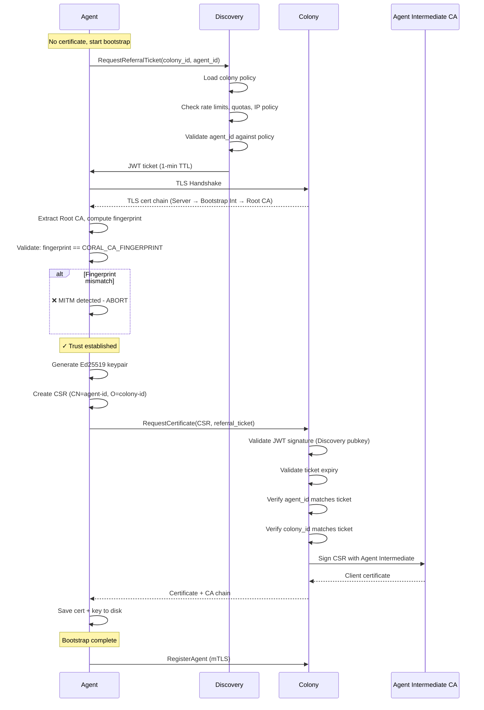
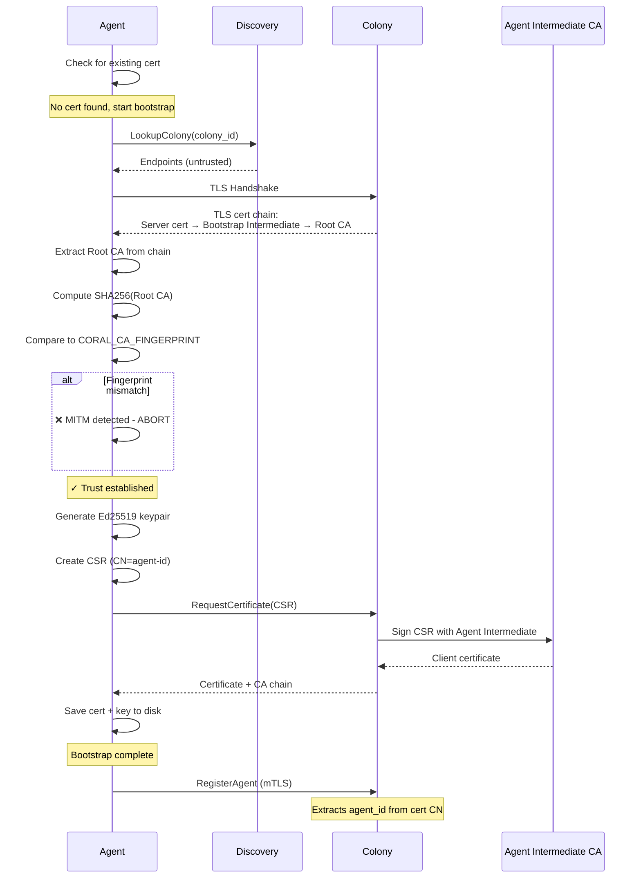

# CA Fingerprint Bootstrap Design

**Status:** Proposed
**Replaces:** JWT bootstrap tokens from RFD 022
**Updates:** RFD 022, RFD 047

## Overview

Agents bootstrap using a **Root CA fingerprint** distributed via configuration,
eliminating the need for per-agent bootstrap tokens while maintaining MITM
protection. This follows Kubernetes kubelet's `--discovery-token-ca-cert-hash`
pattern.

## CA Hierarchy

### Three-Level PKI Structure

```
Root CA (10-year validity, offline/HSM)
  ├─ Bootstrap Intermediate CA (1-year, rotatable)
  │   └─ Colony TLS Server Certificate
  │       └─ Used for HTTPS endpoint
  │
  ├─ Agent Intermediate CA (1-year, rotatable)
  │   └─ Agent Client Certificates
  │       └─ Used for mTLS authentication
  │
  └─ Policy Signing Certificate (10-year, same lifetime as Root CA)
      └─ Signs policy documents
          └─ Used for authorization policies pushed to Discovery
```

**Root CA Fingerprint:**
`sha256:a3f2e1d4c5b6a7f8e9d0c1b2a3f4e5d6c7b8a9f0e1d2c3b4a5f6e7d8c9b0a1f2`

### Why Hierarchical?

| Aspect            | Benefit                                             |
|-------------------|-----------------------------------------------------|
| **Security**      | Root CA key stored offline/HSM, minimizes exposure  |
| **Rotation**      | Rotate intermediates without changing agent configs |
| **Operational**   | Intermediates expire annually, root lasts 10+ years |
| **Flexibility**   | Can issue new intermediates for different purposes  |
| **Best Practice** | Follows PKI standards (X.509, RFC 5280)             |

## Colony Initialization

### CLI Workflow

```bash
$ coral colony init my-app-prod

Initializing colony: my-app-prod...

Generated Certificate Authority:
  Root CA:                ~/.coral/colonies/my-app-prod/ca/root-ca.crt
  Root CA Key:            ~/.coral/colonies/my-app-prod/ca/root-ca.key (SECRET)

  Bootstrap Intermediate: ~/.coral/colonies/my-app-prod/ca/bootstrap-intermediate.crt
  Agent Intermediate:     ~/.coral/colonies/my-app-prod/ca/agent-intermediate.crt
  Policy Signing Cert:    ~/.coral/colonies/my-app-prod/ca/policy-cert.crt
  Policy Signing Key:     ~/.coral/colonies/my-app-prod/ca/policy-key.key (SECRET)

Root CA Fingerprint (distribute to agents):
  sha256:a3f2e1d4c5b6a7f8e9d0c1b2a3f4e5d6c7b8a9f0e1d2c3b4a5f6e7d8c9b0a1f2

⚠️  IMPORTANT: Keep root-ca.key secure (offline storage or HSM recommended)

Deploy agents with:
  export CORAL_COLONY_ID=my-app-prod-a3f2e1
  export CORAL_CA_FINGERPRINT=sha256:a3f2e1d4c5b6a7f8e9d0c1b2a3f4e5d6...
  coral agent start

✓ Colony initialized successfully
```

### File Structure

```
~/.coral/colonies/my-app-prod-a3f2e1/
├── config.yaml
└── ca/
    ├── root-ca.crt                    # Public (10-year validity)
    ├── root-ca.key                    # SECRET - store offline/HSM
    ├── bootstrap-intermediate.crt     # Public (1-year validity)
    ├── bootstrap-intermediate.key     # Used for TLS server certs
    ├── agent-intermediate.crt         # Public (1-year validity)
    ├── agent-intermediate.key         # Used for agent client certs
    ├── policy-cert.crt                # Public (10-year, signed by Root CA)
    ├── policy-key.key                 # SECRET - used for signing policies
    ├── server.crt                     # Colony's TLS certificate
    └── server.key                     # Colony's TLS private key
```

### Colony Config

```yaml
colony_id: my-app-prod-a3f2e1

ca:
    root:
        certificate: ~/.coral/colonies/my-app-prod/ca/root-ca.crt
        private_key: ~/.coral/colonies/my-app-prod/ca/root-ca.key
        fingerprint: sha256:a3f2e1d4c5b6a7f8e9d0c1b2a3f4e5d6c7b8a9f0e1d2c3b4a5f6e7d8c9b0a1f2

    bootstrap_intermediate:
        certificate: ~/.coral/colonies/my-app-prod/ca/bootstrap-intermediate.crt
        private_key: ~/.coral/colonies/my-app-prod/ca/bootstrap-intermediate.key
        expires_at: 2025-11-21

    agent_intermediate:
        certificate: ~/.coral/colonies/my-app-prod/ca/agent-intermediate.crt
        private_key: ~/.coral/colonies/my-app-prod/ca/agent-intermediate.key
        expires_at: 2025-11-21

    policy_signing:
        certificate: ~/.coral/colonies/my-app-prod/ca/policy-cert.crt
        private_key: ~/.coral/colonies/my-app-prod/ca/policy-key.key
        expires_at: 2034-11-21  # Same as Root CA

tls:
    certificate: ~/.coral/colonies/my-app-prod/ca/server.crt
    private_key: ~/.coral/colonies/my-app-prod/ca/server.key

auto_issue_certificates: true
```

## Policy-Based Authorization with Discovery Referral Tickets

### Problem: Unrestricted Certificate Issuance

With only CA fingerprint validation, any entity with the fingerprint can request
unlimited certificates:

```
Attacker has CA fingerprint
→ Submits CSRs to colony
→ Colony auto-issues certificates
→ ⚠️ No authorization layer, only rate limiting
```

### Solution: Discovery Referral Tickets

Add an authorization layer where Discovery issues short-lived **referral tickets
** that Colony validates before issuing certificates. Colony stores signed
authorization policies at Discovery during initialization, enabling Discovery to
enforce colony-specific rules.

### Architecture

```
┌──────────────────────────────────────────────────────────────┐
│ Colony Initialization                                        │
└──────────────────────────────────────────────────────────────┘

$ coral colony init my-app-prod

Generated Certificate Authority + Policy Signing Certificate
  Root CA:                     ~/.coral/colonies/.../ca/root-ca.crt
  Bootstrap Intermediate:      ~/.coral/colonies/.../ca/bootstrap-intermediate.crt
  Agent Intermediate:          ~/.coral/colonies/.../ca/agent-intermediate.crt
  Policy Signing Certificate:  ~/.coral/colonies/.../ca/policy-cert.crt (signed by Root CA)
  Policy Signing Key:          ~/.coral/colonies/.../ca/policy-key.key

Pushing authorization policy to Discovery...
  ✓ Policy signed with policy certificate
  ✓ Discovery validates certificate chain (Policy Cert → Root CA)
  ✓ Discovery locks colony ID to Root CA fingerprint
  ✓ Policy active (version: 1)


┌──────────────────────────────────────────────────────────────┐
│ Agent Bootstrap Flow with Referral Ticket                   │
└──────────────────────────────────────────────────────────────┘

Agent → Discovery: RequestReferralTicket(colony_id, agent_id)
           Discovery checks policy (rate limits, quotas, allow/deny lists)
           Discovery → Agent: JWT ticket (1-minute TTL)

Agent → Colony: RequestCertificate(CSR, referral_ticket)
           Colony validates JWT signature (Discovery public key)
           Colony validates ticket expiry and colony_id match
           Colony issues certificate

Agent → Colony: RegisterAgent (mTLS with certificate)
```

### Policy Document Structure

Colony defines authorization policies in YAML, signs them, and pushes to
Discovery:

```yaml
# Policy document (stored at Discovery)
colony_id: my-app-prod-a3f2e1
policy_version: 1
created_at: "2024-11-21T10:30:00Z"
expires_at: "2025-11-21T10:30:00Z"  # Policy valid for 1 year

# Referral ticket issuance policies
referral_tickets:
    enabled: true
    ttl: 60  # Ticket lifetime in seconds (1 minute)

    rate_limits:
        per_agent_per_hour: 10      # Max tickets per agent_id per hour
        per_source_ip_per_hour: 100 # Max tickets per source IP per hour
        per_colony_per_hour: 1000   # Max tickets for entire colony per hour

    quotas:
        max_active_agents: 10000    # Total agent limit for colony
        max_new_agents_per_day: 100 # Daily new agent registration limit

    # Agent ID validation rules
    agent_id_policy:
        allowed_prefixes: [ "web-", "worker-", "db-", "cache-" ]  # Optional prefix allowlist
        denied_patterns: [ "test-*", "dev-*" ]                     # Deny test/dev in production
        max_length: 64
        regex: "^[a-z0-9][a-z0-9-]*[a-z0-9]$"  # Kubernetes-compatible names

    # IP-based access control (optional)
    allowed_cidrs:
        - "10.0.0.0/8"      # Private network
        - "172.16.0.0/12"   # Private network
        - "192.168.0.0/16"  # Private network

    denied_cidrs:
        - "192.168.100.0/24"  # Known malicious subnet

# Certificate Signing Request validation policies
csr_policies:
    allowed_key_types: [ "ed25519", "ecdsa-p256" ]
    min_key_size: 256
    max_validity_days: 90

    required_subject_fields:
        common_name: true    # Must have CN (agent_id)
        organization: true   # Must have O (colony_id)

# Monitoring and alerting
monitoring:
    alert_on_rate_limit_exceeded: true
    alert_on_denied_request: true
    alert_threshold_per_hour: 50  # Alert if single agent_id exceeds this

# Signature (Ed25519)
# Computed over canonical JSON of above fields
signature: "base64-encoded-ed25519-signature"
```

### Colony Policy Certificate Generation

```go
// internal/colony/ca/policy.go

func (c *Colony) generatePolicySigningCertificate() error {
// Generate Ed25519 keypair for policy signing
policyPubKey, policyPrivKey, err := ed25519.GenerateKey(rand.Reader)
if err != nil {
return fmt.Errorf("failed to generate policy keypair: %w", err)
}

// Create certificate template for policy signing
policyCertTemplate := &x509.Certificate{
SerialNumber: generateSerial(),
Subject: pkix.Name{
CommonName:   fmt.Sprintf("Policy Signer - %s", c.ID),
Organization: []string{c.ID},
},
NotBefore:   time.Now(),
NotAfter:    c.rootCA.NotAfter, // Same as Root CA lifetime (10 years)
KeyUsage:    x509.KeyUsageDigitalSignature,
ExtKeyUsage: []x509.ExtKeyUsage{x509.ExtKeyUsageCodeSigning},

// Add colony ID as SAN for verification
DNSNames: []string{c.ID},
}

// Sign with Root CA
policyCertDER, err := x509.CreateCertificate(
rand.Reader,
policyCertTemplate,
c.rootCA, // Issuer: Root CA
policyPubKey,       // Subject: Policy signing public key
c.rootCAPrivateKey, // Signer: Root CA private key
)
if err != nil {
return fmt.Errorf("failed to create policy cert: %w", err)
}

policyCert, _ := x509.ParseCertificate(policyCertDER)

// Save to disk
saveCertPEM(c.pathPolicyCert(), policyCert)
saveKeyPEM(c.pathPolicyKey(), policyPrivKey)

c.policySigningCert = policyCert
c.policySigningKey = policyPrivKey

log.Info().
Str("colony_id", c.ID).
Str("policy_cert_fingerprint", computeFingerprint(policyCert)).
Msg("Policy signing certificate generated")

return nil
}
```

### Colony Policy Initialization

```go
// internal/colony/policy/policy.go

type ColonyPolicy struct {
ColonyID       string                 `json:"colony_id"`
PolicyVersion  int                    `json:"policy_version"`
CreatedAt      time.Time              `json:"created_at"`
ExpiresAt      time.Time              `json:"expires_at"`

ReferralTickets ReferralTicketPolicy  `json:"referral_tickets"`
CSRPolicies     CSRPolicy             `json:"csr_policies"`
Monitoring      MonitoringPolicy      `json:"monitoring"`
}

type ReferralTicketPolicy struct {
Enabled        bool              `json:"enabled"`
TTL            int               `json:"ttl"`
RateLimits     RateLimits        `json:"rate_limits"`
Quotas         Quotas            `json:"quotas"`
AgentIDPolicy  AgentIDPolicy     `json:"agent_id_policy"`
AllowedCIDRs   []string          `json:"allowed_cidrs,omitempty"`
DeniedCIDRs    []string          `json:"denied_cidrs,omitempty"`
}

func (c *Colony) InitializePolicy() (*SignedPolicy, error) {
// Create default policy
policy := &ColonyPolicy{
ColonyID:      c.ID,
PolicyVersion: 1,
CreatedAt:     time.Now(),
ExpiresAt:     time.Now().AddDate(1, 0, 0), // 1 year

ReferralTickets: ReferralTicketPolicy{
Enabled: true,
TTL:     60,
RateLimits: RateLimits{
PerAgentPerHour:    10,
PerSourceIPPerHour: 100,
PerColonyPerHour:   1000,
},
Quotas: Quotas{
MaxActiveAgents:    10000,
MaxNewAgentsPerDay: 100,
},
AgentIDPolicy: AgentIDPolicy{
MaxLength: 64,
Regex:     "^[a-z0-9][a-z0-9-]*[a-z0-9]$",
},
},

CSRPolicies: CSRPolicy{
AllowedKeyTypes:   []string{"ed25519", "ecdsa-p256"},
MinKeySize:        256,
MaxValidityDays:   90,
RequiredSubjectFields: RequiredFields{
CommonName:   true,
Organization: true,
},
},

Monitoring: MonitoringPolicy{
AlertOnRateLimitExceeded: true,
AlertOnDeniedRequest:     true,
AlertThresholdPerHour:    50,
},
}

// Sign policy with policy certificate's private key
signedPolicy, err := c.signPolicy(policy)
if err != nil {
return nil, fmt.Errorf("failed to sign policy: %w", err)
}

return signedPolicy, nil
}

func (c *Colony) signPolicy(policy *ColonyPolicy) (*SignedPolicy, error) {
// Serialize to canonical JSON
canonicalJSON, err := json.MarshalIndent(policy, "", "  ")
if err != nil {
return nil, err
}

// Sign with Ed25519 policy signing key
signature := ed25519.Sign(c.policySigningKey, canonicalJSON)

return &SignedPolicy{
Policy:           policy,
Signature:        base64.StdEncoding.EncodeToString(signature),
PolicyCert:       c.policySigningCert.Raw, // Full certificate (not just public key)
RootCA:           c.rootCA.Raw, // Root CA for chain validation
PolicyCertPEM:    encodePEM(c.policySigningCert),
RootCAPEM:        encodePEM(c.rootCA),
}, nil
}
```

### Push Policy to Discovery

```go
// internal/colony/policy/push.go

func (c *Colony) PushPolicyToDiscovery(signedPolicy *SignedPolicy) error {
client := discovery.NewDiscoveryServiceClient(c.discoveryConn)

req := &discoveryv1.UpsertColonyPolicyRequest{
ColonyId:          c.ID,
Policy:            mustMarshalJSON(signedPolicy.Policy),
Signature:         signedPolicy.Signature,
PolicyCertificate: signedPolicy.PolicyCert, // Policy signing cert (signed by Root CA)
RootCaCertificate: signedPolicy.RootCA, // Root CA for chain validation
}

resp, err := client.UpsertColonyPolicy(context.Background(), connect.NewRequest(req))
if err != nil {
return fmt.Errorf("failed to push policy: %w", err)
}

log.Info().
Str("colony_id", c.ID).
Int("policy_version", signedPolicy.Policy.PolicyVersion).
Str("root_ca_fingerprint", computeFingerprint(c.rootCA)).
Msg("Policy pushed to Discovery")

return nil
}
```

### Discovery Policy Storage and Validation

```go
// Discovery service: internal/discovery/policy/store.go

func (s *DiscoveryServer) UpsertColonyPolicy(
ctx context.Context,
req *connect.Request[discoveryv1.UpsertColonyPolicyRequest],
) (*connect.Response[discoveryv1.UpsertColonyPolicyResponse], error) {

colonyID := req.Msg.ColonyId

// Parse certificates
policyCert, err := x509.ParseCertificate(req.Msg.PolicyCertificate)
if err != nil {
return nil, connect.NewError(connect.CodeInvalidArgument,
fmt.Errorf("invalid policy certificate: %w", err))
}

rootCA, err := x509.ParseCertificate(req.Msg.RootCaCertificate)
if err != nil {
return nil, connect.NewError(connect.CodeInvalidArgument,
fmt.Errorf("invalid root CA: %w", err))
}

// 1. Verify certificate chain: Policy Cert → Root CA
roots := x509.NewCertPool()
roots.AddCert(rootCA)

opts := x509.VerifyOptions{
Roots:     roots,
KeyUsages: []x509.ExtKeyUsage{x509.ExtKeyUsageCodeSigning},
}

chains, err := policyCert.Verify(opts)
if err != nil {
return nil, connect.NewError(
connect.CodePermissionDenied,
fmt.Errorf("policy certificate chain validation failed: %w", err),
)
}

log.Info().
Str("colony_id", colonyID).
Int("chain_length", len(chains[0])).
Msg("Policy certificate chain verified")

// 2. Check if colony ID is already registered (prevents impersonation)
storedRootCA, err := s.db.GetColonyRootCA(ctx, colonyID)

if err == nil {
// Colony exists - verify Root CA matches (prevents impersonation!)
storedFingerprint := computeFingerprint(storedRootCA)
providedFingerprint := computeFingerprint(rootCA)

if storedFingerprint != providedFingerprint {
log.Warn().
Str("colony_id", colonyID).
Str("stored_fingerprint", storedFingerprint).
Str("provided_fingerprint", providedFingerprint).
Msg("Colony ID impersonation attempt detected!")

return nil, connect.NewError(
connect.CodePermissionDenied,
fmt.Errorf(
"colony ID '%s' already registered with different Root CA - impersonation prevented",
colonyID,
),
)
}

log.Info().
Str("colony_id", colonyID).
Str("root_ca_fingerprint", storedFingerprint).
Msg("Root CA verified - colony authenticated")

} else {
// New colony - register and lock this colony ID to this Root CA
rootCAFingerprint := computeFingerprint(rootCA)

if err := s.db.RegisterColony(ctx, &ColonyRegistration{
ColonyID:          colonyID,
RootCACert:        rootCA.Raw,
RootCAFingerprint: rootCAFingerprint,
RegisteredAt:      time.Now(),
}); err != nil {
return nil, connect.NewError(connect.CodeInternal, err)
}

log.Info().
Str("colony_id", colonyID).
Str("root_ca_fingerprint", rootCAFingerprint).
Msg("Colony ID registered and locked to Root CA")
}

// 3. Verify policy signature using public key from verified certificate
policyPubKey := policyCert.PublicKey.(ed25519.PublicKey)
signature, err := base64.StdEncoding.DecodeString(req.Msg.Signature)
if err != nil {
return nil, connect.NewError(connect.CodeInvalidArgument, err)
}

if !ed25519.Verify(policyPubKey, req.Msg.Policy, signature) {
return nil, connect.NewError(
connect.CodePermissionDenied,
fmt.Errorf("invalid policy signature"),
)
}

// 4. Parse and validate policy structure
var policy ColonyPolicy
if err := json.Unmarshal(req.Msg.Policy, &policy); err != nil {
return nil, connect.NewError(connect.CodeInvalidArgument, err)
}

if policy.ColonyID != colonyID {
return nil, connect.NewError(
connect.CodeInvalidArgument,
fmt.Errorf("policy colony_id mismatch"),
)
}

if err := s.validatePolicyStructure(&policy); err != nil {
return nil, connect.NewError(connect.CodeInvalidArgument, err)
}

// 5. Store policy
if err := s.db.UpsertColonyPolicy(ctx, &StoredPolicy{
ColonyID:      colonyID,
Policy:        req.Msg.Policy,
Signature:     req.Msg.Signature,
PolicyCert:    req.Msg.PolicyCertificate,
RootCA:        req.Msg.RootCaCertificate,
Version:       policy.PolicyVersion,
UploadedAt:    time.Now(),
ExpiresAt:     policy.ExpiresAt,
}); err != nil {
return nil, connect.NewError(connect.CodeInternal, err)
}

log.Info().
Str("colony_id", colonyID).
Int("policy_version", policy.PolicyVersion).
Msg("Policy stored successfully")

return connect.NewResponse(&discoveryv1.UpsertColonyPolicyResponse{
Success:       true,
PolicyVersion: int32(policy.PolicyVersion),
}), nil
}

func computeFingerprint(cert *x509.Certificate) string {
hash := sha256.Sum256(cert.Raw)
return "sha256:" + hex.EncodeToString(hash[:])
}
```

### Discovery Database Schema

```sql
-- Colony registrations (locks colony IDs to Root CAs)
CREATE TABLE colony_registrations
(
    colony_id           TEXT PRIMARY KEY,
    root_ca_cert        BLOB      NOT NULL, -- Full Root CA certificate
    root_ca_fingerprint TEXT      NOT NULL, -- SHA256 fingerprint for quick lookup
    registered_at       TIMESTAMP NOT NULL,
    INDEX               idx_fingerprint (root_ca_fingerprint)
);

-- Colony policies (versioned, signed by verified policy certificates)
CREATE TABLE colony_policies
(
    colony_id      TEXT      NOT NULL,
    policy_version INTEGER   NOT NULL,
    policy_json    TEXT      NOT NULL,
    signature      TEXT      NOT NULL,
    policy_cert    BLOB      NOT NULL, -- Policy signing certificate
    root_ca_cert   BLOB      NOT NULL, -- Root CA (for verification)
    uploaded_at    TIMESTAMP NOT NULL,
    expires_at     TIMESTAMP NOT NULL,
    PRIMARY KEY (colony_id, policy_version),
    FOREIGN KEY (colony_id) REFERENCES colony_registrations (colony_id)
);
```

### Discovery Referral Ticket Issuance

```go
// Discovery service: internal/discovery/referral/ticket.go

func (s *DiscoveryServer) RequestReferralTicket(
ctx context.Context,
req *connect.Request[discoveryv1.RequestReferralTicketRequest],
) (*connect.Response[discoveryv1.RequestReferralTicketResponse], error) {

colonyID := req.Msg.ColonyId
agentID := req.Msg.AgentId
sourceIP := extractSourceIP(ctx)

// Load colony policy
policy, err := s.db.GetColonyPolicy(ctx, colonyID)
if err != nil {
return nil, connect.NewError(connect.CodeNotFound, err)
}

if !policy.ReferralTickets.Enabled {
return nil, connect.NewError(
connect.CodePermissionDenied,
fmt.Errorf("referral tickets disabled for colony"),
)
}

// Check rate limits
if err := s.checkRateLimits(ctx, policy, agentID, sourceIP); err != nil {
log.Warn().
Str("colony_id", colonyID).
Str("agent_id", agentID).
Str("source_ip", sourceIP).
Err(err).
Msg("Rate limit exceeded")

return nil, connect.NewError(connect.CodeResourceExhausted, err)
}

// Check quotas
if err := s.checkQuotas(ctx, policy, agentID); err != nil {
return nil, connect.NewError(connect.CodeResourceExhausted, err)
}

// Validate agent_id against policy
if err := s.validateAgentID(policy, agentID); err != nil {
return nil, connect.NewError(connect.CodeInvalidArgument, err)
}

// Check IP allowlist/denylist
if err := s.checkIPPolicy(policy, sourceIP); err != nil {
return nil, connect.NewError(connect.CodePermissionDenied, err)
}

// Issue referral ticket (JWT)
ticket, err := s.issueReferralTicket(colonyID, agentID, policy.ReferralTickets.TTL)
if err != nil {
return nil, connect.NewError(connect.CodeInternal, err)
}

// Track issuance for rate limiting
s.recordTicketIssuance(ctx, colonyID, agentID, sourceIP)

log.Info().
Str("colony_id", colonyID).
Str("agent_id", agentID).
Str("source_ip", sourceIP).
Msg("Referral ticket issued")

return connect.NewResponse(&discoveryv1.RequestReferralTicketResponse{
Ticket:    ticket,
ExpiresAt: timestamppb.New(time.Now().Add(time.Duration(policy.ReferralTickets.TTL) * time.Second)),
}), nil
}

func (s *DiscoveryServer) issueReferralTicket(colonyID, agentID string, ttl int) (string, error) {
claims := jwt.MapClaims{
"iss":       "coral-discovery",
"sub":       agentID,
"colony_id": colonyID,
"iat":       time.Now().Unix(),
"exp":       time.Now().Add(time.Duration(ttl) * time.Second).Unix(),
"jti":       uuid.New().String(), // Unique ticket ID
}

token := jwt.NewWithClaims(jwt.SigningMethodEdDSA, claims)

// Sign with Discovery's Ed25519 key
return token.SignedString(s.ticketSigningKey)
}

func (s *DiscoveryServer) validateAgentID(policy *ColonyPolicy, agentID string) error {
ap := policy.ReferralTickets.AgentIDPolicy

// Check length
if len(agentID) > ap.MaxLength {
return fmt.Errorf("agent_id exceeds max length %d", ap.MaxLength)
}

// Check regex
if ap.Regex != "" {
matched, _ := regexp.MatchString(ap.Regex, agentID)
if !matched {
return fmt.Errorf("agent_id does not match required pattern")
}
}

// Check prefix allowlist
if len(ap.AllowedPrefixes) > 0 {
allowed := false
for _, prefix := range ap.AllowedPrefixes {
if strings.HasPrefix(agentID, prefix) {
allowed = true
break
}
}
if !allowed {
return fmt.Errorf("agent_id prefix not in allowlist")
}
}

// Check denied patterns
for _, pattern := range ap.DeniedPatterns {
matched, _ := filepath.Match(pattern, agentID)
if matched {
return fmt.Errorf("agent_id matches denied pattern: %s", pattern)
}
}

return nil
}
```

### Agent Referral Ticket Request

```go
// Agent: internal/agent/bootstrap/referral.go

func (a *Agent) requestReferralTicket(ctx context.Context, colonyID string) (string, error) {
client := discovery.NewDiscoveryServiceClient(a.discoveryConn)

req := &discoveryv1.RequestReferralTicketRequest{
ColonyId: colonyID,
AgentId:  a.agentID,
}

resp, err := client.RequestReferralTicket(ctx, connect.NewRequest(req))
if err != nil {
// Handle specific errors
if connect.CodeOf(err) == connect.CodeResourceExhausted {
return "", fmt.Errorf("rate limit exceeded - too many bootstrap attempts")
}
if connect.CodeOf(err) == connect.CodePermissionDenied {
return "", fmt.Errorf("agent not authorized for this colony")
}
return "", fmt.Errorf("failed to get referral ticket: %w", err)
}

log.Info().
Str("colony_id", colonyID).
Str("agent_id", a.agentID).
Time("expires_at", resp.Msg.ExpiresAt.AsTime()).
Msg("Received referral ticket from Discovery")

return resp.Msg.Ticket, nil
}
```

### Colony Ticket Validation and Certificate Issuance

```go
// Colony: internal/colony/ca/issuer.go

func (s *ColonyServer) RequestCertificate(
ctx context.Context,
req *connect.Request[colonyv1.RequestCertificateRequest],
) (*connect.Response[colonyv1.RequestCertificateResponse], error) {

// Validate referral ticket (JWT from Discovery)
claims, err := s.validateReferralTicket(req.Msg.ReferralTicket)
if err != nil {
log.Warn().Err(err).Msg("Invalid referral ticket")
return nil, connect.NewError(connect.CodePermissionDenied, err)
}

// Parse CSR
csr, err := x509.ParseCertificateRequest(req.Msg.Csr)
if err != nil {
return nil, connect.NewError(connect.CodeInvalidArgument, err)
}

// Validate CSR signature
if err := csr.CheckSignature(); err != nil {
return nil, connect.NewError(connect.CodeInvalidArgument, err)
}

// Extract agent_id from CN
agentID := csr.Subject.CommonName

// Verify agent_id matches ticket
if agentID != claims["sub"].(string) {
return nil, connect.NewError(
connect.CodePermissionDenied,
fmt.Errorf("agent_id mismatch between ticket and CSR"),
)
}

// Verify colony_id matches ticket
if s.colonyID != claims["colony_id"].(string) {
return nil, connect.NewError(
connect.CodePermissionDenied,
fmt.Errorf("colony_id mismatch in ticket"),
)
}

log.Info().
Str("agent_id", agentID).
Str("ticket_jti", claims["jti"].(string)).
Msg("Issuing certificate (referral ticket validated)")

// Sign with Agent Intermediate CA
cert, err := s.issueAgentCertificate(csr)
if err != nil {
return nil, connect.NewError(connect.CodeInternal, err)
}

// Store certificate metadata
if err := s.db.StoreCertificate(&CertificateRecord{
AgentID:      agentID,
SerialNumber: cert.SerialNumber.String(),
IssuedAt:     cert.NotBefore,
ExpiresAt:    cert.NotAfter,
TicketJTI:    claims["jti"].(string), // Track which ticket was used
Revoked:      false,
}); err != nil {
return nil, connect.NewError(connect.CodeInternal, err)
}

return connect.NewResponse(&colonyv1.RequestCertificateResponse{
Certificate: encodePEM(cert),
CaChain:     s.getCAChain(),
ExpiresAt:   timestamppb.New(cert.NotAfter),
}), nil
}

func (s *ColonyServer) validateReferralTicket(tokenString string) (jwt.MapClaims, error) {
token, err := jwt.Parse(tokenString, func (token *jwt.Token) (interface{}, error) {
// Validate signing method
if _, ok := token.Method.(*jwt.SigningMethodEd25519); !ok {
return nil, fmt.Errorf("unexpected signing method: %v", token.Header["alg"])
}

// Return Discovery's public key for verification
return s.discoveryPublicKey, nil
})

if err != nil {
return nil, fmt.Errorf("failed to parse ticket: %w", err)
}

if !token.Valid {
return nil, fmt.Errorf("invalid ticket")
}

claims, ok := token.Claims.(jwt.MapClaims)
if !ok {
return nil, fmt.Errorf("invalid claims format")
}

// Validate issuer
if claims["iss"] != "coral-discovery" {
return nil, fmt.Errorf("invalid issuer")
}

// Check expiration (should be within 1 minute)
exp := int64(claims["exp"].(float64))
if time.Now().Unix() > exp {
return nil, fmt.Errorf("ticket expired")
}

return claims, nil
}
```

### Updated Bootstrap Sequence



## Agent Bootstrap Flow

### Deployment

**Kubernetes:**

```yaml
apiVersion: v1
kind: Secret
metadata:
    name: coral-colony-ca
data:
    colony_id: bXktYXBwLXByb2QtYTNmMmUx
    ca_fingerprint: c2hhMjU2OmEzZjJlMWQ0YzViNmE3ZjhlOWQwYzFiMmEzZjRlNWQ2...
---
apiVersion: apps/v1
kind: Deployment
spec:
    template:
        spec:
            containers:
                -   name: coral-agent
                    image: coral/agent:latest
                    env:
                        -   name: CORAL_COLONY_ID
                            valueFrom:
                                secretKeyRef:
                                    name: coral-colony-ca
                                    key: colony_id
                        -   name: CORAL_CA_FINGERPRINT
                            valueFrom:
                                secretKeyRef:
                                    name: coral-colony-ca
                                    key: ca_fingerprint
                    volumeMounts:
                        -   name: coral-certs
                            mountPath: /var/lib/coral/certs
            volumes:
                -   name: coral-certs
                    emptyDir: { }
```

**Environment Variables:**

```bash
CORAL_COLONY_ID=my-app-prod-a3f2e1
CORAL_CA_FINGERPRINT=sha256:a3f2e1d4c5b6a7f8e9d0c1b2a3f4e5d6...
coral agent start
```

### Bootstrap Process



### Code Example

```go
func (a *Agent) Bootstrap() error {
expectedRootFingerprint := os.Getenv("CORAL_CA_FINGERPRINT")
if expectedRootFingerprint == "" {
return fmt.Errorf("CORAL_CA_FINGERPRINT required")
}

// 1. Query discovery for colony endpoints
colonyInfo, err := a.discovery.LookupColony(a.colonyID)
if err != nil {
return fmt.Errorf("colony not found: %w", err)
}

// 2. Connect with InsecureSkipVerify (we'll validate manually)
colonyURL := fmt.Sprintf("https://%s:%d",
colonyInfo.Endpoints[0], colonyInfo.ConnectPort)

conn, err := tls.Dial("tcp", colonyURL, &tls.Config{
InsecureSkipVerify: true,
})
if err != nil {
return fmt.Errorf("failed to connect: %w", err)
}
defer conn.Close()

// 3. Extract certificate chain
peerCerts := conn.ConnectionState().PeerCertificates
if len(peerCerts) == 0 {
return fmt.Errorf("no certificates received")
}

// 4. Get Root CA (last cert in chain)
rootCA := peerCerts[len(peerCerts)-1]

// 5. Compute and validate fingerprint
actualFingerprint := computeCAFingerprint(rootCA)

if actualFingerprint != expectedRootFingerprint {
return fmt.Errorf(
"Root CA fingerprint mismatch - MITM detected!\n"+
"Expected: %s\n"+
"Received: %s",
expectedRootFingerprint,
actualFingerprint,
)
}

log.Info().Msg("✓ Root CA fingerprint verified - trust established")

// 6. Validate certificate chain integrity
if err := validateCertChain(peerCerts, rootCA); err != nil {
return fmt.Errorf("certificate chain validation failed: %w", err)
}

// 7. Save validated Root CA for future use
if err := saveCertificate("/var/lib/coral/certs/root-ca.crt", rootCA); err != nil {
return fmt.Errorf("failed to save root CA: %w", err)
}

// 8. Generate keypair and CSR
privateKey, err := ecdsa.GenerateKey(elliptic.P256(), rand.Reader)
if err != nil {
return fmt.Errorf("failed to generate keypair: %w", err)
}

csr, err := createCSR(a.agentID, a.colonyID, privateKey)
if err != nil {
return fmt.Errorf("failed to create CSR: %w", err)
}

// 9. Request certificate from colony
certPool := x509.NewCertPool()
certPool.AddCert(rootCA)

secureClient := &http.Client{
Transport: &http.Transport{
TLSClientConfig: &tls.Config{
RootCAs: certPool, // Now we trust this CA
},
},
}

cert, err := requestCertificate(secureClient, colonyURL, csr)
if err != nil {
return fmt.Errorf("certificate request failed: %w", err)
}

// 10. Save certificate and key
if err := saveCertificateAndKey(cert, privateKey); err != nil {
return fmt.Errorf("failed to save credentials: %w", err)
}

log.Info().
Str("agent_id", a.agentID).
Time("expires_at", cert.NotAfter).
Msg("✓ Bootstrap complete")

return nil
}

func computeCAFingerprint(cert *x509.Certificate) string {
hash := sha256.Sum256(cert.Raw)
return "sha256:" + hex.EncodeToString(hash[:])
}

func validateCertChain(peerCerts []*x509.Certificate, rootCA *x509.Certificate) error {
// Build intermediate pool
intermediates := x509.NewCertPool()
for i := 1; i < len(peerCerts)-1; i++ {
intermediates.AddCert(peerCerts[i])
}

// Verify chain
opts := x509.VerifyOptions{
Roots:         x509.NewCertPool(),
Intermediates: intermediates,
}
opts.Roots.AddCert(rootCA)

if _, err := peerCerts[0].Verify(opts); err != nil {
return fmt.Errorf("chain verification failed: %w", err)
}

return nil
}
```

## Colony Certificate Issuance

### Auto-Issuance Policy

Colony automatically issues certificates on valid CSRs:

```go
func (s *ColonyServer) RequestCertificate(
ctx context.Context,
req *connect.Request[colonyv1.RequestCertificateRequest],
) (*connect.Response[colonyv1.RequestCertificateResponse], error) {

// Parse CSR
csr, err := x509.ParseCertificateRequest(req.Msg.Csr)
if err != nil {
return nil, connect.NewError(connect.CodeInvalidArgument, err)
}

// Validate CSR signature
if err := csr.CheckSignature(); err != nil {
return nil, connect.NewError(connect.CodeInvalidArgument, err)
}

// Extract agent ID from CN
agentID := csr.Subject.CommonName

// Rate limiting check
if s.rateLimiter.IsExceeded(agentID) {
return nil, connect.NewError(
connect.CodeResourceExhausted,
fmt.Errorf("rate limit exceeded for agent %s", agentID),
)
}

log.Info().
Str("agent_id", agentID).
Msg("Issuing certificate")

// Sign with Agent Intermediate CA
cert, err := s.issueAgentCertificate(csr)
if err != nil {
return nil, connect.NewError(connect.CodeInternal, err)
}

// Store in database
if err := s.db.StoreCertificate(&CertificateRecord{
AgentID:      agentID,
SerialNumber: cert.SerialNumber.String(),
IssuedAt:     cert.NotBefore,
ExpiresAt:    cert.NotAfter,
Revoked:      false,
}); err != nil {
return nil, connect.NewError(connect.CodeInternal, err)
}

// Return certificate + full chain
return connect.NewResponse(&colonyv1.RequestCertificateResponse{
Certificate: encodePEM(cert),
CaChain:     s.getCAChain(), // Agent Intermediate + Root CA
ExpiresAt:   timestamppb.New(cert.NotAfter),
}), nil
}

func (s *ColonyServer) issueAgentCertificate(csr *x509.CertificateRequest) (*x509.Certificate, error) {
serialNumber, _ := rand.Int(rand.Reader, new(big.Int).Lsh(big.NewInt(1), 128))

template := &x509.Certificate{
SerialNumber: serialNumber,
Subject:      csr.Subject,
NotBefore:    time.Now(),
NotAfter:     time.Now().Add(90 * 24 * time.Hour), // 90 days
KeyUsage:     x509.KeyUsageDigitalSignature | x509.KeyUsageKeyEncipherment,
ExtKeyUsage:  []x509.ExtKeyUsage{x509.ExtKeyUsageClientAuth},
}

// Sign with Agent Intermediate CA
certDER, err := x509.CreateCertificate(
rand.Reader,
template,
s.agentIntermediate, // Issuer: Agent Intermediate CA
csr.PublicKey,
s.agentIntermediateKey, // Signer: Agent Intermediate private key
)
if err != nil {
return nil, err
}

return x509.ParseCertificate(certDER)
}
```

### Rate Limiting

Prevent abuse with configurable limits:

```yaml
security:
    certificate_issuance:
        rate_limits:
            per_agent_per_hour: 10
            per_colony_per_hour: 1000

        monitoring:
            alert_threshold: 50  # Alert if >50 certs/hour for single agent
```

## Intermediate CA Rotation

### When to Rotate

- **Scheduled:** Every 365 days (before expiration)
- **Emergency:** Intermediate key compromise
- **Operational:** Policy changes, key algorithm updates

### Rotation Process

```bash
$ coral colony ca rotate-intermediate --type agent

Rotating Agent Intermediate CA...

Current intermediate:
  Serial:     3a4f5e2d1c0b9a8f
  Expires:    2025-11-21 10:30:00 UTC
  Issued by:  Coral Root CA - my-app-prod

Generating new intermediate...
✓ New intermediate generated
✓ Signed by Root CA
✓ Valid until 2026-11-21 10:30:00 UTC

Migration strategy:
  Old intermediate: Valid for 30 more days (deprecation period)
  New intermediate: Active immediately for new certificates

Agents with old certificates:
  - Will continue working until expiration
  - Will automatically renew with new intermediate
  - No configuration changes needed

✓ Rotation complete
```

### Zero-Downtime Rotation

```
Before:
  Root CA
    └─ Agent Intermediate (old) → signs agent certs

During rotation:
  Root CA
    ├─ Agent Intermediate (old) → still valid, signs renewals
    └─ Agent Intermediate (new) → signs new certs

After 30 days:
  Root CA
    └─ Agent Intermediate (new) → all agents migrated
```

Agents automatically validate against Root CA, so intermediate rotation is
transparent.

## Security Properties

### Attack Scenarios

| Attack                               | Protection                                                                 |
|--------------------------------------|----------------------------------------------------------------------------|
| **Discovery MITM**                   | Agent validates Root CA fingerprint, aborts on mismatch ✅                  |
| **Colony ID leaked**                 | Cannot push policies without Root CA private key ✅                         |
| **Colony ID impersonation**          | Discovery locks colony ID to Root CA fingerprint on first registration ✅   |
| **Policy forgery**                   | Policy must be signed by certificate chaining to registered Root CA ✅      |
| **CA fingerprint leaked**            | Need referral ticket from Discovery (rate-limited, policy-controlled) ✅    |
| **Fake agent registration**          | Discovery enforces rate limits, quotas, agent ID policies, IP allowlists ✅ |
| **Agent certificate stolen**         | Individual revocation, certificate expires in 90 days ✅                    |
| **Intermediate CA compromised**      | Rotate intermediate, Root CA remains trusted ✅                             |
| **Root CA compromised**              | Nuclear option: Re-initialize colony with new Root CA, new fingerprint ⚠️  |
| **Discovery referral ticket stolen** | 1-minute TTL, single-use (tracked by jti), agent_id binding ✅              |
| **Mass agent registration attack**   | Per-IP rate limits, per-colony quotas, monitoring/alerting ✅               |

### Colony ID Reservation and Ownership

**Discovery automatically locks colony IDs to their Root CA on first policy
push:**

```
First policy push for colony "my-app-prod-a3f2e1":
  1. Discovery receives Root CA with fingerprint sha256:abc123...
  2. Discovery stores: colony_id → root_ca_fingerprint mapping
  3. ✅ Colony ID now LOCKED to this Root CA

Subsequent policy updates from same colony:
  1. Discovery receives Root CA with same fingerprint sha256:abc123...
  2. Discovery compares: stored(abc123) == provided(abc123)
  3. ✅ ACCEPTED - colony authenticated

Attacker tries to impersonate colony:
  1. Attacker generates different Root CA with fingerprint sha256:xyz789...
  2. Attacker pushes policy for "my-app-prod-a3f2e1"
  3. Discovery compares: stored(abc123) != provided(xyz789)
  4. ❌ REJECTED - "colony ID already registered with different Root CA"
  5. Discovery logs impersonation attempt
```

**Trust model:**

```
Colony ownership = Root CA private key possession

Verification chain for policy push:
  Policy document
    ↓ (signed by)
  Policy Signing Certificate (Ed25519 public key)
    ↓ (issued by)
  Root CA (X.509 certificate)
    ↓ (fingerprint matches)
  Discovery's registered Root CA for this colony_id
```

**Benefits:**

- ✅ First-to-register owns the colony ID permanently
- ✅ No pre-registration ceremony needed
- ✅ Cryptographic proof of ownership (Root CA private key)
- ✅ Cannot fake ownership without compromising Root CA
- ✅ Automatic detection and prevention of impersonation
- ✅ Full audit trail of registration and policy updates

### Fingerprint Distribution Security

**The Root CA fingerprint is NOT a secret** - it's like an SSH host key
fingerprint:

```bash
# Similar security model:
ssh user@server
# The authenticity of host 'server (192.168.1.100)' can't be established.
# ED25519 key fingerprint is SHA256:a3f2e1d4c5b6a7f8e9d0c1b2a3f4e5d6.

coral agent start
# Validates colony using:
# Root CA fingerprint: SHA256:a3f2e1d4c5b6a7f8e9d0c1b2a3f4e5d6...
```

**Public distribution is acceptable:**

- Can be in ConfigMaps, not Secrets
- Can be logged, documented, shared
- Only validates "talking to correct colony"
- Cannot be used to join colony without certificate

**Compromise scenario with referral tickets:**

```
Attacker has CA fingerprint
→ Requests referral ticket from Discovery
→ Discovery enforces: rate limits, quotas, agent ID policy, IP allowlists
→ Discovery issues ticket (if authorized)
→ Attacker submits CSR + ticket to Colony
→ Colony validates ticket and issues certificate
→ Colony/Discovery can: rate limit, alert, monitor, revoke, block by IP/agent_id
→ Much better than current colony_secret (unlimited access)
```

**Defense in depth:**

1. **CA fingerprint**: Prevents MITM attacks during bootstrap
2. **Referral ticket**: Adds authorization layer before certificate issuance
3. **Policy enforcement**: Colony-defined rules enforced by Discovery
4. **Rate limiting**: Prevents mass registration attacks
5. **Monitoring**: Detects suspicious patterns and alerts operators

## Comparison with Alternatives

### vs. JWT Bootstrap Tokens (RFD 022 Original)

| Aspect                   | JWT Tokens           | Root CA Fingerprint    |
|--------------------------|----------------------|------------------------|
| **Token per agent**      | ✅ Yes                | ❌ No (one fingerprint) |
| **Discovery changes**    | ✅ Required           | ❌ None                 |
| **Database tracking**    | ✅ Required           | ❌ Cert tracking only   |
| **Complexity**           | High                 | Low                    |
| **Generic binary**       | ⚠️ Needs embedded CA | ✅ Yes                  |
| **MITM protection**      | ✅ Yes                | ✅ Yes                  |
| **Operational overhead** | High                 | Low                    |

### vs. Kubernetes kubelet

| Aspect                    | Kubernetes                       | Coral                   |
|---------------------------|----------------------------------|-------------------------|
| **Trust anchor**          | `--discovery-token-ca-cert-hash` | `CORAL_CA_FINGERPRINT`  |
| **Bootstrap credential**  | Bootstrap token                  | None (auto-issue)       |
| **CSR approval**          | Manual or auto via RBAC          | Auto-issue on valid CSR |
| **Certificate lifetime**  | 1 year                           | 90 days                 |
| **Intermediate rotation** | Requires new join command        | Transparent             |

### vs. Embedded CA Bundle (Talos/Omni)

| Aspect                | Embedded Bundle    | Runtime Fingerprint   |
|-----------------------|--------------------|-----------------------|
| **Binary per colony** | ✅ Different images | ❌ Same binary         |
| **Multi-colony**      | ⚠️ Rebuild images  | ✅ Just change env var |
| **CA rotation**       | ⚠️ New images      | ✅ No client changes   |
| **Zero-config**       | ✅ Yes              | ⚠️ Needs fingerprint  |

## Implementation Checklist

### Colony Initialization

- [ ] Implement Root CA generation (10-year validity)
- [ ] Implement Bootstrap Intermediate CA generation
- [ ] Implement Agent Intermediate CA generation
- [ ] Generate policy signing certificate (signed by Root CA, 10-year validity)
- [ ] Generate policy signing Ed25519 keypair
- [ ] Compute and display Root CA fingerprint
- [ ] Save CA hierarchy to disk with proper permissions
- [ ] Add `coral colony ca status` command
- [ ] Add `coral colony ca rotate-intermediate` command

### Colony Policy Management

- [ ] Implement policy structure and defaults
- [ ] Implement policy signing with Ed25519
- [ ] Implement policy push to Discovery
- [ ] Add `coral colony policy show` command
- [ ] Add `coral colony policy update` command
- [ ] Add `coral colony policy push` command

### Discovery Service

- [ ] Implement colony registration (colony_id → Root CA fingerprint mapping)
- [ ] Implement policy certificate chain validation (Policy Cert → Root CA)
- [ ] Implement Root CA fingerprint comparison for existing colonies
- [ ] Add database schema for colony registrations
- [ ] Add database schema for colony policies with certificate storage
- [ ] Add `UpsertColonyPolicy` RPC endpoint with certificate validation
- [ ] Add `GetColonyPolicy` RPC endpoint
- [ ] Implement referral ticket issuance
- [ ] Add `RequestReferralTicket` RPC endpoint
- [ ] Implement rate limiting (per-agent, per-IP, per-colony)
- [ ] Implement quota tracking
- [ ] Implement agent ID validation (regex, prefixes, deny patterns)
- [ ] Implement IP allowlist/denylist checks
- [ ] Store Discovery signing key for JWT tickets
- [ ] Add monitoring/alerting for denied requests
- [ ] Add alerting for colony impersonation attempts

### Agent Bootstrap

- [ ] Implement referral ticket request from Discovery
- [ ] Implement CA fingerprint validation
- [ ] Extract Root CA from TLS certificate chain
- [ ] Validate chain integrity (intermediates → root)
- [ ] Generate Ed25519 keypair
- [ ] Create CSR with proper CN/SAN
- [ ] Request certificate from colony with referral ticket
- [ ] Handle rate limit and permission errors gracefully
- [ ] Save certificate + CA chain locally

### Colony Certificate Issuance

- [ ] Implement referral ticket validation (JWT)
- [ ] Verify ticket signature with Discovery public key
- [ ] Verify agent_id and colony_id match ticket claims
- [ ] Check ticket expiration
- [ ] Implement auto-issuance on valid CSR + ticket
- [ ] Store ticket JTI in certificate record
- [ ] Add monitoring/alerting for invalid tickets
- [ ] Store certificate metadata in database
- [ ] Implement certificate revocation

### Testing

- [ ] Unit tests for CA generation
- [ ] Unit tests for fingerprint computation
- [ ] Unit tests for chain validation
- [ ] Integration test: full bootstrap flow
- [ ] Integration test: intermediate rotation
- [ ] E2E test: agent connects with certificate
- [ ] E2E test: MITM detection (wrong fingerprint)

## Migration Path

### Phase 1: Deploy Hierarchical CA (Breaking Change)

```bash
# Existing colonies need re-initialization
coral colony ca migrate-to-hierarchical
```

### Phase 2: Update Agent Bootstrap

- Agents use `CORAL_CA_FINGERPRINT` instead of `CORAL_COLONY_SECRET`
- Fallback to `colony_secret` during migration
- Monitor bootstrap success rates

### Phase 3: Deprecate Colony Secret

- After all agents migrated, disable `colony_secret` authentication
- Enforce certificate-only access

---

**Next Steps:**

1. Review this design document
2. Update RFD 022 to remove JWT token sections
3. Update RFD 047 to use Root CA fingerprint validation
4. Implement colony CA initialization with hierarchy
5. Implement agent fingerprint validation
